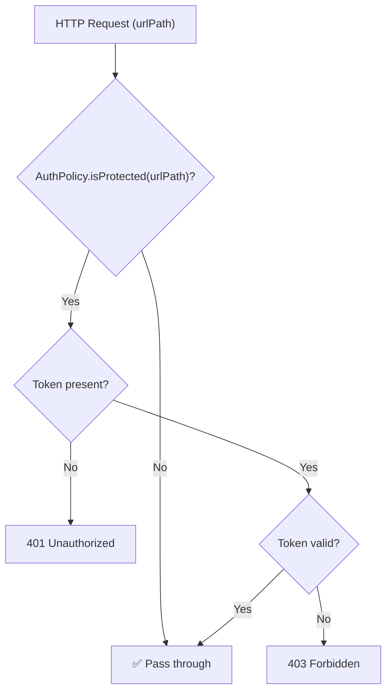
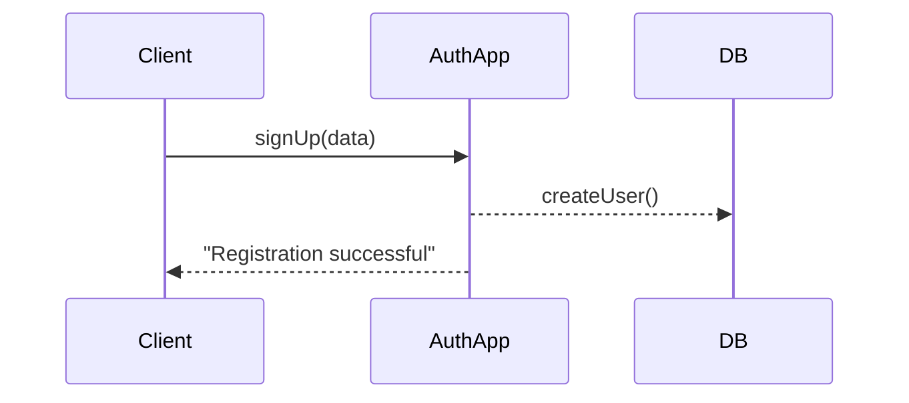

# @nan0web/auth.app
<!-- %PACKAGE_STATUS% -->

## Description
Authorization application core for nan0web. Implementation of One Logic — Many UI (OLMUI) 
for user management, identity verification, and rule-based access control.

## 🏁 Authorization Flow



## 🧬 Domain Models

### AuthPolicy

| Property | Type | Default | Description |
| :--- | :--- | :--- | :--- |
| enabled | boolean | true | global auth toggle |
| protectedPaths | string[] | ['/api/**'] | glob-patterns to guard |
| publicPaths | string[] | ['/api/health'] | glob-overrides (public) |
| strategy | enum | 'jwt' | jwt, session, or apikey |

### UserAccount

| Property | Type | Description |
| :--- | :--- | :--- |
| username | string | Unique login identifier |
| email | string | Primary contact (validated) |
| soulId | string | Sovereign identity bridge |

## Installation
```bash
npm install @nan0web/auth.app
```

How to install?

## Usage

### 🛡 URL Access Control (AuthPolicy)
Define protection rules using glob patterns with automatic public overrides.

How to check if a path is protected?
```js
import { AuthPolicy } from '@nan0web/auth.app'
const policy = new AuthPolicy({
	protectedPaths: ['/api/**'],
	publicPaths: ['/api/health']
})
```
### 🛠 System Configuration (AuthConfig)
Formalize system behavior using the AuthConfig model.

How to configure the auth system?
```js
import { AuthConfig } from '@nan0web/auth.app'
const config = new AuthConfig({
	'password-min-length': 12,
	'token-expiry': '24h'
})
console.info(config.passwordMinLength)
```
### 👤 Extension via Inheritance
Extend the base `UserAccount` to add specific fields for your application (e.g., coins, roles).

How to extend UserAccount for your app?
```js
import { UserAccount } from '@nan0web/auth.app'
class SunAccount extends UserAccount {
	static dailyCoins = { type: 'number', default: 100 }
}
const user = new SunAccount({
	username: 'architechnomag',
	email: 'mag@nan0web.net',
	dailyCoins: 500
})
```
### 🏁 Headless Auth Dispatcher (AuthApp)
Orchestrate complex flows (signup, login) while staying platform-agnostic.



How to run the signup flow?
```js
import { AuthApp, AuthConfig } from '@nan0web/auth.app'
const config = new AuthConfig({ 'default-community-coins': 500 })
const app = new AuthApp(config, {
	db: {
		getUser: async () => null,
		createUser: async () => ({ email: 'test@example.com' }),
		saveVerificationCode: async () => {}
	},
	tokenManager: { getShortHash: (v) => 'hash-' + v.slice(0,6) },
	tokenRotationRegistry: { registerToken: () => {} }
})
const signupFlow = app.signUp({
	body: { email: 'test@example.com', username: 'testuser', password: 'password123' }
})
for await (const message of signupFlow) {
	const label = Array.isArray(message.content) ? message.content[0] : message.body?.message || message.error?.message
	console.info(label)
}
```
## API Reference (v1.1.0)

* **AuthApp**: business logic dispatcher.
* **AuthPolicy**: URL access control rule manager.
* **UserAccount**: identity domain model (extendable).
* **AuthConfig**: system environment settings.

API completeness check
