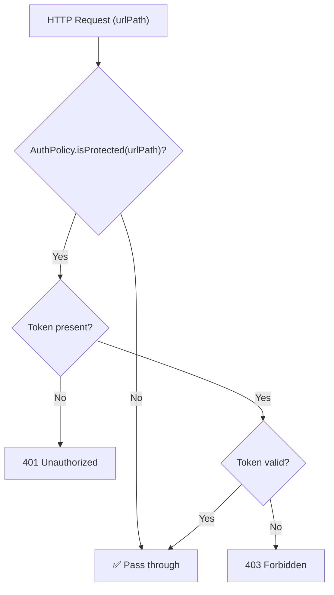
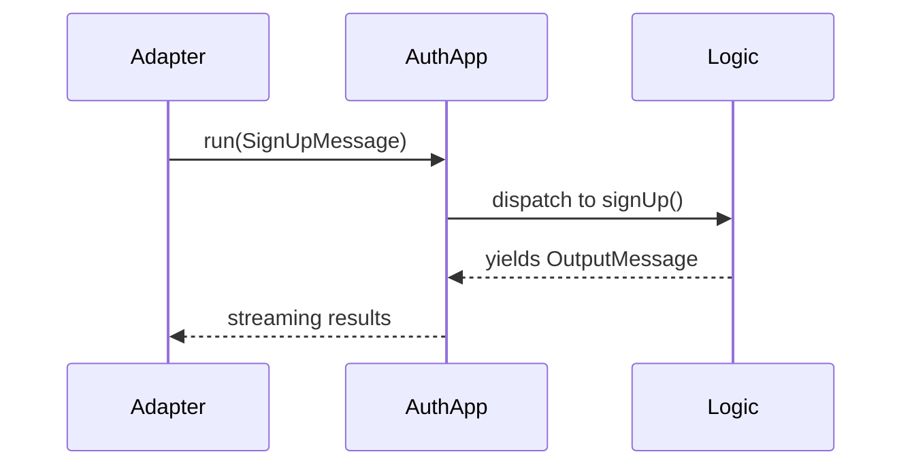

# @nan0web/auth.app
<!-- %PACKAGE_STATUS% -->

## Description
Authorization application core for nan0web. Implementation of One Logic — Many UI (OLMUI) 
for user management, identity verification, and rule-based access control.

## 🏁 Authorization Flow


```mermaid
graph TD
    REQ["HTTP Request (urlPath)"] --> POLICY{"AuthPolicy.isProtected(urlPath)?"}
    POLICY -->|No| PASS["✅ Pass through"]
    POLICY -->|Yes| CHECK{"Token present?"}
    CHECK -->|No| R401["401 Unauthorized"]
    CHECK -->|Yes| VERIFY{"Token valid?"}
    VERIFY -->|No| R403["403 Forbidden"]
    VERIFY -->|Yes| PASS
```

## 🧬 Domain Models

### AuthPolicy

|
|
|
|
|
|

|
|
|
|
|

### AuthConfig

|
|
|
|
|

## Installation
```bash
npm install @nan0web/auth.app
```

How to install?

## Usage

### 🛡 URL Access Control (AuthPolicy)
Define protection rules using glob patterns with automatic public overrides.

How to check if a path is protected?

```js
import { AuthPolicy } from '@nan0web/auth.app'
const policy = new AuthPolicy({
	protectedPaths: ['/api/**'],
	publicPaths: ['/api/health']
})
```
### 🛠 System Configuration (AuthConfig)
Formalize system behavior using the AuthConfig model.

How to configure the auth system?

```js
import { AuthConfig } from '@nan0web/auth.app'
const config = new AuthConfig({
	'password-min-length': 12,
	'token-expiry': '24h'
})
console.info(config.passwordMinLength)
```
### 👤 Extension via Inheritance
Extend the base `UserAccount` to add specific fields for your application (e.g., coins, roles).

How to extend UserAccount for your app?

```js
import { UserAccount } from '@nan0web/auth.app'
class SunAccount extends UserAccount {
	static dailyCoins = { type: 'number', default: 100 }
}
const user = new SunAccount({
	username: 'architechnomag',
	email: 'mag@nan0web.net',
	dailyCoins: 500
})
```
### 🧩 Registration Strategies
Configure how users join your community using the `verificationFlow` parameter.

|
|
|
|
|

### 🚀 Polymorphic Dispatcher (run)
The `AuthApp` uses a generator-based pipeline to process any domain message.
It automatically routes `[Action]Message` to the corresponding `[action]` method.


```mermaid
sequenceDiagram
    Adapter->>AuthApp: run(SignUpMessage)
    AuthApp->>Logic: dispatch to signUp()
    Logic-->>AuthApp: yields OutputMessage
    AuthApp-->>Adapter: streaming results
```

How to run the signup flow?

```js
import { AuthApp, AuthConfig } from '@nan0web/auth.app'
const config = new AuthConfig({ 'default-community-coins': 500 })
const app = new AuthApp(config, {
	db: {
		getUser: async () => null,
		createUser: async () => ({ email: 'test@example.com', name: 'testuser' }),
		saveVerificationCode: async () => {},
		saveUser: async () => {}
	},
	tokenManager: {
		getShortHash: (v) => 'hash-' + v.slice(0,6),
		createTokenPair: () => ({ accessToken: 'at', refreshToken: 'rt' })
	},
	tokenRotationRegistry: { registerToken: () => {} }
})
// 1. Using the polymorphic run() dispatcher
const msg = SignUpMessage.from({
	body: { email: 'test@example.com', username: 'testuser', password: 'password123' }
})
const signupFlow = app.run(msg)
for await (const output of signupFlow) {
	if (Array.isArray(output.content)) {
		output.content.forEach((x) => console.info(x))
	} else {
		const label = output.body?.message || output.error?.message
		if (label) console.info(label)
	}
}
```
### 🛡 Advanced Strategies: Email + Admin approval
In this mode, the user confirms their email, but the account remains unapproved until an administrator takes action.

How to use email+admin strategy?

```js
const config = new AuthConfig({ 'verification-flow': 'email+admin' })
const app = new AuthApp(config, {
	db: {
		getUser: async () => null,
		getUserByEmail: async () => ({ name: 'testuser', email: 'test@example.com', verified: false, approved: false, verificationCode: '123456' }),
		createUser: async () => ({ email: 'test@example.com', name: 'testuser' }),
		saveVerificationCode: async () => {},
		saveUser: async () => {}
	},
	tokenManager: { getShortHash: (v) => 'hash-' + v.slice(0,6) },
	tokenRotationRegistry: { registerToken: () => {} }
})
const confirmFlow = app.confirmSignUp({ body: { contact: 'test@example.com', code: '123456' } })
for await (const output of confirmFlow) {
	if (Array.isArray(output.content)) {
		output.content.forEach((x) => console.info(x))
	} else {
		const label = output.body?.message || output.error?.message
		if (label) console.info(label)
	}
}
```
## API Reference (v1.1.0)

* **AuthApp**: business logic dispatcher.
* **AuthPolicy**: URL access control rule manager.
* **UserAccount**: identity domain model (extendable).
* **AuthConfig**: system environment settings.

API completeness check


