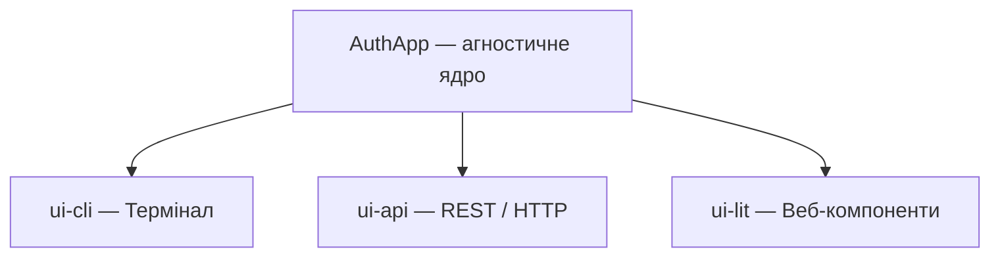
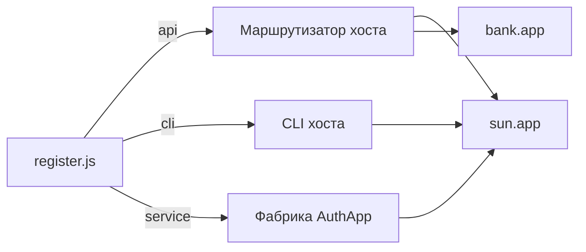
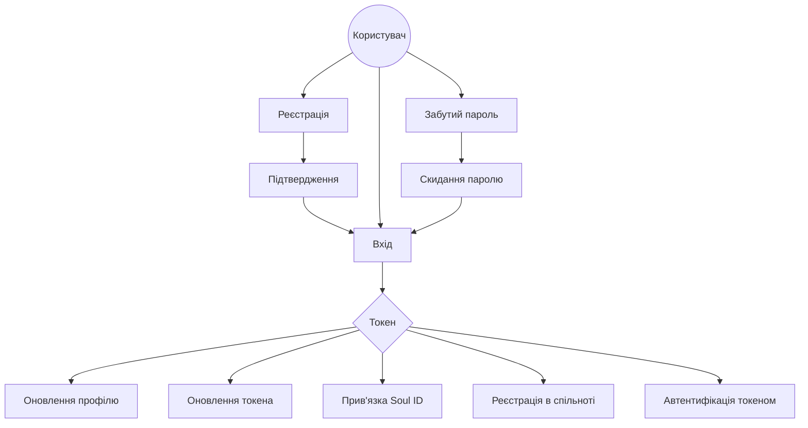

# @nan0web/auth.app

Мікро-застосунок автентифікації та авторизації для екосистеми nan•web.

> 🇬🇧 [English version](../../README.md)

> **Одна Логіка — Багато UI**: єдине ядро (`AuthApp`) забезпечує роботу CLI,
> HTTP API та Web Component інтерфейсів без дублювання коду.

## Можливості

| Функція                                   | Статус |
| ----------------------------------------- | ------ |
| Реєстрація (email + username + password)  | ✅     |
| Підтвердження реєстрації (contact + code) | ✅     |
| Вхід (identifier + password)              | ✅     |
| Забутий пароль / Скидання паролю          | ✅     |
| Оновлення профілю (авторизований)         | ✅     |
| Оновлення токена + ротація                | ✅     |
| Прив'язка Soul ID (міст `sun.app`)        | ✅     |
| Реєстрація в спільноті                    | ✅     |
| Інтерактивний CLI (`ui-cli`)              | ✅     |
| REST API сервер (`ui-api`)                | ✅     |
| Веб-компоненти (`ui-lit`)                 | 🔧 WIP |

## Архітектура



- **`AuthApp`** — чиста бізнес-логіка як асинхронні генератори (`yield` повідомлень)
- **`ui-cli`** — інтерактивний термінал через `@nan0web/ui-cli` (Select, Forms)
- **`ui-api`** — доменний HTTP-маршрутизатор через `@nan0web/http-node`
- **`ui-lit`** — Lit-елемент `<auth-login-form>` (Web Component)

### Інтеграція «Додаток-у-Додаток»



Будь-який nan•web додаток може вбудувати `auth.app` через `register()`:
він отримує готові API-маршрути, CLI-команди та фабрику сервісу.

### Шлях користувача



## Встановлення

```bash
pnpm add @nan0web/auth.app
```

## Використання CLI

```bash
# Інтерактивний режим — вибір дії з меню
pnpm cli

# Пряме виконання команди
pnpm cli signup
pnpm cli confirm
pnpm cli login

# Довідка
pnpm cli --help
```

Доступні команди: `signup`, `confirm`, `login`, `forgot`, `reset`, `info`, `refresh`

## API Сервер

```bash
# Запуск HTTP сервера на порті 3000
pnpm api
```

Приклад запиту:

```bash
curl -X POST http://localhost:3000/api/Auth/LogIn \
  -H "Content-Type: application/json" \
  -d '{"username":"test", "password":"secret"}'
```

API-маршрутизатор автоматично генерує маршрути з дерева доменних повідомлень.

## Програмне використання

### Ядро (пряме)

```js
import AuthApp from '@nan0web/auth.app/src/AuthApp.js'

const app = new AuthApp({ db, tokenManager, logger, tokenRotationRegistry })
await app.init()

// Усі дії повертають асинхронні генератори
for await (const msg of app.signUp({ body: { email, username, password } })) {
  console.log(msg.content)
}
```

### Реєстрація «Додаток-у-Додаток»

```js
import register from '@nan0web/auth.app/src/register.js'

const setup = register.register({
  api: { prefix: 'my-auth' },
  cli: { command: 'users' },
})

// setup.api     — інтеграція REST-маршрутів
// setup.cli     — інтеграція CLI-команд
// setup.service — фабрика AuthApp
```

### Міст Sun.app

```js
// Прив'язка суверенного Soul ID до локального користувача
for await (const msg of app.linkSoulId({ body: { username, soulId } })) {
  console.log(msg.content)
}

// Реєстрація + вступ до спільноти одним кроком
for await (const msg of app.registerForCommunity({
  body: { email, username, password, soulId, communityId },
})) {
  console.log(msg.content)
}
```

## Повідомлення (доменна модель)

| Повідомлення           | Призначення                       | Ключові поля                              |
| ---------------------- | --------------------------------- | ----------------------------------------- |
| `SignUpMessage`        | Реєстрація нового користувача     | `email`, `username`, `password`           |
| `ConfirmSignUpMessage` | Підтвердження email/телефону      | `contact`, `code`                         |
| `LoginMessage`         | Автентифікація користувача        | `identifier`, `password`                  |
| `UpdateInfoMessage`    | Оновлення профілю (авторизований) | `username`, `avatar`, `bio`               |
| `AuthorizedMessage`    | Базовий для авторизованих дій     | заголовок `authorization`                 |
| `RegistrationMessage`  | Внутрішній реєстраційний потік    | `email`, `username`, `password`, `soulId` |

Усі повідомлення розширюють `@nan0web/types/Message` і визначають статичну схему `Body`
з валідацією, мітками, підказками та метаданими типів.

## Залежності

| Пакет                | Роль                                            |
| -------------------- | ----------------------------------------------- |
| `@nan0web/types`        | Базовий фреймворк (App, Message, OutputMessage) |
| `@nan0web/auth-core` | Контроль доступу, правила Membership            |
| `@nan0web/auth-node` | AuthDB, TokenManager, TokenRotationRegistry     |
| `@nan0web/ui-cli`    | Інтерактивні CLI-компоненти (Select, Form тощо) |
| `@nan0web/ui`        | Абстракція UiForm                               |
| `@nan0web/http-node` | HTTP-сервер та маршрутизатор                    |
| `@nan0web/log`       | Логер                                           |

## Скрипти

| Скрипт           | Опис                                               |
| ---------------- | -------------------------------------------------- |
| `pnpm test`      | Юніт-тести (85+ тестів)                            |
| `pnpm test:all`  | Повний конвеєр: test → docs → build → knip → audit |
| `pnpm test:docs` | Генерація README.md з вихідного коду               |
| `pnpm build`     | Перевірка типів TypeScript (`tsc`)                 |
| `pnpm cli`       | Запуск інтерактивного CLI                          |
| `pnpm api`       | Запуск API-сервера                                 |
| `pnpm knip`      | Аналіз мертвого коду                               |

## Участь у розробці

1. Клонуй монорепо: `git clone https://github.com/nicoth-in/nan.web.git`
2. Встанови залежності: `pnpm install`
3. Запусти тести: `pnpm test:all`
4. Дотримуйся [Інженерних стандартів nan•web](https://nan0web.yaro.page/system.html)

## Ліцензія

[ISC](../../LICENSE)
