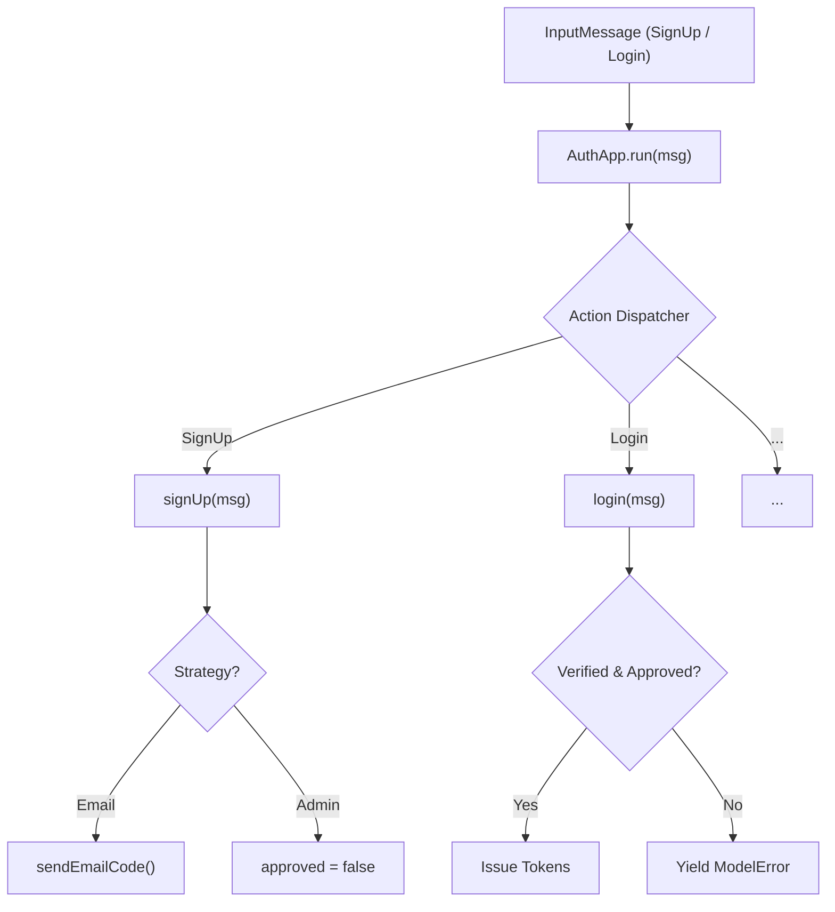

# Seed: Auth App & Access Logic (v1.4.0)

## 1. Сутність та Мета

`auth.app` — універсальне ядро автентифікації та контролю доступу. 
Замість успадкування від застарілого `App`, воно базується безпосередньо на `Model` (`@nan0web/types`), що забезпечує повну ізоляцію логіки та підтримку **Model-as-Schema**.

**Поліморфний Диспетчер**: 
Основний інтерфейс взаємодії — метод `run(msg)`. Він автоматично маршрутизує вхідні доменні повідомлення (напр. `SignUpMessage`) на відповідні методи логіки.

## 2. Model-as-Schema (Схема Даних)

### UserAccount (extends Model)
- `verified` (boolean) — чи підтверджено ідентичність (email/did)
- `approved` (boolean) — чи схвалено аккаунт адміністратором (потрібно для закритих спільнот)
- `soulId` (string) — суверенний ідентифікатор

### AuthConfig (extends Model)
- `verificationFlow` (`email-only`|`admin-only`|`email+admin`) — стратегія вступу
- `passwordMinLength` (number) — валідація пароля
- `allowPublicSignup` (boolean) — чи дозволена самостійна реєстрація

## 3. Каркас Роботи (Діаграма)

## 4. Генератор (Flow)

### AuthApp (v1.4.0 — поточний етап)

1. ✅ `base`: Переведено на `extends Model` (відмова від `@nan0web/types`)
2. ✅ `dispatcher`: Впроваджено `run(msg)` з автоматичним рутингом
3. ✅ `strategies`: Додано підтримку `verificationFlow` та статусу `approved`
4. ✅ `error`: Переведено на `ModelError` для UI-автоматизації
5. ✅ `docs`: Оновлено `README.md.js` з прикладами стратегій

### Майбутні плани (v1.5.0)

1. 🔴 `web`: Lit/React адаптери для форм на базі доменних схем
2. 🔴 `roles`: Впровадження ієрархічних ролей (admin, moderator, user)
3. 🔴 `audit`: Глобальний лог дій користувачів (AuditTrail)

## 5. User Stories

Детальний список: [user-stories.md](./user-stories.md)
Архітектурний маніфест: [project.md](./project.md)
