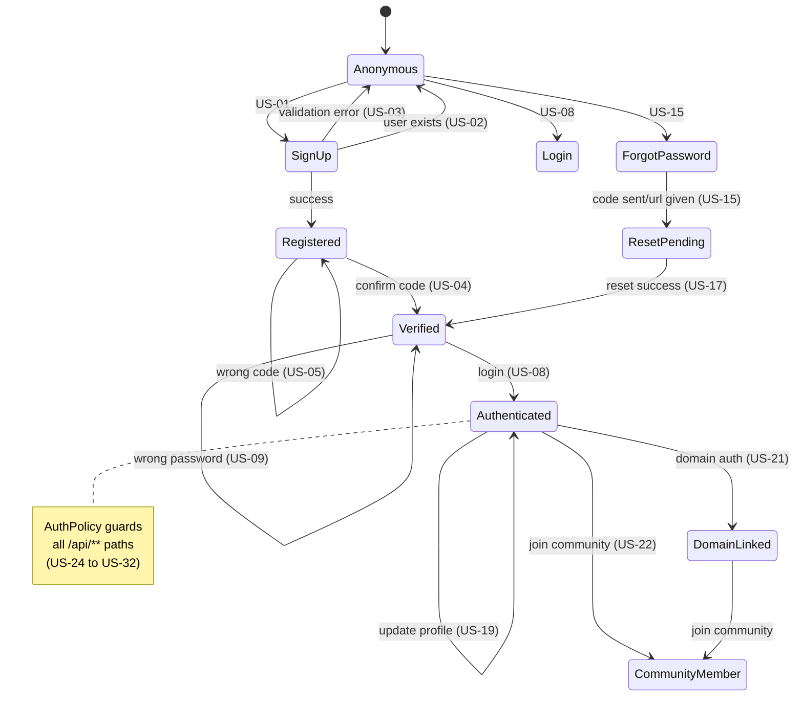

# User Stories — auth.app

> Кожна Story має бути підкріплена тестом (`*.story.js`).
> Сценарії охоплюють весь життєвий цикл: реєстрація → автентифікація → авторизація → захист → відновлення.

---

## 🔐 Реєстрація (Sign Up)

### US-01: Успішна реєстрація нового користувача
**Як** новий відвідувач,
**я хочу** зареєструватися з email, username та паролем,
**щоб** отримати код підтвердження на пошту.

### US-02: Реєстрація з існуючим username
**Як** новий відвідувач,
**я хочу** побачити повідомлення "User already exists",
**коли** я вводжу username, який вже зайнятий.

### US-03: Реєстрація з невалідними даними
**Як** новий відвідувач,
**я хочу** побачити помилки валідації,
**коли** мій email некоректний, пароль занадто короткий або username має недопустимі символи.

---

## ✅ Підтвердження (Confirm Sign Up)

### US-04: Успішне підтвердження акаунту
**Як** зареєстрований користувач,
**я хочу** ввести код підтвердження,
**щоб** активувати акаунт і отримати access + refresh токени.

### US-05: Підтвердження з невірним кодом
**Як** зареєстрований користувач,
**я хочу** побачити "Invalid confirmation code",
**коли** я ввожу неправильний код.

---

## 🔑 Вхід (Login)

### US-08: Успішний вхід
**Як** верифікований користувач,
**я хочу** ввести identifier (username або email) та пароль,
**щоб** отримати access + refresh токени.

### US-09: Вхід з невірним паролем
**Як** верифікований користувач,
**я хочу** побачити "Invalid credentials",
**коли** мій пароль неправильний.

### US-10: Вхід з неверифікованим акаунтом
**Як** зареєстрований (але неверифікований) користувач,
**я хочу** побачити "Account not verified",
**коли** я намагаюся увійти.

### US-11: Вхід з неіснуючим identifier
**Як** будь-хто,
**я хочу** побачити "Invalid credentials",
**коли** я ввожу неіснуючий username/email (без витікання інформації про існування акаунту).

---

## 🔄 Оновлення Token (Refresh)

### US-12: Успішне оновлення токена
**Як** авторизований користувач,
**я хочу** оновити access token через refresh token,
**щоб** продовжити сесію.

### US-13: Оновлення з невалідним refresh token
**Як** будь-хто,
**я хочу** побачити "Invalid refresh token",
**коли** refresh token не розпізнаний.

### US-14: Ротація refresh token
**Як** авторизований користувач,
**після** успішного refresh,
**я очікую** що старий refresh token буде відкликаний, а новий виданий.

---

## 🔓 Відновлення пароля (Forgot/Reset Password)

### US-15: Запит на скидання пароля
**Як** користувач, що забув пароль,
**я хочу** ввести username,
**щоб** отримати лінк для відновлення на email/власний сайт (без витоку даних про існування юзера чи його відсутність — для зловмисника відповідь завжди однакова).

### US-16: Скидання з невірним кодом
**Як** користувач,
**я хочу** побачити "Invalid reset code",
**коли** код скидання неправильний.

### US-17: Успішне скидання пароля
**Як** користувач з кодом скидання,
**я хочу** встановити новий пароль,
**щоб** отримати нові access + refresh токени.

### US-18: Скидання з очисткою попередніх токенів
**Як** користувач (при увімкненому `clearTokensOnPasswordReset`),
**після** скидання пароля,
**я очікую** сигналізацію про те, що всі інші сесії закінчені і всі попередні токени стають невалідними.

---

## 📝 Оновлення профілю (Update Info)

### US-19: Успішне оновлення профілю
**Як** авторизований користувач,
**я хочу** оновити свій avatar або bio,
**щоб** персоналізувати та зберегти зміни свого профілю (без дозволу змінювати username, щоб уникнути витоків або колізій).

---

## 🌐 Авторизація через власний сайт (Domain Auth / Soul ID)

### US-21: Авторизація через власний вебсайт
**Як** користувач,
**я хочу** авторизуватися через свій власний вебсайт (домен) подібно до імейлу,
**щоб** підтвердити та використовувати свою суверенну цифрову ідентичність.

### US-22: Реєстрація з членством у спільноті (через домен)
**Як** новий відвідувач свого власного домену,
**я хочу** прив'язати його і одразу отримати членство у спільноті "willni",
**щоб** мати доступ та зв'язати ідентичність зі спільнотою.

---

## 🛡 AuthPolicy (URL Access Control)

### US-24: Захищений шлях вимагає автентифікації
**Як** Middleware,
**я хочу** перевірити `AuthPolicy.isProtected('/api/users')` → `true`,
**щоб** заблокувати неавторизований доступ.

### US-25: Публічний шлях завжди доступний
**Як** Middleware,
**я хочу** перевірити `AuthPolicy.isProtected('/api/health')` → `false`,
**щоб** публічні ендпоінти працювали без токена.

### US-26: Публічний шлях перевизначає захищений
**Як** Middleware,
**коли** шлях `/api/health` одночасно у `protectedPaths` (через `['/api/**']`) та `publicPaths`,
**я очікую** що `isProtected` поверне `false` (public wins).

### US-27: Незахищений шлях поза правилами
**Як** Middleware,
**я хочу** перевірити `AuthPolicy.isProtected('/public/page')` → `false`,
**щоб** шляхи поза `protectedPaths` залишались відкритими.

### US-28: Glob matching — покриває глибину та сегменти
**Як** Middleware,
**я хочу** перевірити `AuthPolicy.isProtected('/api/v2/users/123')` → `true` для патерну `['/api/**']`, 
а для патерну `['/*/users']` очікую що спрацює лише `/api/users`, а не `/api/v2/users`,
**щоб** мати гнучкий контроль над роутингом (де `**` це будь-яка глибина, а `*` це лише один сегмент).

### US-32: AuthPolicy — кастомна стратегія
**Як** розробник,
**я хочу** створити екземпляр `AuthPolicy` зі стратегією `apikey`,
**щоб** підтримувати API Key автентифікацію замість JWT чи сесій.

---

## 🖥 CLI (Interactive)

### US-33: Вибір дії з меню
**Як** адміністратор,
**я хочу** запустити CLI і вибрати дію із інтерактивного меню,
**щоб** керувати автентифікацією через термінал.

### US-34: Реєстрація через CLI форму
**Як** адміністратор,
**я хочу** заповнити форму реєстрації (email, username, password) у CLI,
**щоб** зареєструвати нового користувача інтерактивно.

### US-35: Валідація полів у CLI в реальному часі
**Як** адміністратор,
**я хочу** бачити помилки валідації при введенні кожного поля,
**щоб** виправити дані до відправки.

---

## 🔌 App-in-App Integration

### US-36: Реєстрація auth.app як модулю
**Як** розробник host-додатку,
**я хочу** викликати експорт з `src/ui-api/index.js` (зареєстрований також в `package.json` або `nano.web` конфізі),
**щоб** вбудувати маршрути і логіку авторизації в свій додаток як стандартний модуль екосистеми.

### US-37: Кастомний prefix для API
**Як** розробник,
**я хочу** вказати `{ api: { prefix: 'my-auth' } }`,
**щоб** маршрути авторизації мали свій ізольований namespace.

---

## 📊 Діаграма сценаріїв

