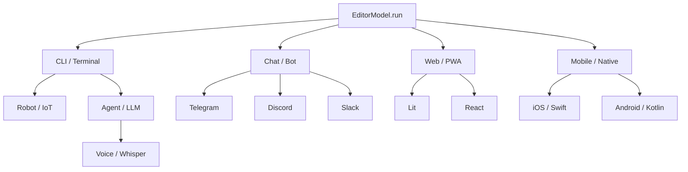

# 🔀 Поліморфізм (Polymorphism)

> Одне джерело правди — багато інтерфейсів: CLI, Web, Chat, Voice, Robot.

---

## Визначення

Поліморфізм у NaN•Web означає, що **доменна логіка** (`EditorModel`, `Document`) існує незалежно від способу взаємодії з користувачем. Один і той самий `model.run()` породжує потік інтентів (`ask`, `show`, `progress`), які кожен адаптер інтерпретує по-своєму.

## Ієрархія інтерфейсів

Ми виділяємо 5 рівнів взаємодії, від найбільш "сирих" до візуальних:

### Рівень 1: CLI / Термінал / Робот (Низькорівневий)

Пряма взаємодія з доменною моделлю через потоки введення/виводу.

- **Сценарій**: Системний адміністратор або робот-контролер.
- **Flow**: Послідовний (одне поле за раз).

### Рівень 2: LLiMo Chat (Агентний)

Інтерфейс над терміналом, що використовує LLM для інтерпретації інтентів.

- **Сценарій**: Користувач спілкується з AI-асистентом для виконання дій.
- **Flow**: Послідовний діалог.

### Рівень 3: Voice / Голос (Whisper/TTS)

Інтерфейс над чатом, де введення здійснюється через голос, а виведення — через синтез мовлення.

- **Сценарій**: Водій або оператор з вільними руками.
- **Flow**: Послідовний, керований голосом.

### Рівень 4: Mobile / Swift (Нативний)

Пряма нативна взаємодія без посередників.

- **Сценарій**: Журналіст у дорозі.
- **Flow**: Паралельний/Гібридний (візуальні форми).

### Рівень 5: Web / Lit / React (Візуальний)

Найбільш насичений UX з анімаціями та складними графами.

- **Сценарій**: Контент-менеджер у офісі.
- **Flow**: Паралельний (редагування всієї форми одночасно).

## Особливості взаємодії

### Послідовне vs Паралельне (Sequential vs Parallel)

1. **Sequential (CLI, Chat, Voice)**:
   Система запитує значення по черзі. Валідація відбувається для кожного поля миттєво. Якщо значення невірне, система повторює запит саме для цього поля.
2. **Parallel (Web, Mobile)**:
   Користувач бачить всі поля одночасно. Валідація може відбуватися в реальному часі для всіх полів паралельно, підсвічуючи помилки в різних частинах інтерфейсу.

## Принцип "Жодного if для UI"

Доменна модель **ніколи** не знає про рівень інтерфейсу. Вона лише генерує інтенти. Адаптер відповідного рівня вирішує, як обробити потік:

- Адаптер Рівня 1 виведе `Question: [Title]`.
- Адаптер Рівня 2 запитає AI: "Попроси користувача ввести заголовок".
- Адаптер Рівня 5 відрендерить `<input type="text">`.

## Аналоги в індустрії

| Платформа      | Підтримувані інтерфейси              | Поліморфізм          |
| :------------- | :----------------------------------- | :------------------- |
| **VS Code**    | Web, Desktop                         | Частковий (Electron) |
| **Salesforce** | Web, Mobile, API                     | Високий              |
| **Odoo**       | Web, POS Terminal                    | Середній             |
| **NaN•Web**    | CLI, Web, Chat, Voice, Robot, Mobile | Максимальний         |
