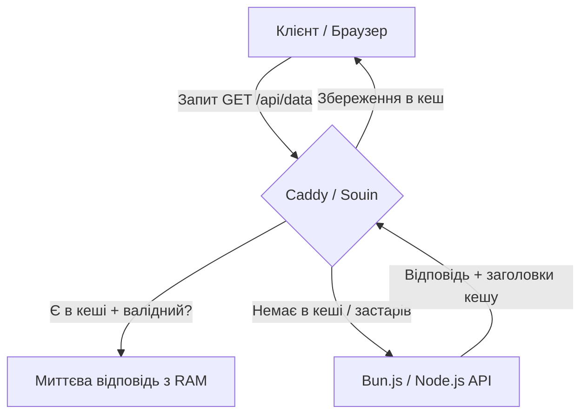

# Архітектура кешування та оптимізації в hosting.app

Цей документ описує стратегію оптимізації доставки контенту за допомогою інтеграції веб-сервера Caddy (модуль кешування **Souin**) та прикладного рівня API (Bun.js / Node.js).

---

## 1. Загальна схема кешування



---

## 2. HTTP-заголовки керування кешем

Для координації роботи Caddy та нашого прикладного API використовуються стандартні RFC 7234 заголовки:

### A. Часове кешування (Time-To-Live)
Використовується для контенту, який змінюється нечасто (наприклад, статті, каталоги товарів).
* **Специфікація заголовка:**
  ```http
  Cache-Control: public, max-age=180
  ```
  *Поведінка:* Caddy кешує відповідь на 180 секунд (3 хвилини). Запити від користувачів не доходять до бекенду.

### B. Повний обхід кешу (Bypass)
Використовується для фінансових транзакцій, авторизації, балансу користувача.
* **Специфікація заголовка:**
  ```http
  Cache-Control: no-store, no-cache, must-revalidate, private
  ```
  *Поведінка:* Caddy ніколи не зберігає відповідь і завжди перенаправляє запит на бекенд.

### C. Валідація за версією (ETag)
Використовується для даних, які оновлюються непередбачувано, але потребують економії трафіку.
* **Перша відповідь сервера:**
  ```http
  ETag: "w/33a64df55142"
  Cache-Control: public, no-cache
  ```
* **Наступний запит клієнта через Caddy:**
  ```http
  If-None-Match: "w/33a64df55142"
  ```
* **Поведінка:** Якщо дані не змінилися, API повертає порожній статус `304 Not Modified`, а Caddy віддає закешований контент.

---

## 3. Динамічна інвалідація через Cache-Tags

Для миттєвого скидання кешу при оновленні бази даних (наприклад, додавання нової новини) без очікування закінчення `max-age`:

1. **Маркування відповідей (API -> Caddy):**
   Кожен динамічний запит маркується специфічними тегами:
   ```http
   Cache-Tags: news-list, main-page
   ```
2. **Запит на очищення (API -> Caddy):**
   При зміні даних у БД API надсилає запит очищення до Caddy API:
   ```http
   PURGE /
   Invalidate-Tags: news-list
   ```
3. **Результат:** Caddy миттєво видаляє з пам'яті всі закешовані сторінки, що містили тег `news-list`.

---

## 4. Оптимізація запитів та масштабування користувачів

При розрахунку на **100 000+ активних користувачів**:
* Якщо 1 користувач робить в середньому 1 запит кожні 10 секунд, сумарне навантаження на сервер складе **10 000 RPS**.
* Наш стек (Caddy + Bun.js) забезпечує до **120 000 закешованих RPS** та **70 000+ динамічних RPS**, що дає запас міцності у 7-12 разів.

### Правила мінімізації запитів (Request Reduction Rules)
1. **Агресивне кешування статики:** Усі CSS, JS, шрифти та картинки повинні обслуговуватися із заголовком `Cache-Control: public, max-age=31536000, immutable`.
2. **Stale-While-Revalidate:** Дозволяє Caddy миттєво віддати клієнту злегка застарілий кеш, одночасно роблячи асинхронний фоновий запит на оновлення до Bun API. Це усуває проблему пікового навантаження при одночасному закінченні терміну кешу (Cache Stampede).
3. **Пакетування запитів (Request Batching):** Клієнтський UI (Lit/React) має об'єднувати дрібні запити стану в один батч-запит до API, зменшуючи кількість HTTP-з'єднань.

---

## 5. Обробка надвеликих вкладень у пошті (2-3 ГБ)

Головний ризик при отриманні листів з вкладеннями на 2–3 ГБ — вихід сервера з ладу через нестачу пам'яті (Out Of Memory / OOM) на VPS з 2 ГБ RAM.

### Як системи обробляють великі вкладення без перевантаження RAM:
1. **Потокова передача на диск (Streaming to Disk):**
   Postfix та Dovecot **не завантажують весь лист в оперативну пам'ять**. Вони читають вхідний потік (SMTP-трансляцію) частинами (chunk-by-chunk) і відразу записують дані у тимчасові файли на диск (`/var/spool/postfix/` та Maildir). Споживання RAM залишається стабільним (кілька мегабайт).
2. **Сканування Rspamd:**
   Антивіруси та спам-фільтри (Rspamd) мають ліміт `max_size` (зазвичай 10–50 МБ). Rspamd автоматично пропускає глибокий аналіз тіла листа, якщо його розмір перевищує ліміт, запобігаючи CPU-блокуванню.

### Рекомендована архітектурна стратегія для надвеликих файлів:
Надсилання файлів розміром понад 50 МБ електронною поштою є антипатерном (через 33% оверхед Base64 кодування). 
У NaN•Panel для цього використовується інтеграція з сервісом збереження файлів (`share.app`):
* Клієнт завантажує файл на сховище (наприклад, через S3-сумісне сховище або локальний диск), а в лист автоматично вставляється захищене одноразове посилання для скачування.

