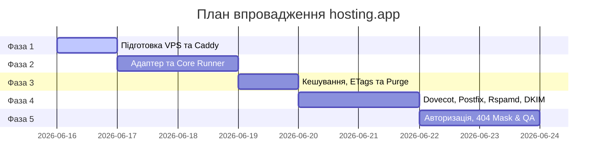

# План розробки та впровадження hosting.app (NaN•Panel)

Цей документ описує покроковий план створення, налаштування та розгортання суверенної панелі керування сервером на базі Caddy, Bun.js та SQLite.

---

## 📅 Загальний графік (Роадмап)

Загальний час реалізації: **7 робочих днів (56 годин)**.

---

## 🛠️ Детальний опис фаз та трудовитрат

### Фаза 1: Базове оточення та встановлення Caddy
* **Час:** 1 робочий день (8 годин)
* **Завдання:**
  * Оренда та базова безпека нового VPS (Firewall, SSH-ключі, ліміти ресурсів).
  * Збірка Caddy за допомогою `xcaddy` з додатковими плагінами (Cloudflare DNS для wildcard-сертифікатів, Souin для кешу).
  * Первинне налаштування автозапуску Caddy через systemd.
  * Тестування ручного створення хостів.

### Фаза 2: Створення WebServerAdapter та Core Runner
* **Час:** 1.5 робочих дні (12 годин)
* **Завдання:**
  * Реалізація базового класу `BaseWebServerAdapter` та конфігу для Caddy (`CaddyServerAdapter.js`).
  * Інтеграція `@nan0web/db-fs` для збереження стану хостів у плоских YAML-файлах (0 МБ споживання пам'яті в простої).
  * Розробка логіки генератора `async *run()`, який зчитує вхідні дані за схемою `WebDomainSchema` та автоматично оновлює конфіги через API Caddy.

### Фаза 3: Інтеграція кешування (ETags, TTL, Purge)
* **Час:** 1 робочий день (8 годин)
* **Завдання:**
  * Налаштування блоку `cache` у Caddyfile (через Souin).
  * Реалізація сервісу генерації `ETag` (на базі хешування вмісту відповідей Bun API).
  * Створення роуту `/purge` в API та механізму надсилання тегів `Cache-Tags`/`Invalidate-Tags` для миттєвого скидання кешу.
  * Написання контрактних тестів на перевірку кешування (TDD).

### Фаза 4: Поштовий сервер та DKIM оркестрація
* **Час:** 2 робочих дні (16 годин)
* **Завдання:**
  * Встановлення та інтеграція Postfix (SMTP), Dovecot (IMAP) та Rspamd (Spam Filter) з базою SQLite.
  * Автоматизація створення системних директорій `/www/vmail/[domain]` та користувача `vmail`.
  * Реалізація автоматичної генерації DKIM-ключів та додавання їх у конфігурацію Rspamd за допомогою скрипта в Runner.
  * Тестування відправки та отримання пошти.

### Фаза 5: Безпека та фінальне тестування (QA)
* **Час:** 1.5 робочих дні (12 годин)
* **Завдання:**
  * Налаштування безпечного входу в панель за секретним унікальним URL, маскування решти запитів під помилку `404 Not Found`.
  * Інтеграція авторизаційного шару з `auth.app`.
  * Запуск E2E тестів (Playwright) для перевірки створення веб-хостів та пошти через панель.
  * Здача проєкту.
