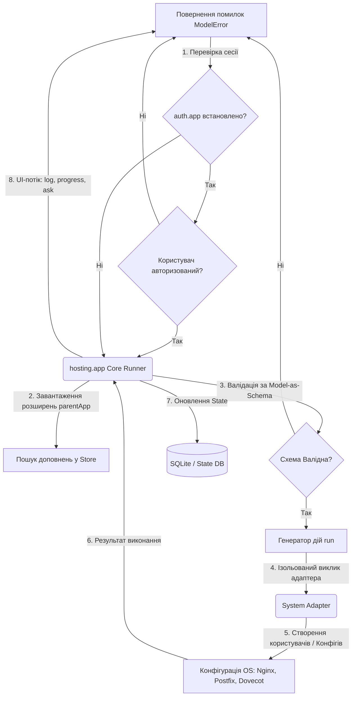

# Seed: hosting.app (Суверенна Панель Керування Сервером)

## 1. Сутність та Мета
**hosting.app** — це суверенний додаток для оркестрації серверних ресурсів (веб-хостинг, поштовий сервер, керування файлами та CDN) на базі архітектурного шаблону **NaN•Web Universal**. Замість монолітної та вразливої логіки традиційних панелей (як-от aaPanel), додаток реалізує концепцію **One Logic — Many UI (OLMUI)**: єдине ядро конфігурації (Runner) керується через вебінтерфейс (у рамках `editor.app`), командний рядок CLI (`@nan0web/ui-cli`) або через агента штучного інтелекту (CnAI-інтерфейс), забезпечуючи повну ізоляцію логіки (Total Logic Isolation) та декларативне моделювання (Model-as-Schema).

### Розширюваність та Авторизація (Parent-App / Extension)
Додаток підтримує модульну та безпечну екосистему:
1. **Базова Авторизація**: Якщо в системі активовано додаток `auth.app`, користувач обов'язково проходить авторизацію перед доступом до панелі.
2. **Розширення (Extensions)**: `hosting.app` є батьківським додатком (**Parent App**). Додаткові специфічні плагіни (наприклад, поштовий клієнт `mail.app`, бекапи тощо) встановлюються з магазину додатків `nan0web.app Store` і реєструються в системі лише якщо в їхньому маніфесті вказано залежність `parentApp: "hosting.app"`.

---

## 2. Model-as-Schema (Схема Даних)

Логіка додатка описується чотирма основними схемами даних. Кожна схема є джерелом правди для автоматичної генерації інтерфейсів введення та перевірки.

### A. WebDomainSchema (Керування Веб-сайтами)
- `domain` (string, валідація FQDN, підказка UI: text, placeholder: "example.com")
- `root` (string, коренева папка сайту на сервері, підказка UI: text, placeholder: "/www/wwwroot/example.com")
- `active` (boolean, підказка UI: toggle, за замовчуванням: true)
- `ssl_provider` (select: ["None", "Let's Encrypt", "Self-Signed"], підказка UI: select)
- `proxy_port` (integer, внутрішній порт бекенд-додатка, наприклад Node.js/Go на порту 3000 або 8080. Зовнішні SSL-порти 80/443 прослуховуються веб-сервером автоматично. Підказка UI: number, min: 80, max: 65535)

### B. MailServerSchema (Налаштування Пошти)
- `mail_domain` (string, валідація FQDN, підказка UI: text)
- `dkim_selector` (string, селектор DKIM, підказка UI: text, за замовчуванням: "default")
- `dkim_key_size` (select: ["1024", "2048"], підказка UI: radio)
- `spam_filter_active` (boolean, інтеграція з Rspamd, підказка UI: toggle)

### C. MailboxSchema (Керування Поштовими Скриньками)
- `domain` (string, референс до домену поштової системи, підказка UI: select)
- `mailbox_username` (string, назва скриньки, підказка UI: text, suffix: "@[domain]")
- `mailbox_password` (string, підказка UI: password)
- `quota_bytes` (bigint, розмір диска в байтах, підказка UI: slider, min: 100MB, max: 50GB)
- `forward_to` (string, переадресація, підказка UI: text, optional: true)

### D. CdnSyncSchema (Налаштування CDN та Кешування)
- `cdn_provider` (select: ["Cloudflare", "BunnyCDN", "Local Static"], підказка UI: select)
- `api_token` (string, секретний токен провайдера, підказка UI: password)
- `proxied` (boolean, проксіювання трафіку через CDN, підказка UI: toggle)

---

## 3. Каркас Роботи (Діаграма)

Логіка взаємодії між клієнтом (CLI/Web/CnAI), ранером та операційною системою побудована за принципом ізольованого конвеєра:

---

## 4. Генератор (Flow)

Життєвий цикл ранера реалізований через асинхронний генератор `async *run(state)`:

1. **`yield progress("init", "Перевірка середовища сервера...")`**
   - Перевірка прав root, наявності системних сервісів (Nginx, Postfix, Dovecot, Rspamd).
2. **`yield ask(WebDomainSchema)`**
   - Запит параметрів нового домену. На основі схеми UI автоматично рендерить форму.
3. **`yield progress("validate", "Перевірка DNS-записів домену...")`**
   - Перевірка A-запису домену перед налаштуванням.
4. **`yield progress("system", "Створення конфігураційного файлу веб-сервера...")`**
   - Запис конфігу Nginx/Caddy через ізольований адаптер.
5. **`yield progress("ssl", "Генерація сертифікату SSL...")`**
   - Запуск клієнта Acme для отримання Let's Encrypt.
6. **`yield progress("db", "Запис домену в базу даних...")`**
   - Реєстрація домену в системній SQLite базі.
7. **`yield log("Домен приєднано та налаштовано успішно.")`**

---

## 5. Сценарії Користувача (User Stories)

Усі сценарії використання детально розписані у файлі [user-stories.md](./user-stories.md), який містить 20 канонічних історій для автоматизованого тестування інтерфейсу (Story Testing).
