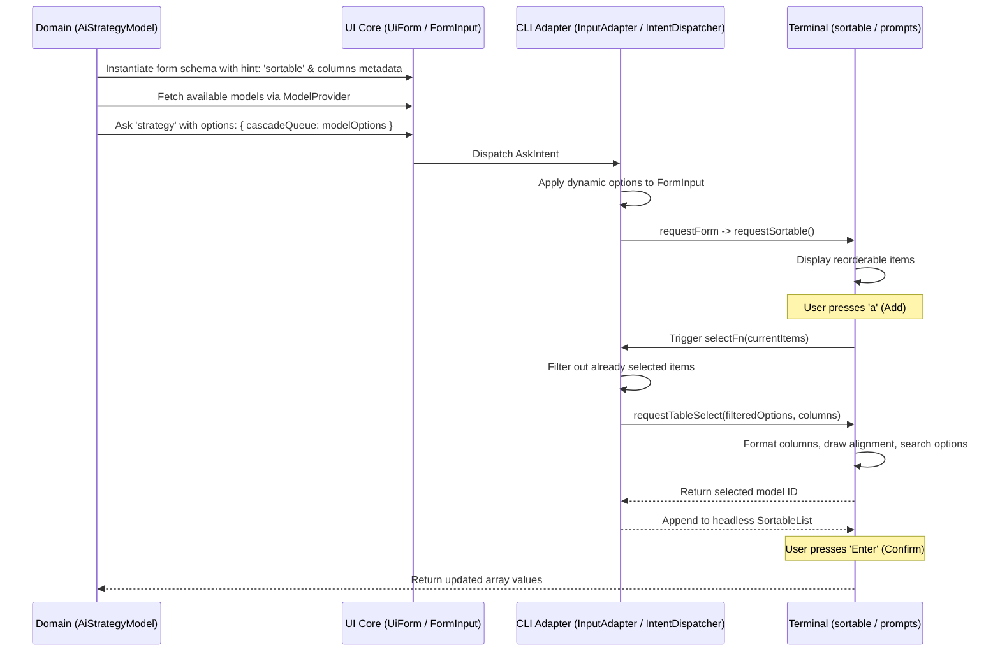

# Implementation Plan: Decoupling Llimo CLI Strategy Configuration

This plan details the platform-agnostic architecture and integration steps to enable interactive AI strategy configuration via terminal-agnostic schemas and OLMUI.

---

## 1. Architectural Design & Logic Isolation

To respect the **One Logic — Many UIs (OLMUI)** paradigm, the domain layer (`llimo.app`) must remain completely unaware of the rendering mechanics of the CLI terminal.

### Key Principles
- **No CLI imports in domain**: All database, model fetching, and i18n logic inside `apps/llimo.app` is pure, platform-independent ES modules.
- **Declarative schemas**: Fields describe their layout characteristics (`hint: 'sortable'`) and custom attributes (`selectHint: 'table-select'`, `columns: [...]`) declaratively.
- **Dynamic Options Ingestion**: Options fetched by the model run generators are passed to `ask()` at runtime. The CLI dispatcher interceptor overrides the statically-generated field configurations with these options before prompting.

---

## 2. Completed Steps

1. **Headless SortableList Mutations**:
   - Implemented `addItem(item, index)`, `removeItem(index)`, and `updateItem(index, item)` in `@nan0web/ui/Component/SortableList`.
   - Verified these mutations with comprehensive unit tests (`packages/ui/src/test/releases/1/3/v1.3.0/task.test.js`).

2. **Form Engine Support for Sortable**:
   - Added `SORTABLE: 'sortable'` to `FormInput.TYPES` in `@nan0web/ui` to prevent type validation errors on custom schemas.
   - Updated `generateForm` to preserve `'sortable'` field hints.
   - Injected the `sortable` handler into the CLI `Form` interpreter, enabling inline rendering of the sortable prompt during form walks.

3. **Dynamic Options Interception**:
   - Added support to `IntentDispatcher.js` to process `options` passed to the `ask()` intent, allowing dynamic injection of list selection choices at runtime.

---

## 3. Pending Implementation Tasks

### Task A: Table-Select Prompt (`packages/ui-cli`)
- [x] Implement `requestTableSelect(config)` in `InputAdapter.js`.
  - Calculate column widths dynamically based on maximum lengths of header labels and value fields.
  - Render a clean table header and column separator lines (e.g. `Model.ID │ Context │ Provider`).
  - Pass aligned, padded text choices to standard `prompts` autocomplete.

### Task B: Keyboard Shortcut Integration in `sortable.js`
- [x] Update `packages/ui-cli/src/ui/impl/sortable.js` and its wrapper `prompt/Sortable.js` to:
  - Intercept `'a'` key: call the injected `selectFn(currentItems)` to present options, retrieve the selection, and invoke `model.addItem()`.
  - Intercept `'d'`, `Backspace` (`\x7f`), and `Delete` (`\x1b[3~`) keys: call `model.removeItem(cursor)`.
  - Re-enable the standard input raw mode after interactive selection prompts return.

### Task C: Domain Schema and Form Wiring (`llimo.app`)
- [x] Define columns metadata and `hint: 'sortable'` on `AiStrategyModel.cascadeQueue`.
- [x] Update `StrategyEditModel.run()` to fetch the full model index from `ModelProvider`, map properties to table columns, and pass them as options overrides.

---

## 4. Verification and Testing Strategy

1. **Unit Testing**:
   - Ensure the headless state transitions (add/remove/move) remain 100% correct.
2. **Snapshot Testing**:
   - Verify that the new CLI `Form` flow can be mocked and executed inside the CLI snapshot test harness (`packages/ui-cli/play/main.js` and snapshot specs).
3. **Execution Verification**:
   - Run `llimo strategy` command interactively to verify the keyboard handling, searching, alignment, and saving.
