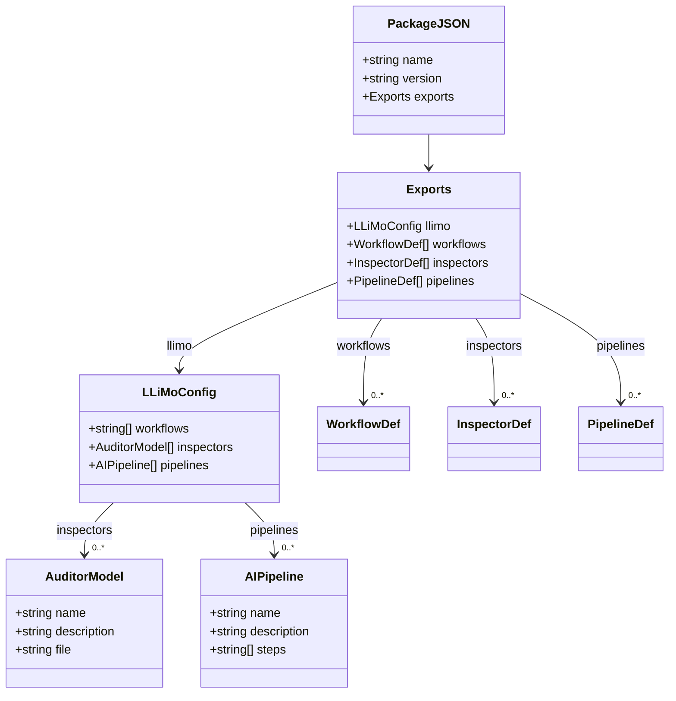
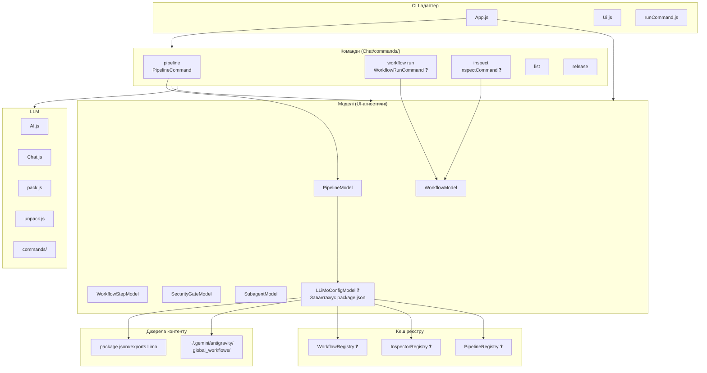
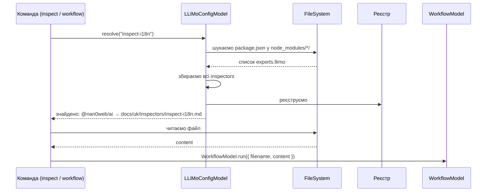
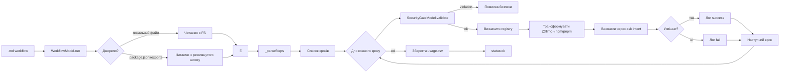
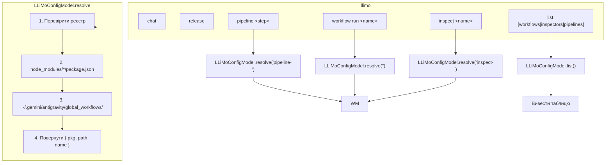
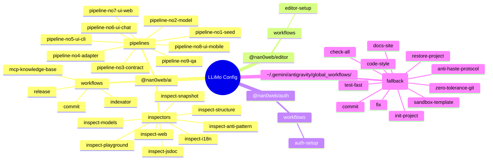
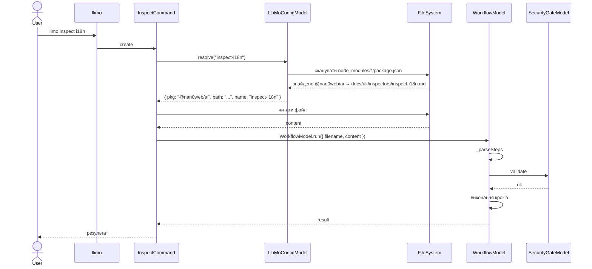

# LLiMo Application — Архітектурний план v2

## 1. Принципи

1. **OLMUI (One Logic Multiple UI)** — вся логіка виконується через моделі, без прив'язки до UI (CLI, Chat, VSCode — це лише адаптери).
2. **Декларативний контракт** — кожен пакет/додаток декларує свої workflows, inspectors та pipelines у `package.json`.
3. **Локальне vs глобальне** — спочатку шукаємо в `node_modules/<pkg>/`, потім у `~/.gemini/antigravity/global_workflows/`.

## 2. Контракт `package.json#exports.llimo`



**Приклад:**

```jsonc
// packages/ai/package.json
{
  "name": "@nan0web/ai",
  "exports": {
    ".": "./src/index.js",
    "./workflows": "./docs/uk/workflows/*.md",
    "./inspect": "./docs/uk/inspectors/*.md",
    "./llimo": {
      "workflows": [
        "packages/ai/docs/uk/workflows/indexator.md",
        "packages/ai/docs/uk/workflows/commit.md"
      ],
      "inspectors": [
        { "name": "inspect-i18n", "description": "Перевірка i18n", "file": "packages/ai/docs/uk/inspectors/inspect-i18n.md" },
        { "name": "inspect-models", "description": "Перевірка моделей", "file": "packages/ai/docs/uk/inspectors/inspect-models.md" }
      ],
      "pipelines": [
        { "name": "pipeline-no1-seed", "description": "Створення seed", "steps": ["seed", "model", "contract"] },
        { "name": "pipeline-full", "description": "Повний пайплайн додатка", "steps": ["seed","model","contract","adapter","cli","chat","web","mobile","qa"] }
      ]
    }
  }
}
```

## 3. Компонентна архітектура



## 4. Реєстрація та резолвінг



## 5. Потік виконання WorkflowModel (оновлений)



## 6. Команди llimo та їх контракти



## 7. Нова модель: LLiMoConfigModel

```javascript
// apps/llimo.app/src/domain/LLiMoConfigModel.js
/**
 * @typedef {Object} WorkflowDef
 * @property {string} name
 * @property {string} description
 * @property {string} file    - шлях відносно пакета
 * @property {string} pkgName - звідки взято
 */

/**
 * @typedef {Object} AuditorModel
 * @property {string} name
 * @property {string} description
 * @property {string} file
 * @property {string} pkgName
 */

/**
 * @typedef {Object} AIPipeline
 * @property {string} name
 * @property {string} description
 * @property {string[]} steps
 * @property {string} pkgName
 */

/**
 * LLiMoConfigModel — сканує package.json#exports.llimo
 * у всіх встановлених пакетах та глобальній директорії.
 * Кешує результати в реєстрі для швидкого резолвінгу.
 */
export class LLiMoConfigModel extends Model {
  // ... сканування, кешування, resolve(name), list()
}
```

## 8. Мапа пакетів та їхніх контрактів



## 9. План реалізації

### 9.1. LLiMoConfigModel
- Сканує `node_modules/*/package.json` на `exports.llimo`
- Сканує `~/.gemini/antigravity/global_workflows/`
- Методи: `resolve(name)`, `list(type)`, `register(pkgDir)`

### 9.2. Команда `inspect <name>`
- Шукає через LLiMoConfigModel.resolve(`inspect-<name>`)
- Виконує через WorkflowModel

### 9.3. Команда `workflow run <name>`
- Шукає через LLiMoConfigModel.resolve(`<name>`)
- Виконує через WorkflowModel

### 9.4. Команда `list [workflows|inspectors|pipelines]`
- Виводить всі знайдені елементи через LLiMoConfigModel.list()

### 9.5. Розширення PipelineCommand
- Читає pipeline з exports.llimo.pipelines або з файлу pipeline-<step>.md
- Використовує AI для генерації коду за описаним пайплайном

### 9.6. Реєстрація в `Chat/commands/index.js`

## 10. Типовий маршрут виконання



## 11. Залежності

| Файл | Залежить від | Призначення |
|------|-------------|-------------|
| `domain/LLiMoConfigModel.js` | `utils/FileSystem.js` | Сканування package.json |
| `domain/WorkflowModel.js` | `domain/WorkflowStepModel.js`, `domain/SecurityGateModel.js` | Виконання кроків |
| `domain/PipelineModel.js` | `domain/LLiMoConfigModel.js` | AI-пайплайн |
| `Chat/commands/inspect.js` | `domain/LLiMoConfigModel.js`, `domain/WorkflowModel.js` | Команда inspect |
| `Chat/commands/workflow-run.js` | `domain/LLiMoConfigModel.js`, `domain/WorkflowModel.js` | Команда workflow run |
| `Chat/commands/list.js` | `domain/LLiMoConfigModel.js` | Команда list |

---

_LLiMo — модельний AI-агент без прив'язки до UI._
