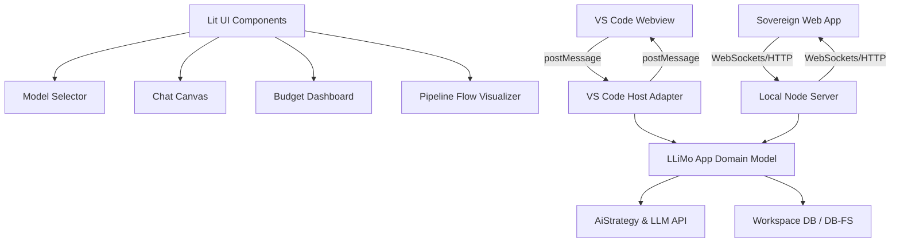

# 🗺️ Еволюція інтерфейсу LLiMo: від CLI до інтерактивного робочого простору розробника (v3.2.0)

Цей документ містить стратегічний аналіз та план впровадження інтерфейсу для `@nan0web/llimo.app` з урахуванням збереження даних у форматі `.nan0`, конвеєрної стратегії `AiStrategy`, керування розміром логів та комплексної оцінки ефективності виконання завдань.

---

## 📊 1. Порівняльний аналіз: Сучасні AI-інтерфейси розробника

Щоб зробити інтерфейс LLiMo швидким, преміальним та зручним, ми проаналізували провідні індустріальні рішення:

| Інструмент / Інтерфейс | Механізм роботи з контекстом | Виконання агентів та конвеєрів | Візуалізація та контроль витрат | Сильні сторони UI/UX |
| :--- | :--- | :--- | :--- | :--- |
| **Cursor / Continue.dev** | Автодоповнення через `@file`, `@codebase`, `@git`. | Редагування окремих файлів, виконання команд у терміналі. | Відсутня або базова статистика токенів. | Нативна інтеграція з IDE, мінімальна затримка, керування з клавіатури. |
| **Claude.ai (Web Projects)** | Завантаження файлів вручну, статичний контекст. | Одноразовий чат-цикл (панель перегляду Artifacts). | Стандартний місячний ліміт без детальних метрик запитів. | Естетичний прев'ю-рендеринг веб-компонентів. |
| **OpenClaude / Vercel AI SDK** | API keys, кастомні промпти. | Звичайний чат з редагуванням системного промпту. | Оцінка вартості токенів у реальному часі. | Мінімалістичний інтерфейс розробника з контролем параметрів генерації. |
| **LLiMo (CLI / Поточний стан)** | Парсинг меж через `FileProtocol`, аліаси `@workflow`. | Послідовні кроки конвеєру (seed → model → contract → qa). | Таблиця в терміналі з часом читання/міркування/запису та ціною запиту. | 100% локальна робота, інтеграція з тестами, повна детермінованість. |

---

## 🏗️ 2. Архітектурний шаблон: Універсальний інтерфейс OLMUI

> [!IMPORTANT]
> **Принцип ізоляції бізнес-логіки**: Всі інтерфейси UI є виключно набором візуальних Lit-компонентів. Уся бізнес-логіка, збереження сесій, підрахунок лімітів, логування статистики та керування API виконуються виключно всередині Доменних Моделей.
> **Агностичність сховища даних**: Робоче сховище проекту абстраговане через `@nan0web/db` (DB/DB-FS). Ми не зав'язуємось на локальну файлову систему, тому підключені адаптери можуть динамічно взаємодіяти як з локальним диском, так і з MemoryDB або віддаленим об'єктним сховищем (Remote Object File Storage).

Ядро інтерфейсу будується на базі **Lit Web Components** (веб-компоненти з нульовою вагою фреймворків), що забезпечує швидкість роботи та легке пакування:



---

## ⚙️ 3. Стратегії роботи з моделями: `AiStrategy`

Користувач може створювати та зберігати шаблони стратегій у вигляді надшвидких бінарних/JSONL файлів конфігурації `.nan0` у папці `.nan0web/strategies/*.nan0` (це працює **в 30 разів швидше** за класичний YAML).

### Таблиця конфігурацій `AiStrategy` для DX/UX:

| Параметр | Тип даних | Значення за замовчуванням | Опис |
| :--- | :--- | :--- | :--- |
| `cascade_queue` | Array[String] | `['gpt-oss-120b@cerebras', 'glm-4.7@cerebras', 'llama-3.3-70b@cerebras', 'grok-2@openrouter']` | Послідовний пріоритетний ланцюжок моделей для автоматичного перемикання (failover). |
| `budget_limit_usd`| Float | `2.00` | Максимальний ліміт витрат на поточну сесію / запуск конвеєру. |
| `timeout_ms` | Integer | `5000` | Максимальний час очікування відповіді від моделі перед перемиканням на наступну у черзі. |
| `failover_limit` | Integer | `3` | Максимальна кількість спроб перемикання моделей для одного запиту. |
| `retry_count` | Integer | `1` | Кількість швидких перезапусків для тієї самої моделі при мережевих помилках 5xx. |
| `fallback_codes` | Array[String] | `['429', '402', 'TIMEOUT', '503']` | Коди помилок або події, які тригерять виконання наступного кроку каскаду. |
| `concurrency_limit`| Integer | `1` | Ліміт паралельно запущених субагентів для вирішення підзадач. |
| `caching_mode` | Enum | `'persist'` | Рівень кешування відповідей моделей (`none`, `memory`, `persist`). |

---

## 📂 4. Логування та накопичення статистики: `stats.nan0`

Усі метрики виконання запитів автоматично логуються в ієрархічну файлову систему звітів у форматі `.nan0`.

### Структура збереження файлів статистики:
* Річна статистика: `~/.nan0web/logs/YYYY/stats.nan0`
* Місячна статистика: `~/.nan0web/logs/YYYY/MM/stats.nan0`
* Денна статистика: `~/.nan0web/logs/YYYY/MM/DD/stats.nan0`
* Детальні логи чату за конкретною сесією: `~/.nan0web/logs/YYYY/MM/DD/chat/ID/log*`

> [!IMPORTANT]
> **Контроль дискового простору**: Оскільки детальні логи накопичуються з часом і можуть важити гігабайти, у доменну модель логування інтегрується:
> 1. Метрика оцінки зайнятого місця на диску.
> 2. Функція ротації логів (автоматичне видалення логів старше $N$ днів).
> 3. Можливість стиснення (архівації) старих сесій на зовнішній диск та швидкого очищення (trash/purge) в один клік з інтерфейсу.

---

## 🎯 5. Ефективність виконання завдання (Task Efficiency)

Оцінка ефективності на рівні окремого запиту (Вартість / Швидкість) розширюється до **Ефективності виконання всього завдання (Task Efficiency)**. Задача в конвеєрі часто вимагає десятка запитів до різних моделей.

### Метрика ефективності завдання:

```
Ефективність Завдання = Task Success / (Total Cost * Total Time)
```

Де:
* **Task Success (Результат)** — приймає значення `1` (успішно) або `0` (помилка). Встановлюється в `1` тільки якщо згенерований код успішно проходить всі етапи компіляції, лінтування та автоматичні тести (SpecRunner).
* **Total Cost (Сумарна вартість)** — сума в доларах США, витрачена на всі запити ланцюжка моделей у межах вирішення цього завдання.
* **Total Time (Загальний час)** — загальний час роботи конвеєру в секундах (від запуску до успішного проходження тестів).

Це дозволяє порівнювати різні шаблони `AiStrategy` і виявляти найефективніший ланцюжок моделей для конкретного типу завдань.

### Таблиця аналітики параметрів `stats.nan0`:

| Параметр | Тип даних | Опис |
| :--- | :--- | :--- |
| `timestamp` | ISO String | Точний час виконання запиту. |
| `chat_id` | String | Унікальний ідентифікатор сесії чату. |
| `model_id` | String | Повна назва моделі (наприклад, `gpt-oss-120b`). |
| `provider` | String | Назва провайдера (наприклад, `cerebras`, `openrouter`). |
| `tokens_input` | Integer | Кількість вхідних токенів (контекст). |
| `tokens_output`| Integer | Кількість згенерованих вихідних токенів. |
| `duration_ms` | Integer | Загальна тривалість виконання запиту у мілісекундах. |
| `speed_tps` | Float | Швидкість генерації (tokens per second). |
| `cost_usd` | Float | Точна вартість запиту в доларах США. |
| `query_efficiency`| Float | Ефективність одного запиту (Вартість / Швидкість). |
| `task_efficiency` | Float | Комплексна ефективність виконання всього завдання. |
| `status` | Enum | Статус завершення (`success`, `429_rate_limit`, `timeout`, `error`). |

---

## 🛠️ 6. Заплановані функції, терміни та пріоритети

### Етап 1: Чат, Бюджет та AiStrategy (P0)
*Мета: Реалізувати візуальний інтерфейс чату з каскадним вибором моделей та логуванням.*

| Функція | Опис | Оцінка часу (хв) | Фактичний час (хв) | Пріоритет |
| :--- | :--- | :--- | :--- | :--- |
| **Візуальний чат (Vanilla/Lit)** | Вікно діалогу з рендерингом Markdown, підсвіткою коду та інтерактивними блоками diff на основі Lit Web Components. | 480 | 0 | **P0** |
| **Контекстний селектор (`@`)** | Автодоповнення файлів, папок чи воркфлоу при введенні символу `@` та пакування через `FileProtocol`. | 360 | 3 | **P0** |
| **Панель AiStrategy** | Візуальний вибір та конструювання ланцюжків моделей, встановлення лімітів і таймаутів. Налаштування зберігаються у `.nan0`. | 480 | 5 | **P0** |
| **Калькулятор ціни & stats.nan0** | Збереження структурованої статистики запитів із блокуванням паралельного доступу та аналітикою ефективності завдання. | 360 | 5 | **P0** |

### Етап 2: Оркестратор конвеєру та Веб-агент (P1)
*Мета: Дати можливість запускати та візуалізувати складні автономні конвеєри розробки.*

| Функція | Опис | Оцінка часу (хв) | Фактичний час (хв) | Пріоритет |
| :--- | :--- | :--- | :--- | :--- |
| **Панель кроків конвеєру** | Дашборд етапів конвеєру (seed → model → contract → qa) із кольоровими статусами та логами тестів. | 600 | - | **P1** |
| **RAG-інтеграція з `@nan0web/ai`** | Пошук у веб та автоматичне додавання знайденого контенту в окремі RAG-контейнери знань. | 480 | - | **P1** |
| **Інтерактивний перегляд змін (Diffs)** | Візуальне порівняння коду Side-by-Side перед його записом у файлову систему проекту. | 480 | - | **P1** |

---

## 🚀 7. Дорожня карта впровадження

1. **Крок 1**: Налаштувати IPC-запити в `LlimoApp.js` для отримання списку файлів проекту та запуску сесії. *(Вже зроблено!)*
2. **Крок 2**: Створити Lit-компоненти для дашборду у `/src/ui/vscode/webview-template.html`. *(Вже зроблено!)*
3. **Крок 3**: Інтегрувати селектор моделей та калькулятор бюджету у Webview IPC. *(Вже зроблено!)*
4. **Крок 4**: Реалізувати модель збереження статистики у `stats.nan0` та логіку черг `AiStrategyModel`.
5. **Крок 5**: Додати інтеграцію з `@nan0web/ai` для побудови RAG-контейнерів.
