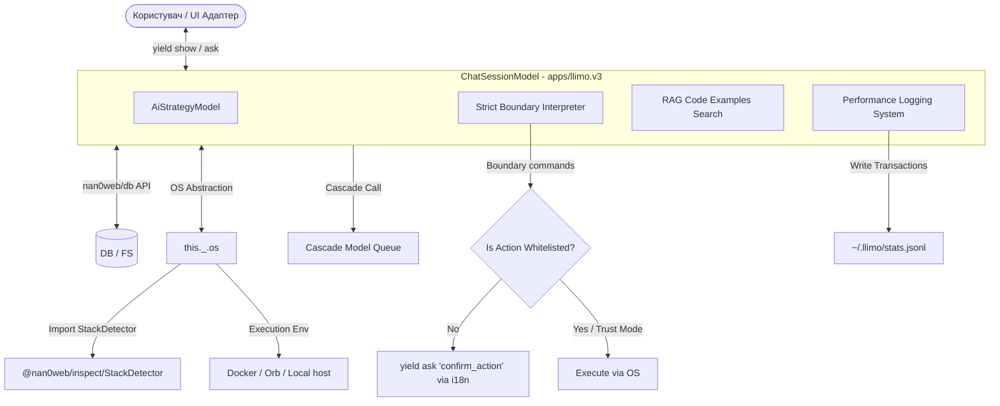

# 🏗️ Архітектурний план: OLMUI Agent Chat для llimo.v3 (Версія 4)

Цей документ описує оновлений та фіналізований архітектурний план створення нового додатку **`llimo.v3`** на базі чистих OLMUI-принципів.

---

## 1. Головні архітектурні зміни та уточнення



### 1.1. Новий додаток `apps/llimo.v3`
Створюється повністю відокремлений додаток **`llimo.v3`**, що дозволяє:
- З нуля побудувати просту, чисту OLMUI архітектуру.
- Покрити кожен доменний елемент та модель тестами перед запуском.
- Згодом безболісно перейменувати додаток та видалити стару версію.

### 1.2. Виключно Boundary формат (Відмова від Markdown виводу)
AI-моделі мають відповідати **виключно у Boundary форматі**:
- Запобігає проблемам з екрануванням вкладених блоків коду та розмітки markdown.
- Спрощує та прискорює парсинг файлових змін та команд.
- Якщо модель намагається вивести Markdown блок для файлів, парсер `Strict Boundary Interpreter` розглядає це як невалідну відповідь та просить повторити вивід у Boundary форматі.

### 1.3. Контракт розширень пакетів (`llimo.config.js`)
Динамічне підтягування розширень відбувається шляхом підключення файлу `llimo.config.js` у корені встановленого пакета.
Цей файл повинен експортувати об'єкт, що строго відповідає наступному контракту:

```javascript
/**
 * @typedef {Object} LlimoPackageExtension
 * @property {Record<string, string>} [workflows] Шляхи до workflow markdown файлів
 * @property {Record<string, typeof import('@nan0web/ui').ModelAsApp>} [inspectors] Доступні інспектори
 * @property {Record<string, typeof import('@nan0web/ui').ModelAsApp>} [tools] Доступні інструменти
 */
```

Чат-сесія аналізує `package.json` та імпортує `llimo.config.js` з кожного сумісного пакета monorepo.

### 1.4. Збереження статистики та аналітика (`~/.llimo/`)
Всі транзакції та результати виклику моделей зберігаються централізовано в `~/.llimo/stats.jsonl`:
- **Поля статистики**:
  - `modelId` / `provider` — ідентифікатори.
  - `inputTokens` / `outputTokens` — обсяги.
  - `speed` — швидкість генерації (`tokens / sec`).
  - `taskDuration` — повний час виконання завдання (`sec`).
  - `cost` — вартість виклику (`USD`).
  - `efficiency` — ефективність моделі (`cost / speed`, тобто скільки коштує одиниця швидкості генерації).

### 1.5. Нативні пакети monorepo та спрощене тестування
- **БД**: Використовуємо нативний пакет `@nan0web/db` / `@nan0web/db-fs`.
- **MockDB для тестів**: Замість створення власних Mock-обгорток, використовується стандартний клас `DB` з наперед заданими даними:
  `const db = new DB({ predefined: [ { path: 'app.js', content: '...' } ] })`.
- **StackDetector**: Використовуємо готовий `StackDetector` з `@nan0web/inspect/src/domain/StackDetector.js`.
- **i18n**: Використовуємо `@nan0web/i18n` для завантаження мовних ключів та локалізації інтерфейсних запитів (наприклад, запитів дозволу на виконання команд через `t(Model.UI.canExecute, { command })`).

---

## 2. CLI команди та Роутинг стратегій

У новому додатку `llimo.v3` роутер стратегії розробляється на базі Model-as-App з підкомандами:
- `llimo.v3 strategy list` — виклик `StrategyListModel`.
- `llimo.v3 strategy remove [pattern]` — виклик `StrategyRemoveModel`, де патерн може бути:
  - Точним ID: `llama3.1-8b@cerebras`
  - Маскою версії: `llama3.1*`
  - Провайдером: `@cerebras`
- `llimo.v3 strategy add [model]` — виклик `StrategyAddModel` з можливістю вказати позицію в черзі:
  - `--position [index]` — вставити на конкретну позицію.
  - `--before [modelId]` — вставити перед обраною моделлю.
  - `--after [modelId]` — вставити після обраної моделі.
- `llimo.v3 strategy edit` — виклик інтерактивного редактора `StrategyEditModel`.

---

## 3. Поетапний план впровадження `llimo.v3`

### 🏁 Крок 1: Створення додатку `apps/llimo.v3`
1. Ініціалізувати пустий пакет `apps/llimo.v3` з посиланням на спільні залежності monorepo (`@nan0web/db`, `@nan0web/inspect`, `@nan0web/i18n`, `@nan0web/ui-cli`).
2. Описати JSDoc-контракт для ОС-адаптера (`OSExecutor` / `this._.os`).

### ⚙️ Крок 2: Інтеграція StackDetector та БД
1. Підключити `@nan0web/inspect/StackDetector` до адаптера `this._.os`.
2. Написати базові тести, що використовують `new DB({ predefined: [] })`.

### 🛡️ Крок 3: Strictly Boundary Interpreter
1. Створити парсер, що обробляє виключно Boundary блоки (`---boundary:filename---`).
2. Додати логіку автоматичного білого списку команд та запитів схвалення `yield ask` з Late-Bound перекладами.

### 📊 Крок 4: Логування статистики у `~/.llimo/`
1. Реалізувати збереження транзакцій викликів у `~/.llimo/stats.jsonl`.
2. Додати модель `StatsReportModel` для швидкого аналізу ефективності моделей.

### 🔄 Крок 5: Cascade execution & TDD Loop
1. Створити `CascadeRunner` з інтегрованими таймаутами та `AiStrategyModel`.
2. Реалізувати TDD-цикл інкрементального тестування (unit ➡️ build ➡️ story).
