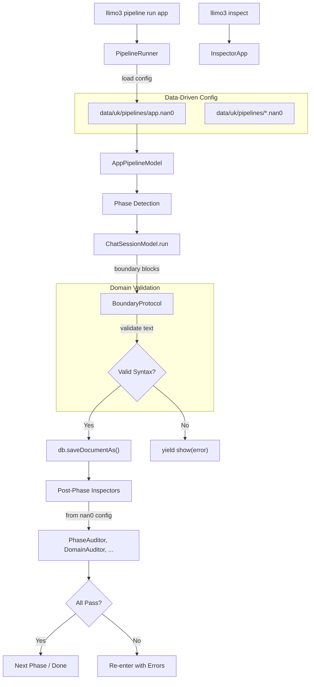

# 🚀 Mission: Pipeline + Inspectors — Data-Driven Автономна Верифікація

## 🏁 Overview (Огляд)

Привести `llimo.v3` у стан, коли можна запускати розробку через pipeline (`llimo3 pipeline run app`) з **data-driven inspectors** після кожної фази — просто й легко, навіть без LLM.

Ключові архітектурні рішення:
1. **Всі Pipeline Drivers → ModelAsApp** (OLMUI-принцип)
2. **Data-Driven конфігурація фаз** з `data/uk/pipelines/app.nan0` замість hardcoded JS
3. **Валідація тексту від LLM** — доменна відповідальність `BoundaryProtocol`, не DBFS
4. **Збереження файлів через `db.saveDocumentAs`** замість `os.writeFile`
5. **Сценарні тести через SpecRunner** + `.nan0` story файли

---

## 🏛️ Цільова Архітектура



---

## 📊 Поточний Стан (Baseline)

| Параметр | Значення |
|---|---|
| Тести | **59 pass**, 0 fail, ~1039ms |
| Pipeline drivers | `app` (AppPipeline), `logic` (LogicPipeline) — plain class, не ModelAsApp |
| Inspectors | 9 аудиторів у `@nan0web/inspect` (всі `extends AuditorModel extends ModelAsApp`) |
| `getPlatformRegistry()` | Парсить `nan0web.nan0` → збирає `{ workflows, inspectors }`, але inspectors **не виконуються** |
| Файли від LLM | Зберігаються через `os.writeFile` без валідації |
| `executeAgentCommand` | Застарілий дубль логіки Command classes |

---

## 👥 Сценарії використання (User Stories)

1. **Як розробник**, я хочу запустити `llimo3 pipeline run app`, щоб отримати 9-фазний OLMUI pipeline з автоматичним виконанням inspectors після кожної фази.
2. **Як розробник**, я хочу налаштовувати набір inspectors для кожної фази через `data/uk/pipelines/app.nan0`, без зміни JavaScript коду.
3. **Як розробник**, я хочу запустити `llimo3 inspect architecture`, щоб перевірити архітектуру проєкту без запуску повного pipeline.
4. **Як розробник**, я хочу щоб зламаний YAML/JSON від LLM не зберігався, а показувалось зрозуміле повідомлення про помилку.
5. **Як розробник**, я хочу мати сценарні тести у `.nan0` файлах через SpecRunner, які може редагувати будь-хто.

---

## ⚙️ Фаза 0: Верифікація Базового Стану

| # | Задача | Статус |
|---|---|---|
| 0.1 | `npm test` → 59/59 pass | ⬜ |
| 0.2 | `npm run build` (tsc) → clean | ⬜ |

**DoD**: Зелений `test:all`.

---

## ⚙️ Фаза 1: Видалення `executeAgentCommand` (Технічний Борг)

> Застарілий метод дублює логіку Command classes, блокує чистий контракт.

### 1.1. Видалити `executeAgentCommand` з ChatSessionModel

- **Файл**: `src/domain/app/ChatSessionModel.js`
- **Дії**: Видалити весь метод (~250 рядків)
- **НЕ чіпати**: `processRequests()`, `run()`, `packInput()`

### 1.2. Мігрувати тести на Command classes

- **Файл**: `src/domain/app/ChatSessionModel.test.js`
- **Дії**: Замінити всі `model.executeAgentCommand(...)` на `new LsCommand(model, {...})` + helper `runCommand(cmd)`

```javascript
// helper для тестів
async function runCommand(cmd) {
    const gen = cmd.run()
    let res
    while (true) {
        const { value, done } = await gen.next()
        if (done) { res = value; break }
    }
    return res
}
```

### 1.3. Верифікація

- [ ] `grep -r "executeAgentCommand" src/` — 0 результатів
- [ ] Всі тести зелені

**DoD**: Жодного `executeAgentCommand`, всі тести pass.

---

## ⚙️ Фаза 2: InspectPipeline як ModelAsApp

> Кожен pipeline driver — це `ModelAsApp`, не plain class.

### 2.1. Створити `InspectPipelineModel`

- **Файл**: `src/domain/pipeline/pipelines/InspectPipelineModel.js` (новий)

```javascript
import { ModelAsApp, show, result } from '@nan0web/ui'

export class InspectPipelineModel extends ModelAsApp {
    static alias = 'inspect'
    static UI = {
        title: '🔍 Running Inspectors',
        noAuditors: 'No auditors specified.',
    }

    static auditors = {
        help: 'Comma-separated list of auditor aliases',
        default: 'architecture',
    }

    async *run() {
        const { t } = this._
        const names = typeof this.auditors === 'string'
            ? this.auditors.split(',').map(s => s.trim()).filter(Boolean)
            : Array.isArray(this.auditors) ? this.auditors : []

        if (names.length === 0) {
            yield show(t(InspectPipelineModel.UI.noAuditors), 'warn')
            return result({ ok: false })
        }

        const { InspectorApp } = await import('@nan0web/inspect')
        const results = []

        for (const name of names) {
            const inspector = new InspectorApp(
                { command: name, dir: '.' },
                this._
            )
            const res = yield* inspector.run()
            results.push({ auditor: name, ...res })
        }

        const allOk = results.every(r => r.ok)
        return result({ ok: allOk, results })
    }
}
```

### 2.2. Рефакторинг Pipeline Drivers → ModelAsApp

- **Файли**: `AppPipeline.js` → `AppPipelineModel`, `LogicPipeline.js` → `LogicPipelineModel`
- **Зміна**: `extends ModelAsApp`, `execute()` → `run()`

### 2.3. Зареєструвати в PipelineRunner

- **Файл**: `src/domain/pipeline/PipelineRunner.js`
- **Зміна**: `inspect: InspectPipelineModel`

### 2.4. Додати InspectorApp як subcommand LlimoApp

- **Файл**: `src/domain/app/LlimoApp.js`
- **Зміна**: Додати `InspectorApp` до `command.options`

### 2.5. Тести

- [ ] InspectPipelineModel returns `result({ ok: true })` з mock context
- [ ] PipelineRunner знаходить `inspect` driver
- [ ] LlimoApp.command.options містить InspectorApp

**DoD**: `llimo3 pipeline run inspect` та `llimo3 inspect` обидва працюють.

---

## ⚙️ Фаза 3: Data-Driven Pipeline Config

> Конфігурація фаз, workflow'ів та inspectors — з nan0 data файлів, а не з JavaScript.

### 3.1. Створити pipeline config файли

- **Файл**: `data/uk/pipelines/app.nan0` (новий)

```yaml
phases:
  1-seed:
    workflows: [init-project, pipeline-no1-seed]
    inspectors: [phase]
    instructions: |
      Ви перебуваєте у Фазі 1 (SEED).
      Генеруйте ВИКЛЮЧНО: langs, release.md, package.json.

  2-model:
    workflows: [pipeline-no2-model]
    inspectors: [phase, domain]
    instructions: |
      Ви перебуваєте у Фазі 2 (MODEL).
      Напишіть доменну модель в src/domain/.

  3-contract:
    workflows: [pipeline-no3-contract]
    inspectors: [phase, domain, verification]
    instructions: |
      Ви перебуваєте у Фазі 3 (CONTRACT).
      Напишіть контрактні тести для моделі.

  4-adapter:
    workflows: [pipeline-no4-adapter]
    inspectors: [phase, domain, export]

  5-ui-cli:
    workflows: [pipeline-no5-ui-cli]
    inspectors: [phase, hygiene, export]

  6-ui-chat:
    workflows: [pipeline-no6-ui-chat]
    inspectors: [phase, hygiene]

  7-ui-web:
    workflows: [pipeline-no7-ui-web]
    inspectors: [phase, hygiene]

  8-ui-mobile:
    workflows: [pipeline-no8-ui-mobile]
    inspectors: [phase, hygiene]

  9-qa:
    workflows: [pipeline-no9-qa]
    inspectors: [architecture, hygiene, export, verification, circular]
```

### 3.2. Рефакторинг AppPipelineModel → завантаження config з DB

- **Файл**: `src/domain/pipeline/pipelines/AppPipeline.js`
- **Зміна**: Замінити hardcoded `getPhaseConfig()` (~60 рядків) на:

```javascript
async loadPhaseConfig(phase, db) {
    try {
        const config = await db.loadDocument('@data/uk/pipelines/app')
        if (config?.phases?.[phase]) return config.phases[phase]
    } catch (e) {}
    return { workflows: [], inspectors: ['phase'] }
}
```

### 3.3. Post-Phase Inspector Execution

Після `yield* chatModel.run()` — виконати inspectors із завантаженого config:

```javascript
if (options.autoVerify !== false) {
    const phaseInspectors = phaseConfig.inspectors || []
    for (const auditorName of phaseInspectors) {
        try {
            const { InspectorApp } = await import('@nan0web/inspect')
            const inspector = new InspectorApp(
                { command: auditorName, dir: cwd },
                chatOpts
            )
            yield* inspector.run()
        } catch (e) {}
    }
}
```

### 3.4. Тести

- [ ] AppPipelineModel завантажує config з mock DB
- [ ] Fallback працює якщо файл відсутній
- [ ] Config файл парситься коректно

**DoD**: Жодних hardcoded instructions у JS — все в nan0 data файлах.

---

## ⚙️ Фаза 4: Валідація тексту в BoundaryProtocol

> Валідація — доменна відповідальність парсера, не DBFS.

### 4.1. Додати syntax validation у BoundaryProtocol

- **Файл**: `src/domain/co/BoundaryProtocol.js`
- **Зміна**: Static method для перевірки що content файлу парситься:

```javascript
/**
 * Validates file content based on extension.
 * @param {string} filename
 * @param {string} content
 * @returns {{ valid: boolean, error?: string }}
 */
static validateFileContent(filename, content) {
    const ext = filename.split('.').pop()?.toLowerCase()
    try {
        if (ext === 'json') JSON.parse(content)
        if (ext === 'yaml' || ext === 'yml') YAML.parse(content)
        if (ext === 'jsonl') {
            content.split('\n').filter(Boolean).forEach(l => JSON.parse(l))
        }
        return { valid: true }
    } catch (e) {
        return { valid: false, error: e.message }
    }
}
```

### 4.2. Мігрувати `applyFileChanges` на `db.saveDocumentAs`

- **Файл**: `src/domain/app/ChatSessionModel.js` → `applyFileChanges()`
- **Зміна**: Замінити `os.writeFile(file.filename, file.content)` на:

```javascript
const validation = BoundaryProtocol.validateFileContent(file.filename, file.content)
if (!validation.valid) {
    yield show(t(ChatSessionModel.UI.syntax_error, {
        filename: file.filename,
        error: validation.error
    }), 'error')
    continue
}
const ext = '.' + (file.filename.split('.').pop() || 'txt')
await db.saveDocumentAs(ext, file.filename, file.content)
```

### 4.3. Додати UI повідомлення

```javascript
static UI = {
    // ... existing
    syntax_error: 'Синтаксична помилка в файлі {filename}: {error}',
    files_not_saved: '{count} файл(ів) з помилками не збережено',
}
```

### 4.4. Тести

- [ ] `BoundaryProtocol.validateFileContent('file.yaml', 'invalid: [yaml')` → `{ valid: false }`
- [ ] `BoundaryProtocol.validateFileContent('file.json', '{"valid": true}')` → `{ valid: true }`
- [ ] `BoundaryProtocol.validateFileContent('file.js', 'any text')` → `{ valid: true }` (JS не валідується)

**DoD**: Зламаний YAML/JSON від LLM → `yield show(error)`, файл не зберігається.

---

## ⚙️ Фаза 5: SpecRunner Сценарні Тести

> Data-driven `.nan0` stories через SpecRunner замість custom E2E тестів.

### 5.1. Створити story файли

- **Файл**: `tests/uk/inspect-pipeline.story.nan0`

```yaml
story:
  - InspectPipelineModel:
      auditors: phase
  - show: '*'
  - result:
      ok: true
```

- **Файл**: `tests/uk/pipeline-list.story.nan0`

```yaml
story:
  - PipelineListModel: {}
  - render: Alert
  - result:
      ok: true
```

### 5.2. Створити story test runner

- **Файл**: `test/stories.test.js`

```javascript
import { describe, it } from 'node:test'
import { SpecRunner } from '@nan0web/ui/testing'
import { InspectPipelineModel } from '../src/domain/pipeline/pipelines/InspectPipelineModel.js'
import { PipelineListModel } from '../src/domain/pipeline/PipelineApp.js'

const registry = { InspectPipelineModel, PipelineListModel }

describe('Pipeline Stories', () => {
    it('inspect pipeline scenario', async () => {
        await SpecRunner.executeFile(
            import.meta.dirname,
            '../tests/uk/inspect-pipeline.story.nan0',
            'default', registry
        )
    })
})
```

### 5.3. Оновити `package.json` scripts

```diff
 "scripts": {
     "test": "node --test --test-timeout=3333 'src/**/*.test.js'",
-    "test:all": "npm run test && npm run build"
+    "test:stories": "node --test --test-timeout=5000 'test/stories.test.js'",
+    "test:all": "npm run test && npm run test:stories && npm run build"
 }
```

**DoD**: `npm run test:stories` запускає nan0 scenario тести через SpecRunner.

---

## 📅 Послідовність Виконання

```mermaid
gantt
    title llimo.v3 v3.2.0 Pipeline + Inspectors
    dateFormat HH:mm
    axisFormat %H:%M

    section Phase 0
    Verify baseline           :p0, 00:00, 10min

    section Phase 1
    Remove executeAgentCmd    :p1, after p0, 60min
    Migrate tests             :p1t, after p1, 90min

    section Phase 2
    InspectPipelineModel      :p2, after p1t, 30min
    Refactor pipelines → MAA  :p2r, after p2, 30min
    CLI inspect + tests       :p2t, after p2r, 20min

    section Phase 3
    Create nan0 pipeline conf :p3, after p2t, 20min
    Refactor AppPipeline      :p3r, after p3, 30min
    Tests                     :p3t, after p3r, 15min

    section Phase 4
    BoundaryProtocol validate :p4, after p3t, 30min
    Migrate to db.saveDocAs   :p4m, after p4, 30min
    Tests                     :p4t, after p4m, 15min

    section Phase 5
    Nan0 story files          :p5, after p4t, 15min
    Story test runner         :p5t, after p5, 15min
```



---

## ✅ Acceptance Criteria (DoD)

- [ ] `executeAgentCommand` повністю видалений
- [ ] `InspectPipelineModel` є `ModelAsApp` і працює через pipeline
- [ ] `llimo3 inspect architecture` — прямий виклик аудитора через CLI
- [ ] Pipeline config завантажується з `data/uk/pipelines/app.nan0`
- [ ] Зламаний YAML/JSON від LLM → `yield show(error)`, файл не зберігається
- [ ] Файли зберігаються через `db.saveDocumentAs`, не `os.writeFile`
- [ ] SpecRunner `.nan0` story тести проходять (`npm run test:stories`)
- [ ] `npm run test:all` зелений (unit + stories + build)

---

## ⚖️ Ризики та Обмеження

| Ризик | Мітігація |
|---|---|
| `ChatSessionModel.js` — 65KB | Фаза 1 та 4 торкаються лише чітко ізольованих методів |
| `InspectorApp` потребує DB context | Передаємо з PipelineRunner через `this._` |
| Аудитори можуть мати неочікувані залежності | `try/catch` на кожен аудитор у post-phase hook |
| Зворотна сумісність при видаленні `getPhaseConfig()` | Fallback на мінімальний дефолт якщо nan0 файл відсутній |
