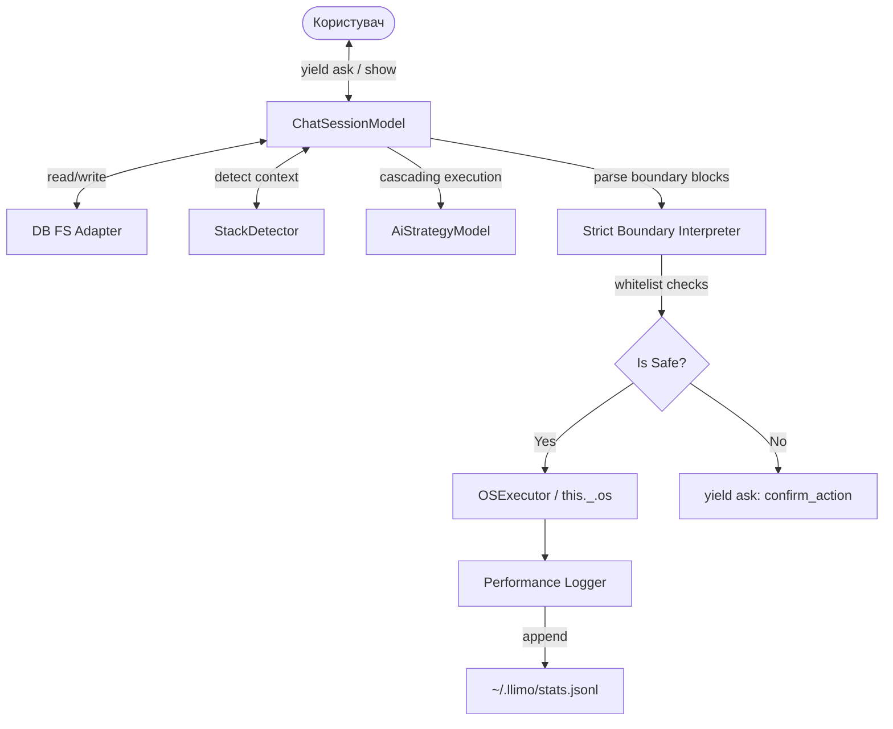

# Seed: llimo.v3

## 1. Сутність та Мета
Додаток `llimo.v3` є вдосконаленим автономним чат-агентом для розробки програмного забезпечення на базі фреймворку NaN•Web та OLMUI-принципів. Метою є створення стійкої, ізольованої від UI бізнес-логіки для керування чат-сесіями, каскадного виконання AI моделей, інтерпретації виключно Boundary блоків, безпечного виконання shell-команд та ведення локальної аналітики продуктивності.

## 2. Model-as-Schema (Схема Даних)

### ChatSessionModel
- `id` (string, UUID) — унікальний ідентифікатор сесії.
- `date` (string, YYYY-MM-DD) — дата створення/запуску.
- `input` (text) — вхідне повідомлення користувача або шлях до файлу з наміром.
- `model` (string) — ідентифікатор активної AI моделі.
- `logsPath` (string) — шлях до папки з логами та артефактами.
- `status` (string: `active` | `ok` | `failed`) — статус сесії.
- `communication` (string: `boundary`) — формат комунікації.

### AiStrategyModel
- `queue` (array of strings) — черга моделей для виконання (каскад).
- `timeouts` (object) — ліміти часу для кожної моделі.

## 3. Каркас Роботи (Діаграма)

## 4. Generator (Flow)
1. **progress**: Ініціалізація з'єднання з БД та завантаження локальних файлів контексту.
2. **show**: Відображення вітального банера з ID сесії.
3. **ask**: Отримання вводу від користувача (якщо `input` порожній).
4. **progress**: Пошук у локальній базі знань (RAG) та формування контексту для AI.
5. **progress**: Стрімінг відповіді від AI моделі відповідно до `AiStrategyModel`.
6. **progress**: Передача відповіді до `Strict Boundary Interpreter`.
7. **ask**: Підтвердження виконання дій, якщо виявлено небезпечні команди.
8. **progress**: Виконання дозволених команд та запис оновлень файлів.
9. **progress**: Запуск TDD-тестів (unit -> build -> story) для валідації змін.
10. **progress**: Запис статистики виклику у `~/.llimo/stats.jsonl`.
11. **show**: Виведення результату виконання.

## 5. User Stories
1. **User Story 1: Базовий запуск чату**
   - Як розробник, я хочу запустити `llimo.v3 chat`, щоб розпочати нову сесію з вітальним повідомленням та отримати промпт вводу.
2. **User Story 2: Парсинг Boundary-блоків**
   - Як розробник, я хочу, щоб агент приймав та обробляв виключно блоки формату `---boundary:filename---` без обгорток markdown backticks, що запобігає збоям екранування.
3. **User Story 3: Каскадне виконання моделей**
   - Як розробник, я хочу, щоб у разі помилки API або таймауту першої моделі, сесія автоматично перемикалася на наступну модель у черзі стратегії.
4. **User Story 4: Захист виконання shell-команд**
   - Як розробник, я хочу, щоб будь-яка команда поза білим списком (наприклад, `rm -rf`) вимагала мого інтерактивного підтвердження через Late-Bound i18n запит.
5. **User Story 5: Збереження статистики**
   - Як розробник, я хочу, щоб кожна транзакція з AI моделями зберігалася в `~/.llimo/stats.jsonl` для подальшого аналізу швидкості, токенів та вартості.
