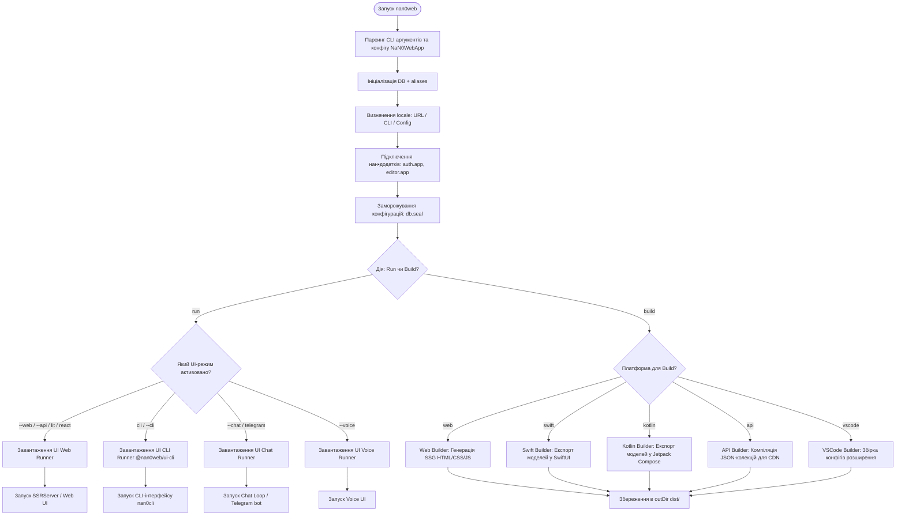

# Seed: nan0web.app (Sovereign OLMUI Runner) v3.2.0

## 1. Сутність та Мета
`nan0web.app` — це універсальний мультиплатформний ранер (Data-Driven App Runner) для екосистеми NaN•Web. Він реалізує концепцію "One Logic — Many UI" та виступає ядром запуску додатків. Ранер повністю відділяє бізнес-логіку від інтерфейсу: залежно від переданих аргументів командного рядка чи налаштувань конфігурації, він автоматично запускає та адаптує додаток під активовані інтерфейси (Web/API/SSR, CLI, Chat UI, Voice UI, React, Lit тощо). 

Метою цього релізу є стабілізація веб-точки входу (`ui-api`), інтеграція системи автентифікації (`auth.app` як нан•додатка) на рівні сесійного middleware, та підключення декларативного редактора документів (`editor.app` як нан•додатка) через універсальні OLMUI-адаптери.

## 2. Model-as-Schema (Схема Конфігурації: NaN0WebApp)
Клас `NaN0WebApp` успадковує `ModelAsApp` (з `@nan0web/ui/domain`) та виступає декларативною схемою конфігурації та життєвого циклу ранера:

- `appName` (string, назва проєкту, alias: `name`)
- `dsn` (string, Data Source Name — шлях до папки даних або URL підключення, за замовчуванням `data/`)
- `locale` (string, поточна локаль. Визначається за пріоритетом: URL-шлях (наприклад `/uk/demo` -> `uk`) -> аргументи CLI -> конфігурація `nan0web.nan0` -> системна змінна `process.env.LANG` -> `en`)
- `port` (number, порт HTTP/HTTPS сервера, за замовчуванням 3000)
- `theme` (string: `'light' | 'dark' | 'auto'`, тема інтерфейсу)
- `ssl` (object, опції для TLS/HTTPS: `{ cert: string, key: string }`)
- `log` (object, налаштування daily-ротації логів `LogConfig`)
- `apps` (array, список активованих нан•додатків `AppEntryConfig[]`)
- `aliases` (object, віртуальні проекції шляхів)
- **Активація UI-режимів**:
  - `web` (boolean, запуск HTTP SSR-сервера / Web SPA на базі Lit/React)
  - `cli` (boolean, запуск інтерактивного CLI-інтерфейсу на базі xterm/readline)
  - `chat` (boolean, запуск Chat UI через WebSocket або CLI-чат з ШІ)
  - `api` (boolean, запуск виключно REST/JSON API ендпоінтів)
  - `voice` (boolean, запуск голосового помічника)
- **Параметри статичного складання (Build)**:
  - `build` (string, цільова платформа для статичної генерації: `'web' | 'swift' | 'kotlin' | 'api' | 'vscode' | 'all'`, за замовчуванням `'web'`)
  - `outDir` (string, шлях для виводу сгенерованих файлів, за замовчуванням `'dist/'`)

### Віртуальні проекції (aliases) — для чого це нам?
**Aliases** — це прозорий мапінг віртуальних URI-шляхів на реальні фізичні файли (наприклад, `docs/en/README.md` -> `./README.md`). 

Це критично важливо для:
1. **Єдиного джерела правди (Single Source of Truth):** Ми уникаємо дублювання однакових документів (як-от базових інструкцій README.md) у різних папках локалей чи піддодатків. Файл лежить в одному місці, але доступний усім частинам системи.
2. **Агрегації документації нан•додатків:** Документи з незалежних нан•додатків (`auth.app`, `editor.app`) можуть віртуально підключатися у спільний каталог сайту (`docs/auth`, `docs/editor`) без реального переміщення файлів.
3. **Захисту оригінальних файлів від перезапису:** Операції читання/запису йдуть через шар абстракції `DB`, який може мати реалізацію з будь яким адаптером, наприклад `DBFS`, що контролює доступ і гарантує збереження файлів конфігурації чи шаблонів.

## 3. Делегування до UI-Адаптерів (Runner & Builder)
Згідно з принципом OLMUI, ядро `nan0web.app` не містить жорсткого коду для рендерингу конкретних інтерфейсів. 
- **Кожен UI-адаптер** (наприклад, `@nan0web/ui-cli`, `@nan0web/ui-lit`, `@nan0web/ui-chat` тощо) самостійно визначає та експортує власні класи `Runner` та `Builder`.
- **Запуск CLI** повністю делегується до перевіреного пакету `@nan0web/ui-cli` (використовуючи патерни `nan0cli`).
- `nan0web.app` виступає оркестратором: аналізує вхідні налаштування/аргументи, динамічно завантажує відповідний UI-пакет та передає керування його методам `.run()` або `.build()`.

## 4. Каркас Роботи (Діаграма Режимів та UI-Адаптерів)

## 5. Генератор (Flow)
1. **progress**: Ініціалізація `NaN0WebApp` конфігурації та бази даних.
2. **progress**: Створення віртуальних проекцій через `aliases`.
3. **progress**: Визначення локалі користувача (з перевіркою URL або системного оточення).
4. **progress**: Підключення та реєстрація нан•додатків (`auth.app` та `editor.app`).
5. **progress**: Застосування безпекових обмежень `db.seal()`.
6. **ask**: Визначення операції: запуск рантайму (`run`) чи статична збірка (`build`).
7. **progress**: 
   - **Для `run`**: Динамічне завантаження та виклик `.run()` відповідного UI Runner (Web, CLI, Chat, Voice).
   - **Для `build`**: Динамічне завантаження та виклик `.build()` відповідного UI Builder (Web SSG, Swift, Kotlin, API schema, VSCode).

## 6. User Stories
Усі сценарії використання та вимоги детально описані в документі [user-stories.md](docs/user-stories.md):
- **Тема 1-3**: Архітектурна міграція базових моделей, PagesRouter та SHEBANG-гігієна.
- **Тема 4**: Забезпечення безпеки бази даних через `db.seal()`.
- **Тема 5**: Декларативна конфігурація з'єднань БД (`DBConfig`).
- **Тема 6**: Композиція нан•додатків (`auth.app` + `editor.app`) для редагування документів та захисту API за допомогою сесійних токенів.
