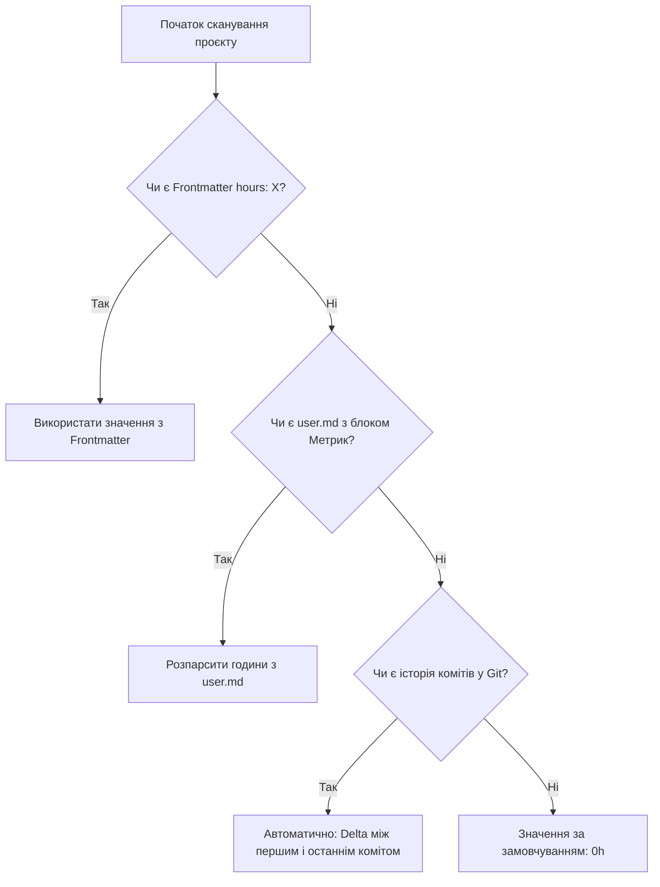

# 📊 PM-as-Code: Методологія Підрахунку Метрик та Телеметрії

> **Стандарт:** Anti-Gravity Release Protocol (AGRP) • PM-as-Code Telemetry Spec  
> **Область дії:** `@nan0web/release` & `@nan0web/release.app`

---

## 🎯 1. Концепція та Філософія

У підході **Project Management as Code (PM-as-Code)** управління проєктом, оцінка витраченого часу та готовність коду є версіонованими артефактами в Git. Дані не зберігаються у зовнішніх закритих таск-трекерах (Jira, Asana, Trello), а обчислюються безпосередньо з кодової бази та Git-історії.

---

## ⏱ 2. Формула та Джерела Підрахунку Часу (Hours)

Підрахунок часу розробки є **3-рівневою ієрархією (Cascading Telemetry)**:



### Рівень 1: Явний Frontmatter (Пріоритет #1)
Якщо у файлі `release.md` або `user.md` вказано значення у YAML-блоці:
```yaml
---
version: 3.3.0
hours: 6.5
iterations: 14
rrs: 324
---
```

### Рівень 2: Блок Метрик у `user.md` (Пріоритет #2)
Зчитування з мультимовного розміченого списку у файлі `user.md`:
```markdown
## ⏱ 1. Метрики Виконання
- **Витрачений час розробки (Годин):** `6.5h`
- **Кількість ітерацій (Test Runs / Refactors):** `14`
- **Фінальний бал RRS (Release Readiness Score):** `324`
```
> **Підтримувані мови:** Українська (`Витрачений час розробки`, `Годин`), Англійська (`Development Time`, `Time Spent`, `Hours`).

### Рівень 3: Автоматична Git-телеметрія (Smart Fallback)
Якщо час не вказано вручну, система автоматично виконує аналіз Git-лога для поточної директорії або релізу:
$$\text{Hours} = \frac{T_{\text{max}} - T_{\text{min}}}{3600}$$
де $T_{\text{min}}$ — таймстемп першого коміту поточної версії, а $T_{\text{max}}$ — таймстемп останнього коміту.

---

## 🔄 3. Підрахунок Ітерацій (Iterations)

**Ітерація** — це одиничний цикл перевірки гіпотези / виконання TDD-циклу (Red -> Green -> Refactor) або запуск тестового набору.

1. **Ручний/Агентний запис:** Вказується у `user.md` (наприклад, `Кількість ітерацій: 14`).
2. **Автоматичний підрахунок:** Кількість комітів у межах спринту версії через `git rev-list --count HEAD -- <path>`.

---

## 🏆 4. Розрахунок Балу Готовності (RRS — Release Readiness Score)

Бал **RRS (0..324+)** є числовим гейтом якості перед релізом (Quality Gate):

| Компонент оцінки | Вага (Бали) | Критерій виконання |
|------------------|-------------|---------------------|
| **1. Контрактні тести (TDD)** | **100** | 100% проходження `task.spec.js` / `task.test.js` / `*.story.js` |
| **2. Виконання DoD (Tasks)** | **100** | Усі чекбокси `- [x]` у `release.md` закриті |
| **3. Паспорт та Документація** | **100** | Наявність `user.md`, `release.md`, `README.md.js`, JSDoc typization |
| **4. Чистота Інженерії** | **24** | 0 регресій, успішний `tsc` build, `knip` без сміття, чистий Git status |
| **РАЗОМ** | **324** | **Gate to Release (Реліз готовий до запечатування)** |

---

## 🛠 5. Як керувати телеметрією через CLI

```bash
# 1. Переглянути зведену таблицю з годинами та RRS
nan0release status

# 2. Переглянути детальний паспорт окремого проєкту
nan0release status 8
nan0release status @industrialbank/bank

# 3. Перевірити коректність структури релізів та наявність метрик
nan0release check
```
