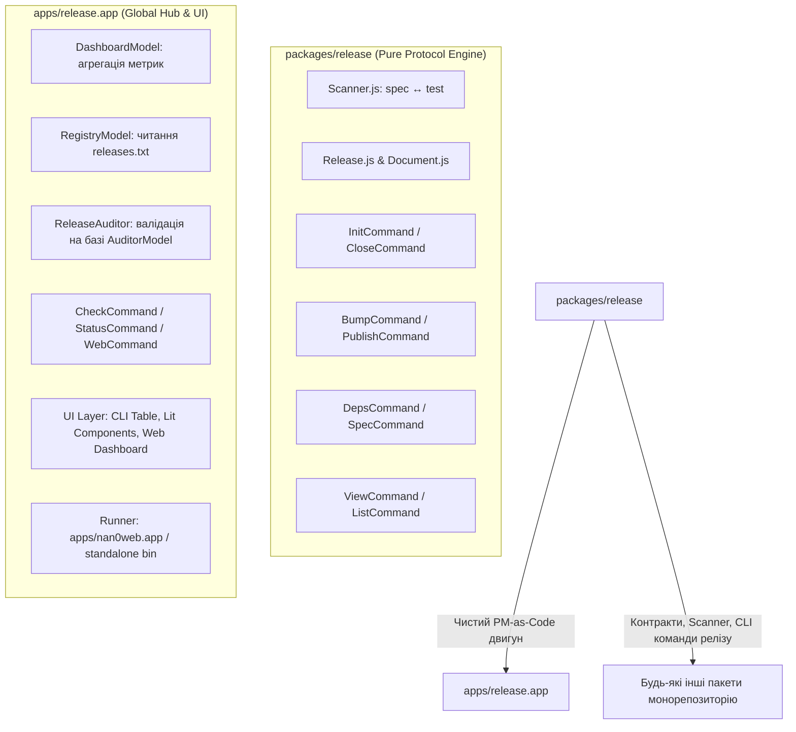

# 🏛️ Архітектурний План Міграції: Відокремлення Домену `packages/release` від UI-Хабу `apps/release.app`

## 🎯 1. Контекст та Проблема (Root Cause Analysis)

### Виявлена Архітектурна Інверсія

Наразі виникло критичне порушення монорепозиторної ієрархії:

1. **Інверсія залежностей "знизу вгору"**: Базовий бібліотечний пакет `packages/release` намагається бути повноцінним застосунком і навіть динамічно імпортує UI-компоненти з `apps/release.app`:
   ```javascript
   // packages/release/src/domain/WebCommand.js (АРХІТЕКТУРНА ПОМИЛКА):
   import('../../../../apps/release.app/src/ui/web/ReleaseDashboard.js')
   ```
2. **Розмиття меж відповідальності**:
   - `packages/release` має бути **виключно чистим протоколом керування релізами** (PM-as-Code Engine): парсери markdown-контрактів (`release.md`, `task.md`, `user.md`), SemVer-пошук, запечатування тестів `Scanner.close()`, `InitCommand`, `CloseCommand`, `BumpCommand`, `PublishCommand`, `DepsCommand`.
   - `apps/release.app` — це **Global PM-as-Code Monitoring Hub & Dashboard**. Саме тут живуть:
     - Агрегація проєктів монорепозиторію (`releases.txt`).
     - Моніторингові моделі (`DashboardModel`, `RegistryModel`).
     - Аудитор якості та відповідності специфікації релізів (`ReleaseAuditor`, `CheckCommand`).
     - Інспекційні команди (`StatusCommand`, `WebCommand`, `PreviewCommand`).
     - Усі шари користувацького інтерфейсу (OLMUI: `src/ui/cli/`, `src/ui/lit/`, `src/ui/web/`).
     - Запуск веб-сервера / прев'ю / раннера.

---

## 🏗️ 2. Цільова Архітектура (Target Topology)



---

## 📋 3. Поетапний План Виконання (Action Items)

### Етап 1: Перенесення бізнес-моделей та аудиту в `apps/release.app`

- [ ] **1.1. Перенести `Dashboard`**:
  - `packages/release/src/domain/Dashboard/*` ➡️ `apps/release.app/src/domain/Dashboard/`
  - Разом з `ReleaseParser.js`, `ReleaseDiscovery.js`, `GitTelemetry.js` (якщо застосунок у Node.js).
- [ ] **1.2. Перенести `RegistryModel`**:
  - `packages/release/src/domain/Registry/` ➡️ `apps/release.app/src/domain/Registry/`
- [ ] **1.3. Перенести `ReleaseAuditor`**:
  - `packages/release/src/domain/inspect/ReleaseAuditor.js` ➡️ `apps/release.app/src/domain/inspect/ReleaseAuditor.js`
- [ ] **1.4. Синхронізувати команди у `apps/release.app`**:
  - Перевірити `apps/release.app/src/domain/CheckCommand.js`
  - Перевірити `apps/release.app/src/domain/StatusCommand.js`
  - Перевірити `apps/release.app/src/domain/WebCommand.js` (тепер він локально імпортує свої Lit/Web компоненти без жодних хаків з відносними шляхами).

### Етап 2: Очищення базового пакету `packages/release`

- [ ] **2.1. Видалити зовнішні UI-команди з `packages/release`**:
  - Видалити `packages/release/src/domain/WebCommand.js`.
  - Видалити `packages/release/src/domain/PreviewCommand.js`.
  - Видалити дублюючі `Dashboard/`, `Registry/`, `inspect/ReleaseAuditor.js` (якщо вони повністю мігровані в `release.app`).
- [ ] **2.2. Оновити `ReleaseApp.js` та експорти `packages/release`**:
  - Залишити в `packages/release` тільки ті команди, які стосуються життєвого циклу окремого релізу: `init`, `spec`, `close`, `bump`, `deps`, `publish`, `list`, `view`, `serve`.
  - Прибрати з `package.json` та `src/index.js` експорти перенесених моніторингових сутностей.

### Етап 3: Тести, Контракти та Верифікація

- [ ] **3.1. Перенесення сценарних тестів**:
  - `Dashboard.story.js`, `RegistryModel.story.js`, `ReleaseAuditor.story.js` перенести у відповідні директорії `apps/release.app/src/domain/**`.
- [ ] **3.2. Автономний запуск тестів**:
  - `pnpm --filter @nan0web/release test` — чистий, швидкий прогін контрактів бібліотеки.
  - `pnpm --filter @nan0web/release.app test` — повне тестування OLMUI хабу та дашбордів.

---

## 🚀 4. Як розпочати новий чат

У новому чаті достатньо надіслати:

```text
/goal @apps/release.app/migration-plan.md
Розпочинаємо виконання архітектурної міграції за планом.
```

# Міграція Release App

**Мета:** Відокремити домен `packages/release` від UI‑хабу `apps/release.app`, забезпечити чисту архітектуру Model‑as‑Schema та OLMUI.

## User Review Required

> [!IMPORTANT]
> План передбачає великі зміни у структурі пакету `packages/release`. Потрібно підтвердити, чи дозволяєте ви видалення UI‑команд та перенесення моделей у `apps/release.app`.

> [!WARNING]
> Після переміщення файлів необхідно оновити імпорти у всіх залежних пакетах. Це може вимагати оновлення `package.json` та `tsconfig` шляхів.

## Open Questions (Resolved)

- CI‑скрипт для тестування `packages/release` вже прописаний у `packages/release/package.json` (скрипти `test`, `test:release`, `test:all`, `test:docs`).
- `ReleaseApp.js` у `packages/release` буде **видалено** (thin wrapper не потрібен).
- Використовуються існуючі скрипти `test`, `test:all`, `test:docs` тощо; додаткові глобальні скрипти у кореневому `package.json` не потрібні.

## Proposed Changes

### packages/release

- **[DELETE]** `src/domain/Dashboard/` (перенести в `apps/release.app/src/domain/Dashboard/`)
- **[DELETE]** `src/domain/Registry/` (перенести в `apps/release.app/src/domain/Registry/`)
- **[DELETE]** `src/domain/inspect/ReleaseAuditor.js` (перенести в `apps/release.app/src/domain/inspect/ReleaseAuditor.js`)
- **[DELETE]** `src/domain/WebCommand.js` (видалити, UI‑логіка переміщена)
- **[DELETE]** `src/domain/PreviewCommand.js` (видалити)
- **[DELETE]** `src/ReleaseApp.js` (видалити)
- **[MODIFY]** `src/index.js` – залишити лише CLI‑команди життєвого циклу релізу (`init`, `spec`, `close`, `bump`, `deps`, `publish`, `list`, `view`, `serve`).
- **[MODIFY]** `package.json` – оновити `exports` та видалити залежності UI‑пакетів (скрипти залишаються без змін).

### apps/release.app

- **[NEW]** `src/domain/Dashboard/` – скопіювати файли з `packages/release/src/domain/Dashboard/`.
- **[NEW]** `src/domain/Registry/` – скопіювати.
- **[NEW]** `src/domain/inspect/ReleaseAuditor.js` – скопіювати.
- **[MODIFY]** `src/domain/CheckCommand.js` – оновити імпорти до нових шляхів.
- **[MODIFY]** `src/domain/StatusCommand.js` – оновити імпорти.
- **[MODIFY]** `src/domain/WebCommand.js` – оновити імпорт UI‑компонентів локально (без відносних шляхів до `packages`).

## Тести та контракти

- **[MOVE]** `Dashboard.story.js`, `RegistryModel.story.js`, `ReleaseAuditor.story.js` у відповідні каталоги `apps/release.app/src/domain/**`.
- **[NOTE]** Скрипти тестування вже присутні у `packages/release/package.json`; у кореневому `package.json` жодних змін не потрібні.

## Verification Plan

### Automated Tests

- Запустити `pnpm --filter @nan0web/release test` – має пройти без UI‑моделей.
- Запустити `pnpm --filter @nan0web/release.app test` – має пройти всі OLMUI тести.
- Виконати `pnpm run lint` у обох пакетах.

### Manual Verification

- Запустити `pnpm --filter @nan0web/release.app dev` та перевірити дашборд у браузері.
- Перевірити, що `ReleaseAuditor` успішно валідує релізи без помилок.
- Переконатися, що `CheckCommand` працює у CLI без імпортів UI.
