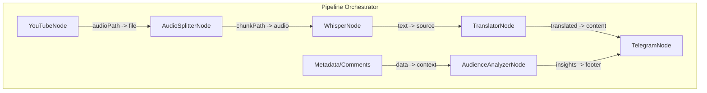

# Seed: MediaProcessor (nan0share)

## 1. Сутність та Мета
**Sovereign Media Hub (nan0share)** — це модульна платформа для обробки та дистрибуції контенту, побудована на базі **Node-Based Pipeline** архітектури. Система використовує абстракцію вузлів (`Nodes`) із пакету `@nan0web/pipeline` для побудови гнучких конвеєрів: від завантаження медіа до багатоканальної публікації.

## 2. Архітектурні Принципи

### Node-Based Logic
Кожна операція (завантаження, транскрипція, публікація) — це окремий клас-спадкоємець `Node`, який має:
- `inputs`: Конфігурація та вхідні дані.
- `outputs`: Отримані результати.
- `run()`: Асинхронний генератор, що транслює **UI Intents**.

### Concise Edge Mapping
Зв'язки між вузлами описуються лаконічно через мапінг полів. Це дозволяє будувати будь-які конфігурації:

**Одне поле в одне:**
```javascript
{ from: 'nodeA', to: 'nodeB', map: { 'audioPath': 'file' } }
```

**Декілька полів одночасно:**
```javascript
{ from: 'analyzer', to: 'publisher', map: { 'text': 'content', 'insights': 'metadata' } }
```

**Одне джерело в декілька різних вузлів (Parallel/Fork):**
```javascript
// Аудіо йде і на транскрипцію, і на аналіз звуку
{ from: 'downloader', to: 'whisper', map: { 'audioPath': 'file' } },
{ from: 'downloader', to: 'audioFilter', map: { 'audioPath': 'source' } }
```

### UI Intent Contract (NanoWeb Extended)
Вузли спілкуються з інтерфейсом через жорстко типізовані інтенції, які розширюють стандартний UI-контракт екосистеми NanoWeb:
- `step(label)`: Візуальний маркер нового етапу конвеєра.
- `progress(v, total)`: Стан виконання.
- `log(level, msg)`: Повноцінне системне логування (`debug`, `info`, `warn`, `error`), яке потрапляє у відповідні потоки виводу.
- `show(data)`: Попередній перегляд або рендеринг фрагмента (текст/зображення).
- `ask(schema)`: Запит на ручний ввід даних від користувача.
- `askAgent(prompt/task)`: Делегування підзадачі AI-Агенту (наприклад, для перекладу чи генерації).
- `result(data)`: Фінальний вихід вузла.

## 3. Реєстр Вузлів (Node Registry)

### Fetching & Sourcing
- **URLDownloadNode**: Універсальний вузол. Приймає будь-яке посилання (YouTube, Spotify, Web) і сам під капотом визначає потрібний адаптер (yt-dlp, RSS parser тощо).
- **LocalFileNode**: Читання та валідація файлів з диска.

### AI & Processing
- **AudioSplitterNode**: Нарізка медіа з нахлистом (Overlap).
- **WhisperNode**: Локальна транскрипція (Engine: `mlx` | `base`).
- **AgentNode**: Універсальний вузол, який використовує `askAgent` для перекладу (`Translator`) або аналізу (`AudienceAnalyzer`).

### Publishing & Dispatch
- **MessengerNode**: Публікація в Telegram, WhatsApp, Signal.
- **SocialNode**: Публікація в Twitter, Facebook, Pinterest.
- **CMSNode**: Відправка у Ghost, WordPress, Medium.

## 4. Каркас Роботи (Pipeline Diagram)


## 5. Model-as-Schema (Global Config)
- `pipeline`: Опис графа (вузли + зв'язки).
- `targetLanguage`: Мова виходу (default: 'uk').
- `skip`: Опції фільтрації (`video`, `comments`, `subtitles`).

## 6. Генератор (Flow)
1. `progress`: Топологічне сортування вузлів графа.
2. `loop`: Для кожного вузла в черзі:
    - `step`: Підготовка `inputs` через мапінг `outputs` попередників.
    - `stream`: Трансляція інтенцій вузла у UI.
    - `result`: Фіксація виходу та перехід до наступного вузла.
3. `done`: Фінальний звіт про виконання всього конвеєра.
