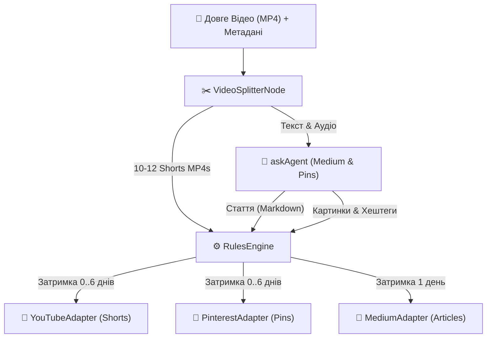

# 🚀 План Інтеграції та Автоматизації Дистрибуції (share.app)

> **Мета:** Повністю автоматизувати процес: запис одного довгого відео → нарізка на 10-12 шортсів → публікація шортсів на YouTube (протягом 6 днів) + супутні статті на Medium + картинки/піни на Pinterest. Все це має керуватися єдиним двигуном `@nan0web/share.app`.

---

## 🗺️ Архітектура Потоку Даних (Pipeline)



---

## 🛠️ 1. Реєстр Нових Адаптерів (Adapters Registry)

Ми перенесемо логіку з Python-скриптів у нативні JS-адаптери всередині `share.app/src/adapters/`:

### 1.1. `YouTubeAdapter` (`YouTubeAdapter.js`)

- **Роль:** Авторизація через OAuth 2.0 (використовуючи `.keys/youtube_token.json` та `client_secret_*.json`).
- **Можливості (Capabilities):** `['media', 'delete', 'video', 'playlist']`.
- **Логіка:**
  - Перевірка чи існує плейліст (наприклад, "Суперінтелект.Активація"). Якщо ні — створення через API.
  - Завантаження відео у режимі `private` або `unlisted` для планування.
  - Встановлення гео-координат (Україна за замовчуванням), мови відео (`uk`), мови опису (`uk`), дати запису.
  - Додавання тегів та очищення описів від заборонених символів (`<`, `>`).

### 1.2. `PinterestAdapter` (`PinterestAdapter.js`)

- **Роль:** Публікація візуальних пінів (Pins) з лінками на відповідні YouTube-відео.
- **Можливості (Capabilities):** `['media', 'photo']`.
- **Логіка:**
  - Завантаження вертикального зображення (співвідношення 2:3), згенерованого під час створення шортсу.
  - Додавання опису, заголовка та `link` (посилання на YouTube Shorts або довге відео).

### 1.3. `MediumAdapter` (`MediumAdapter.js`)

- **Роль:** Публікація текстових статей (філософські транскрипти або розширення тем серій).
- **Можливості (Capabilities):** `['edit']`.
- **Логіка:**
  - Форматування Markdown-файлів у HTML.
  - Публікація як чернетки (`draft`) або публічної статті з тегами.

---

## ⚙️ 2. Декларативна Конфігурація Правил (`share.config.yaml`)

Кожен випуск довгого відео супроводжується YAML-файлом конфігурації, який автоматично створює чергу завдань:

```yaml
# share.config.yaml
metadata:
  episode: 'S01E01'
  title: 'Анатомія Тривоги та Пошук Істини'
  long_video_url: 'https://youtube.com/watch?v=...' # якщо довге відео вже завантажене

rules:
  # 🎥 YouTube Shorts
  - name: 'Shorts scheduling'
    if:
      type: 'short'
    publish:
      - adapter: 'youtube-shorts'
        delay: 0 # Short 1 (День 1, 09:30)
      - adapter: 'youtube-shorts'
        delay: '12h' # Short 2 (День 1, 21:30)
      - adapter: 'youtube-shorts'
        delay: '1d 09:30' # Short 3 (День 2, 09:30)
      - adapter: 'youtube-shorts'
        delay: '1d 21:30' # Short 4 (День 2, 21:30)
      - adapter: 'youtube-shorts'
        delay: '2d 09:30' # Short 5 (День 3, 09:30)
      # ... і так далі до 12-го шортсу (всього 6 днів по 2 на день)

  # 📌 Pinterest Pins (для кожного шортсу)
  - name: 'Pinterest promotion'
    if:
      type: 'short'
    publish:
      - adapter: 'pinterest'
        delay: 0 # Публікується синхронно з виходом конкретного шортсу

  # 📝 Medium Articles (глибока стаття до випуску)
  - name: 'Medium deep dive'
    if:
      type: 'article'
    publish:
      - adapter: 'medium'
        delay: '1d' # Виходить на наступний день після довгого відео
```

---

## 📋 3. Покроковий План Втілення (Implementation Steps)

### Крок 1: Створення адаптерів в `share.app`

1. Портувати логіку завантаження з Python (`vlog/season_1/episode_1/upload_shorts.py`) на JavaScript. Створити `YouTubeAdapter` в `src/adapters/YouTubeAdapter.js`.
2. Написати `PinterestAdapter.js` та `MediumAdapter.js` на базі `SocialAdapter`.
3. Додати юніт-тести для нових адаптерів у `src/domain/YouTubeAdapter.spec.js` тощо.

### Крок 2: Відео-процесор (Video Splitting Node)

1. Реалізувати `VideoSplitter.js` (подібно до `AudioSplitter.js` з використанням `ffmpeg`), який прийматиме файл довгого відео та таймкоди для нарізки шортсів.

### Крок 3: Інтеграція в CLI-інтерфейс (`share.app/bin`)

1. Створити команду `share run-pipeline --config <path_to_yaml>`, яка:
   - Зчитує конфігурацію довгого відео та шортсів.
   - Нарізає відео за допомогою `VideoSplitter`.
   - Запускає `evaluateRules` для планування завдань у SQLite чергу.
   - Активує демон публікації.
