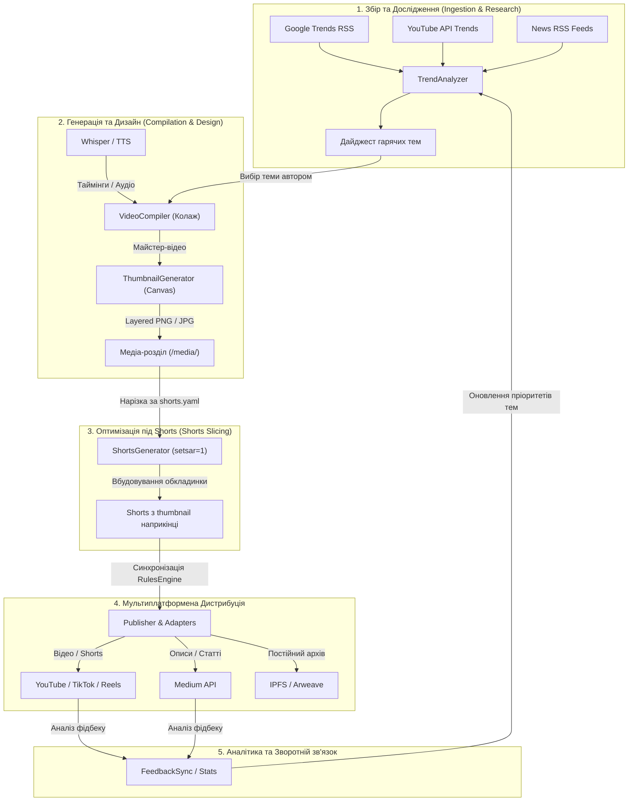
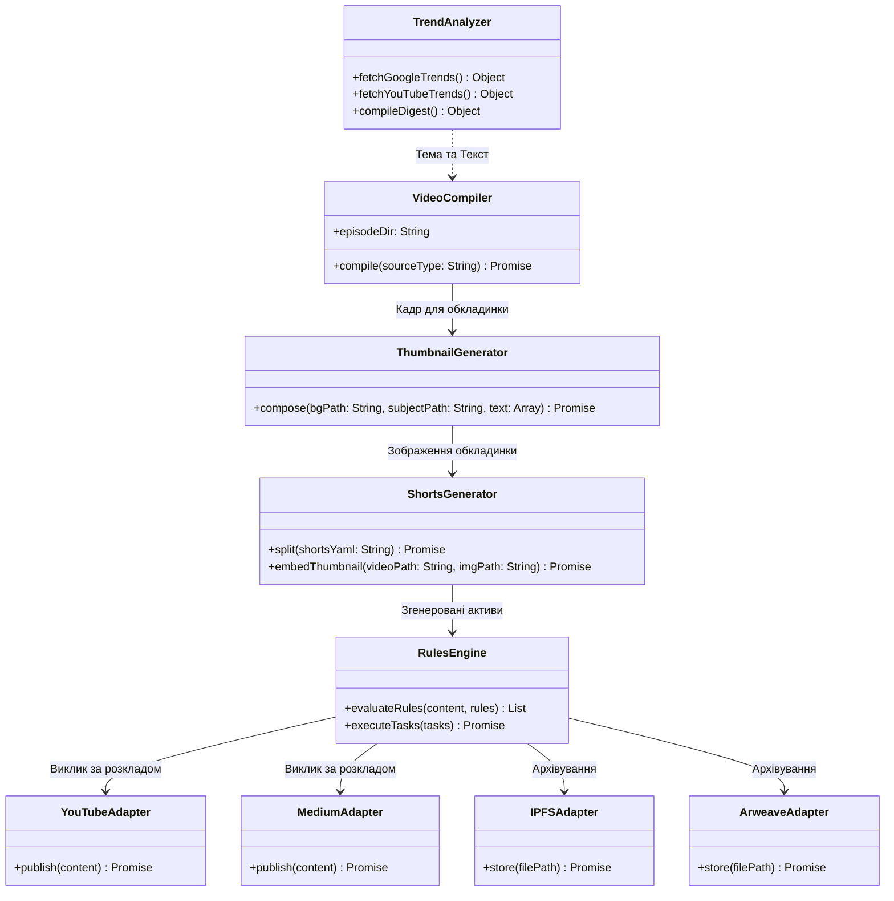

# 🚀 Mission: Уніфікований конвеєр автогенерації, дистрибуції та обкладинок відео (Мультиплатформа)

## 🏁 Overview (Огляд)
Реалізація єдиного, конфігураційно-керованого сервісу в `@nan0web/share.app` для повного життєвого циклу контенту: збору інфоприводів, аналітики, автоматичного монтажу відео за текстом, генерації Shorts, пошарового малювання обкладинок та мультиплатформеної дистрибуції (YouTube, Medium, IPFS, Arweave, Podcasts та соціальні мережі).

При побудові архітектури закладається **максимальна ізоляція доменів**. Усі компоненти дослідження та генерації повністю ізольовані, що дозволить у майбутньому виділити їх у новий додаток `creator.app` простим перенесенням папок без переписування коду.

---

## 💼 1. Бізнес-архітектура процесів (Business Process Flow)

Ця діаграма описує життєвий цикл інформації від пошуку трендів до дистрибуції та збору фідбеку:



---

## 🏗️ 2. Системна архітектура та Декаплінг (Decoupling для creator.app)

Для забезпечення легкого перенесення коду (Creator vs Publisher) ми розділяємо кодову базу `apps/share.app/src/` на три незалежні доменні гілки:
1. `src/domain/research/` (Аналітика та тренди) -> Майбутній кандидат на перенесення.
2. `src/domain/generation/` (Монтаж, субтитри, малювання обкладинок) -> Майбутній кандидат на перенесення.
3. `src/domain/distribution/` (Правила, планувальник, адаптери соцмереж) -> Залишається в `share.app`.

### Діаграма зв'язків класів та доменів:



---

## 📊 3. Матриця дистрибуції та платформ (Distribution Matrix)

Для забезпечення повної інформаційної стійкості конвеєр надсилає контент на наступні типи платформ:

| Платформа | Тип контенту | Адаптер | Пріоритет / Реліз |
| :--- | :--- | :--- | :--- |
| **YouTube** | Довгі відео / Shorts | `YouTubeAdapter` | **v3.2.0 (Поточний)** |
| **Medium** | Аналітичні статті, текстові версії | `MediumAdapter` | **v3.2.0 (Поточний)** |
| **IPFS** | Sovereign-архів медіа та описів | `IPFSAdapter` | **v3.2.0 (Поточний)** |
| **Arweave** | Постійне Web3-архівування контенту | `ArweaveAdapter` | **v3.2.0 (Поточний)** |
| **Telegram** | Новини, швидкі тези, анонси | `TelegramAdapter` | Інтегровано (v3.1) |
| **Instagram** | Reels, пости з зображеннями | `InstagramAdapter` | Беклог (Наступна фаза) |
| **Facebook** | Відео, Reels, текстові пости | `FacebookAdapter` | Беклог (Наступна фаза) |
| **TikTok** | Короткі вертикальні відео (Shorts) | `TikTokAdapter` | Беклог (Наступна фаза) |
| **Pinterest** | Stills (піни), Idea Pins | `PinterestAdapter` | Беклог (Наступна фаза) |
| **SoundCloud** | Аудіозаписи, коментарі (подкасти) | `PodcastAdapter` | Беклог (Наступна фаза) |
| **Apple Podcasts** | Аудіоверсії випусків (подкасти) | `PodcastAdapter` (RSS) | Беклог (Наступна фаза) |
| **Spotify** | Аудіоверсії випусків (подкасти) | `PodcastAdapter` (RSS) | Беклог (Наступна фаза) |
| **Sovereign RSS** | Загальний XML фід для подкаст-плеєрів | `PodcastAdapter` (RSS) | Беклог (Наступна фаза) |

---

## 👥 Сценарії використання (User Stories)
* **Як автор контенту**, я хочу покласти файли `config.yaml`, `script_timeline.txt` та `shorts.yaml` у папку випуску, щоб система змонтувала відео, згенерувала Shorts, намалювала обкладинки, опублікувала тексти на **Medium** та завантажила оригінали в постійні децентралізовані сховища **IPFS/Arweave**.
* **Як розробник**, я хочу мати універсальні CLI команди `share compile`, `share shorts` та `share publish`, які працюють з будь-якою конкретною директорією.

---

## ⚙️ Функціональні модулі

### 1. Компілятор відео (`VideoCompiler.js`)
Уніфікований клас, який зчитує конфігурацію та сценарій із папки випуску.
* **Агностичність до джерел транскрипції**:
  1. **Аудіо-джерело**: Автоматичне розпізнавання мовлення через Whisper (наприклад, локальний `mlx_whisper` або зовнішній API) для генерації `script_timeline.txt`.
  2. **Відео-джерело**: Попереднє вилучення аудіодоріжки з відео та подальше Whisper-розпізнавання.
  3. **Текстове джерело**: Автоматичний запуск Text-to-Speech (TTS) для озвучки тексту і розрахунок хронометражу сцен на основі згенерованого TTS-файлу.

### 2. Генератор обкладинок (`ThumbnailGenerator.js`)
Динамічне компонування мініатюр (обкладинок) для довгих відео та Shorts за допомогою пошарового рендерингу (наприклад, Node-canvas або Sharp):
* **Шар 1 (Фон)**: Окрема генерація або масштабування фонового зображення відповідно до формату (горизонтальний 16:9 для довгих відео або vertical 9:16 для Shorts).
* **Шар 2 (Головний елемент)**: Рендеринг основного графічного об'єкта (наприклад, персонажа чи іконки) на прозорому фоні поверх фону.
* **Шар 3 (Текст)**: Додавання великого, висококонтрастного тексту з тінню/обводкою, що містить основні тези відео.

> **Стратегія обкладинок для YouTube/TikTok/Reels**:
> Оскільки більшість API не дозволяють завантажувати окрему обкладинку для коротких вертикальних відео, система **автоматично вбудовує згенеровану обкладинку в останню секунду відеофайлу Shorts**. Це дозволяє легко вибрати її як обкладинку під час завантаження.

### 3. Генератор Shorts (`ShortsGenerator.js`)
Сервіс нарізки фрагментів за конфігом `shorts.yaml` із захистом від розтягування пропорцій (`setsar=1`) та автоматичним масштабуванням вертикального фону.

### 4. YouTube Публікатор (`YouTubePublisher.js`)
Aдаптер на базі офіційного пакета `googleapis` для Node.js. Використовує OAuth2 (`youtube_token.json`), завантажує медіа частинами (Resumable Streams) та автоматично оновлює конфігураційні файли записами `youtube_id` після публікації.

### 5. Аналізатор трендів та новин (`TrendAnalyzer.js`)
Інструмент для автоматичного моніторингу та підбору актуальних тем для нових випусків:
* **Google Trends**: Парсинг регіональних трендів пошукових запитів.
* **YouTube Trends**: Відстеження популярних відео у вибраних категоріях.
* **News RSS Feeds**: Сканування цільових новинних джерел, заданих користувачем.
* **Аналітика**: Зведення результатів в єдиний дайджест для швидкого вибору теми.

---

## 📂 Специфікація структури медіа та конфігів

* **Робоча папка випуску (Workspace — Git / Configs)**:
  ```
  vlog/season_1/episode_2/
  ├── shorts/                   # Метадані для публікації Shorts (описи, теги)
  │   ├── 01.md                 # Описи та теги для YouTube/TikTok
  │   └── ...
  ├── config.yaml               # Конфігурація компіляції майстер-відео
  ├── script_timeline.txt       # Текстова шкала часу та сценарій
  ├── shorts.yaml               # Межі нарізки Shorts
  └── upload_config.yaml        # Графік публікації та метадані YouTube/Medium
  ```

* **Папка готових медіа-файлів (Media partition — External / Symlinked)**:
  ```
  /media/season_1/episode_2/
  ├── 28_Червня_День_Конституції_final.mp4  # Майстер-відео
  ├── constitution_day_thumbnail_bg.png     # Згенерований фон обкладинки
  ├── thumbnail.png                         # Змонтована обкладинка випуску
  ├── backgrounds/                          # Кастомні фони для Shorts (не в Git!)
  │   ├── short1.png
  │   └── ...
  └── shorts/                                # Готові відео-файли Shorts (з вбудованими обкладинками)
      ├── short1.mp4
      └── ...
  ```

---

## 🎯 Scope (Задачі релізу v3.2.0)
- [x] Додати залежність `googleapis` у `package.json`
- [x] Створити уніфікований `VideoCompiler.js` з підтримкою Audio/Video/TTS джерел
- [x] Створити пошаровий `ThumbnailGenerator.js` для рендерингу обкладинок
- [x] Створити `ShortsGenerator.js` із вбудовуванням обкладинки в останню секунду відео для Shorts
- [x] Реалізувати `YouTubeAdapter.js` на базі Google API Client
- [x] Реалізувати `MediumAdapter.js` для автоматичного постінгу текстових версій на Medium
- [x] Реалізувати `IPFSAdapter.js` та `ArweaveAdapter.js` для децентралізованого довготривалого збереження оригіналів та метаданих
- [x] Реалізувати `TrendAnalyzer.js` для моніторингу Google/YouTube трендів та RSS-каналів
- [x] Зареєструвати нові CLI команди в `share.js`

---

## 🎬 Scope: Vlog Pipeline (Інтеграція will-n-i/next.md)

> Міграція відео-конвеєра з `apps/3rdparty/will-n-i` у доменну архітектуру `share.app`
> згідно з OLMUI, Model-as-Schema та Data-Architecture (заборона `fs` для `data/`).

### Фаза 1: TimelineEngine Port (Чиста логіка → Domain)
- [ ] Портувати `timeline_engine.js` → `src/domain/generation/TimelineEngine.js`
- [ ] Прибрати `import fs` (parseSubFile → приймає content замість path)
- [ ] Портувати `timeline_engine.test.js` → `src/test/`

### Фаза 2: SubtitleEngine — ASS-субтитри (Model-as-Schema)
- [ ] Створити `SubtitleEngine.js` — JS-препроцесор чанкінгу Whisper JSON → ASS
- [ ] Караоке `BorderStyle=4` (заокруглений opaque-бокс фону)
- [ ] Width-aware чанкінг (макс. 850px, 1–3 слова на блок)
- [ ] TDD: тест на чанкінг, тест на ASS-генерацію

### Фаза 3: VideoCompiler & WhisperTranscriber (Реальна імплементація)
- [ ] `WhisperTranscriber` — OLMUI async generator з fallback: mlx_whisper → whisper → ctranslate2
- [ ] `VideoCompiler` — замінити stub реальною збіркою через FFmpeg
- [ ] Apple Silicon кодеки: `h264_videotoolbox` / `hevc_videotoolbox` (конфіг через `data/codecs.yaml`)
- [ ] Конфігурація через `db.fetch()` замість `fs.readFileSync`

### Фаза 4: ShortsCompiler (Shorts → 16:9 Long Video)
- [ ] `ShortsCompiler.js` — збирає масив вертикальних Shorts у довге 16:9 горизонтальне відео
- [ ] FFmpeg `boxblur` для заповнення бічних зон (розмиті поля)
- [ ] TDD: тест на генерацію правильної FFmpeg filter_complex команди

### Фаза 5: Lit/Puppeteer Subtitle Renderer (ui-lit)
- [ ] Lit-компонент `SubtitleOverlay` з CSS Transition (ковзаюча плашка хайлайтера)
- [ ] Node CLI контролер: Puppeteer 1080x1920 → PNG frames → FFmpeg stdin
- [ ] Підключення через `theme.js` (Zero-Logic Style Injection)

### Фаза 6: OLMUI VlogPipeline Generator
- [ ] `VlogPipeline` — OLMUI async generator що об'єднує фази 1-5
- [ ] CLI адаптер: `bin/share.js vlog compile`
- [ ] Конфігурація влогу в `data/` (замість хардкоджених шляхів)

## ✅ Acceptance Criteria (DoD)
- [x] Контрактні тести (`task.spec.js`) успішно проходять.
- [x] Велика медіа-видача зберігається виключно в папці `/media/` (конфігурація через змінні середовища або yaml).
- [x] Відсутність жорстко прописаного коду для окремих епізодів.
- [ ] `TimelineEngine` портований без `fs` залежностей, тести зелені.
- [ ] `SubtitleEngine` генерує валідний ASS з Whisper JSON.
- [ ] `WhisperTranscriber` є OLMUI-генератором з yield progress/result.
- [ ] `ShortsCompiler` генерує коректний FFmpeg boxblur pipeline.
- [ ] Жоден новий модуль не використовує `fs` для читання з `data/`.

