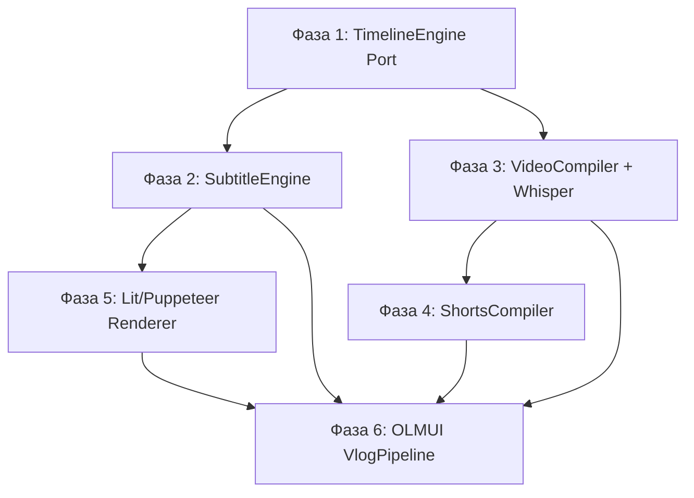

# 🎬 План інтеграції Vlog Pipeline з will-n-i → share.app

> Міграція відео-конвеєра `apps/3rdparty/will-n-i/next.md` у доменну архітектуру `@nan0web/share.app`  
> згідно з Architecture, Data-Architecture та OLMUI

---

## 📊 Аналіз поточного стану

### Що є в `will-n-i` (3rdparty):

| Компонент | Файл | Розмір | Статус |
|---|---|---|---|
| Video Compiler | `compile_constitution.js` | 1130 рядків, монолітний | ❌ Хардкодить шляхи, власний YAML-парсер, `fs` напряму |
| Shorts Generator | `generate_shorts.js` | 247 рядків | ❌ Дублює YAML-парсер, хардкодить FFmpeg |
| Timeline Engine | `timeline_engine.js` | 268 рядків | ✅ Чиста логіка, вже з тестами, експортує утіліти |
| Config | `config.yaml` | Сегменти, джерела, таймлайн | ✅ Data-driven |

### Що є в `share.app` (domain):

| Компонент | Статус |
|---|---|
| `VideoCompiler` | 🟡 Stub (mock, 35 рядків) |
| `ShortsGenerator` | 🟡 Stub (mock, 44 рядки) |
| `ThumbnailGenerator` | 🟡 Stub (mock, 28 рядків) |
| `TrendAnalyzer` | 🟡 Stub (mock, 41 рядок) |
| `AudioSplitter` | ✅ Реальна імплементація (FFmpeg) |
| `MediaDownloadModel` | ✅ Реальна модель |
| `YouTubeDownloader` | ✅ Реальна модель |
| `script-generator.js` (bin) | ✅ Працює з `@nan0web/ai` |

### Функціонал з `next.md` що потрібно впровадити:

1. **ASS-субтитри** — JS-препроцесор чанкінгу Whisper JSON → ASS (караоке `BorderStyle=4`)
2. **Lit/Puppeteer рендерер** — Кастомні CSS-анімації субтитрів (ковзаюча плашка хайлайтера)
3. **Shorts → 16:9 компілятор** — boxblur збірка вертикальних роликів у довге горизонтальне відео
4. **Apple Silicon прискорення** — `h264_videotoolbox` / `hevc_videotoolbox`

---

## 🏗️ Архітектурний Аналіз (Відповідність Стандартам)

### ⚖️ Ключові рішення

> [!IMPORTANT]
> **Проблема**: Код `will-n-i` є монолітним скриптом з хардкодженими шляхами (`/Users/i/src/nan.web/apps/3rdparty/will-n-i`), власним YAML-парсером, і прямим використанням `fs`.  
> Це порушує **100% правил архітектури NaN•Web**: заборона `fs` для `data/`, Model-as-Schema, OLMUI, Total UI Blindness.

### Як має виглядати за стандартами:

```
apps/share.app/
  src/
    domain/
      generation/
        SubtitleEngine.js         ← НОВА доменна модель (ASS/SRT чанкінг)  
        VideoCompiler.js          ← Реальна імплементація (замість stub)
        ShortsGenerator.js        ← Реальна імплементація (замість stub)
        ShortsCompiler.js         ← НОВА модель (Shorts → 16:9 Long)
        WhisperTranscriber.js     ← НОВА модель (Whisper з fallback)
        TimelineEngine.js         ← Порт з will-n-i (вже чистий)
      research/
        TrendAnalyzer.js          ← існує
    ui/
      cli/                        ← OLMUI CLI адаптер для VlogPipeline
      lit/                        ← OLMUI Lit адаптер (Puppeteer рендерер)
  data/
    _/
      t.yaml                     ← i18n для pipeline UI
    codecs.yaml                  ← конфігурація кодеків (videotoolbox vs libx264)
```

---

## 🛠️ Фази Реалізації

### Фаза 1: Timeline Engine Port (Чиста логіка → Domain)
**Оцінка: 1 сесія**

- [ ] Портувати `timeline_engine.js` → `share.app/src/domain/generation/TimelineEngine.js`
- [ ] Прибрати `import fs` (залишити лише чисту логіку, `parseSubFile` приймає `content` замість `path`)
- [ ] Портувати `timeline_engine.test.js` → `share.app/src/test/`
- [ ] Переконатися що `npm test` проходить

> [!TIP]
> `timeline_engine.js` вже має правильну архітектуру — чисті функції з тестами.  
> `parseSubContent` (чиста) vs `parseSubFile` (fs) — треба лише прибрати fs-обгортку.

### Фаза 2: SubtitleEngine (ASS-чанкінг) — Model-as-Schema
**Оцінка: 1 сесія**

Це головна задача з `next.md` (Крок 1: ASS-субтитри):

- [ ] Створити `SubtitleEngine` як Model-as-Schema:
  ```js
  export class SubtitleEngine {
    static format = { help: 'Output format', default: 'ass', options: ['ass', 'srt'] }
    static maxWidth = { help: 'Max text width in pixels', default: 850 }
    static chunkSize = { help: 'Words per chunk', default: 3 }
    static fontFamily = { help: 'Font family', default: 'Roboto' }
    static borderStyle = { help: 'ASS BorderStyle', default: 4 }
    
    /** Whisper JSON → ASS file content */
    generateASS(whisperJson) { /* чанкінг + ASS рендер */ }
    
    /** Whisper JSON → групи слів */
    chunkWords(whisperJson) { /* width-aware чанкінг */ }
  }
  ```
- [ ] TDD: тест на чанкінг, тест на ASS-генерацію
- [ ] Інтеграція з TimelineEngine (shift субтитрів для складних відео)

### Фаза 3: VideoCompiler & WhisperTranscriber (Реальна імплементація)
**Оцінка: 2 сесії**

Замінити stubs реальним кодом (витягнути логіку з `compile_constitution.js`):

- [ ] `WhisperTranscriber` — OLMUI-модель:
  ```js
  export class WhisperTranscriber {
    static model = { help: 'Whisper model', default: 'mlx-community/whisper-large-v3-turbo' }
    static language = { help: 'Transcription language', default: 'uk' }
    static wordTimestamps = { help: 'Enable word-level timestamps', default: true }
    
    async *run(options) {
      yield { type: 'progress', message: 'Extracting audio...' }
      // ... FFmpeg audio extract
      yield { type: 'progress', percent: 30 }
      // ... Whisper transcription (mlx → whisper → ctranslate2 fallback)
      yield { type: 'result', ok: true, srtPath, jsonPath }
    }
  }
  ```
- [ ] `VideoCompiler` — реалізувати збірку (замінити mock):
  - Приймає `config` (YAML через `db.fetch()`, не `fs`)
  - Downloads через `YouTubeDownloader` (вже існує)
  - Збірка через FFmpeg з кодек-конфігурацією (`codecs.yaml`)
- [ ] Apple Silicon: конфігурація кодеків через `data/codecs.yaml`:
  ```yaml
  # data/codecs.yaml
  profiles:
    apple_silicon:
      video: h264_videotoolbox
      hevc: hevc_videotoolbox
      preset: ''
    default:
      video: libx264
      preset: superfast
  ```

### Фаза 4: ShortsCompiler (Shorts → 16:9 Long Video)
**Оцінка: 1 сесія**

Нова модель для Кроку 3 з `next.md`:

- [ ] `ShortsCompiler` — Model-as-Schema:
  ```js
  export class ShortsCompiler {
    static blurRadius = { help: 'Background blur radius', default: 20 }
    static blurPasses = { help: 'Background blur passes', default: 5 }
    static outputResolution = { help: 'Output resolution', default: '1920x1080' }
    
    /** Збирає масив Shorts у довге 16:9 відео */
    async compile(shortsPaths) { /* FFmpeg boxblur + overlay */ }
  }
  ```
- [ ] Генерація FFmpeg filter_complex для boxblur
- [ ] TDD: тест на генерацію правильної FFmpeg-команди

### Фаза 5: Lit/Puppeteer Subtitle Renderer (ui-lit)
**Оцінка: 2 сесії**

Крок 2 з `next.md` — кастомний рендерер:

- [ ] Lit-компонент `SubtitleOverlay` в `share.app/src/ui/lit/`
  - CSS Transition для ковзаючої плашки хайлайтера
  - Приймає `whisperJson` + `currentTime` як props
- [ ] Node CLI контролер:
  - Puppeteer 1080x1920 viewport
  - Покроковий рендер кадрів (`frame / FPS`)
  - PNG stdout → FFmpeg stdin
- [ ] Це підключається через `theme.js` (Zero-Logic Style Injection)

### Фаза 6: OLMUI Generator для VlogPipeline
**Оцінка: 1 сесія**

Об'єднати все в один OLMUI-генератор:

- [ ] `VlogPipeline` — OLMUI async generator:
  ```js
  export class VlogPipeline {
    async *run(options) {
      const { db, adapter } = options
      
      // 1. Зчитати конфіг з db (не fs!)
      const config = await db.fetch('vlog/config')
      
      // 2. Whisper транскрипція
      yield { type: 'ask', field: 'transcribe', help: 'Transcribe sources?' }
      
      // 3. Збірка відео
      yield { type: 'progress', message: 'Compiling video...' }
      
      // 4. Генерація субтитрів
      yield { type: 'progress', message: 'Generating ASS subtitles...' }
      
      // 5. Результат
      yield { type: 'result', ok: true, outputPath }
    }
  }
  ```
- [ ] CLI адаптер: `bin/share.js vlog compile`
- [ ] Конфігурація в `data/` (замість хардкоджених шляхів)

---

## 🔗 Залежності між фазами



---

## ⚠️ Архітектурні Обмеження

> [!WARNING]
> **Не переносити як є!** Монолітний `compile_constitution.js` (1130 рядків) НЕ МОЖНА просто скопіювати.  
> Він порушує:
> 1. **Заборона fs/path** — використовує `fs.readFileSync` для data
> 2. **Хардкоджені шляхи** — `/Users/i/src/nan.web/apps/3rdparty/will-n-i`
> 3. **Власний YAML-парсер** — замість `@nan0web/db` 
> 4. **UI в Domain** — `console.log`, прогрес-бари, ANSI-коди
> 5. **Відсутність Model-as-Schema** — немає статичних полів з `help`/`default`

> [!NOTE]
> **`timeline_engine.js`** є єдиним файлом, який можна портувати майже без змін —  
> він вже використовує чисті функції та має тести.

---

## 📋 Оцінка обсягу

| Фаза | Сесії | Пріоритет | Цінність |
|---|---|---|---|
| 1. TimelineEngine Port | 1 | 🔴 Критичний | Фундамент для всього |
| 2. SubtitleEngine (ASS) | 1 | 🔴 Критичний | Головна задача з next.md |
| 3. VideoCompiler + Whisper | 2 | 🟡 Високий | Замінює stubs реальним кодом |
| 4. ShortsCompiler (16:9) | 1 | 🟢 Середній | Нова фіча |
| 5. Lit/Puppeteer Renderer | 2 | 🟢 Середній | Кастомні анімації |
| 6. OLMUI VlogPipeline | 1 | 🟡 Високий | Об'єднує все |
| **Разом** | **~8 сесій** | | |

---

## ❓ Питання для узгодження

1. **Пріоритет**: Чи починаємо з Фази 1+2 (чиста логіка + ASS субтитри), чи є інший порядок?

2. **Data Architecture**: Конфіг влогу (`config.yaml`) — де зберігати?
   - **Варіант A**: `share.app/data/vlog/` (як частина share.app)
   - **Варіант B**: `will-n-i/data/` (окремо, монтується через `db.mount()`)
   - **Варіант C**: `will-n-i` залишається 3rdparty, share.app лише надає доменні моделі як бібліотеку

3. **Apple Silicon**: Чи потрібен автодетект платформи для вибору кодека, чи достатньо ручного конфігу?

4. **Puppeteer Renderer (Фаза 5)**: Це найскладніша частина — чи потрібен він зараз, чи ASS-субтитри (Фаза 2) покриють 80% потреб?

5. **will-n-i/compile_constitution.js**: Після міграції логіки в share.app — видаляємо монолітний скрипт і робимо will-n-i «тонким клієнтом» share.app, чи підтримуємо обидва варіанти?
