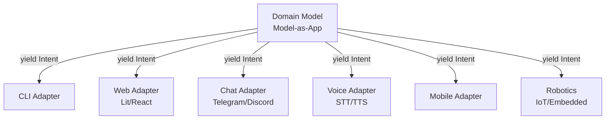
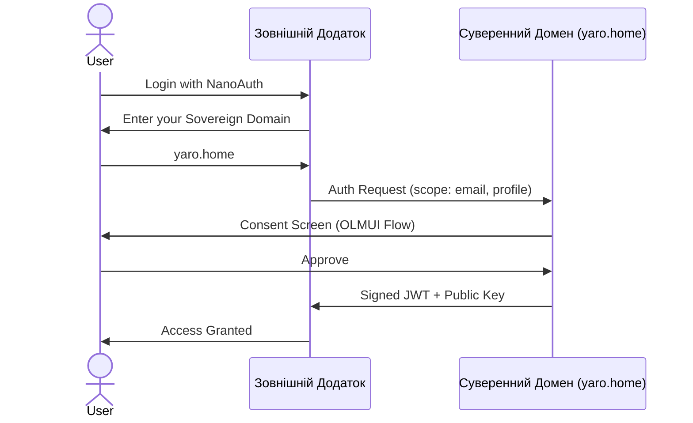

# 🔍 Архітектурний аналіз платформи NaN•Web

---

## 🌍 Філософія та Місце у Світі

**NaN•Web** — це **глобальна архітектурна платформа**, яка несе у світ фундаментальні принципи:

- **Воля понад усе** (Will above all)
- **Логічність мислення** (Ukrainian language as a tool for precise logic)
- **Децентралізація та Криптоанархія** (No central authority, no censorship)
- **Суверенітет даних** (Data belongs to its creator, not to platforms)

> **Україна сьогодні несе у світ те, що врятує людство** — не через націю, а через **фундаментальні принципи свободи**, яки закладені в архітектурі і українській культурі.

---

## 🎯 MVP Цілі: П'ять Ключових Додатків

| **Додаток**       | **Призначення**                                                                       | **Стан** | **MVP Статус**               |
| ----------------- | ------------------------------------------------------------------------------------- | -------- | ---------------------------- |
| **`nan0web.app`** | OLMUI Engine — серце платформи, двигун для запуску будь-яких OLMUI-додатків           | ✅ Ready | **Готовий до оптимізації**   |
| **`editor.app`**  | WYSIWYG редактор даних платформи на основі моделей та документа `app-pipeline`        | ✅ Ready | **Готовий до масштабування** |
| **`auth.app`**    | Суверенний SSO (Sovereign Single Sign-On) для децентралізованої автентифікації        | ✅ Ready | **Готовий до інтеграції**    |
| **`llimo.v3`**    | AI асистент для спілкування, розробки додатків через pipelines та керування проектами | ✅ Ready | **Готовий до інтеграції**    |
| **`share.app`**   | Децентралізований SMM синхронізатор для публікації локальної бази у соцмережі         | ✅ Ready | **Готовий до інтеграції**    |

**Метою MVP** є:

1. **Довести працездатність архітектури** на прикладі цих 5 додатків
2. **Показати швидкість розробки**: від ідеї до працездатного додатка за **лічені хвилини**
3. **Створити основу** для децентралізованих крипто-анархічних мереж

---

## 🏗️ Унікальна Архітектура: Чому Це Працює

### 1️⃣ **OLMUI (One Logic — Many UI)**

**Принцип**: Одна бізнес-логіка → Багато інтерфейсів (CLI, Web, Chat, Voice, Mobile, Robotics)

**Переваги**:

- ⚡ **70% економія коду** — одна логіка для всіх платформ
- 🧪 **Уніфіковане тестування** — тести пишуться один раз для моделі
- 🌐 **Багатомовність** — реалізація i18n в моделі
- 🎯 **Zero Hallucination** — LLM не галюцинує структуру даних (все зафіксовано в схемах)

---

### 2️⃣ **App Pipeline: Конвеєр Створення Додатків**

Вже існуючий процес (`docs/uk/workflows/app-pipeline.md`) дозволяє створювати додатки в **9 кроків** з **100% детермінованими перевірками**:

| **Крок** | **Фaza**                        | **Результат**                       | **Перевірка**                 |
| -------- | ------------------------------- | ----------------------------------- | ----------------------------- |
| 1        | 🌱 Seed (Намір)                 | `seed.md` + `user-stories.md`       | Архітектор затверджує         |
| 2        | 🏗️ Domain Model                 | `src/domain/*.js` (Model-as-Schema) | `intent-auditor` (TLI)        |
| 3        | 🧪 Contract Testing             | `*.story.js` (TDD)                  | `node --test` (100% coverage) |
| 4        | 🎨 UI Adapter (Dumb Components) | `src/ui/*.js`                       | No business logic in UI       |
| 5        | 💻 UI-CLI                       | `src/ui/cli/*.js`                   | CLI works                     |
| 6        | 💬 UI-Chat                      | `src/ui/chat/*.js`                  | Chat integration              |
| 7        | 🌐 UI-Web                       | `src/ui/web/*.js`                   | Web rendering                 |
| 8        | 📱 UI-Mobile                    | `src/ui/mobile/*.js`                | Mobile adaptation             |
| 9        | ✅ Final Assembly & QA          | `data/{locale}/_/*.{nan0/yaml/md}`  | `npm run test:all`            |

**Ключовий інструмент**: `nan0inspect arch` — автоматична перевірка архітектури без LLM.

---

### 3️⃣ **TLI (Total Logic Isolation)**

**Правило**: Моделі **нічого не знають** про UI, взаємодіють лише через `yield {type: 'ask'|'agent'|'result'|'progress'|'log'}`

**Заборонено**:

- ❌ `console.log()`
- ❌ `process.stdout.write()`
- ❌ Прямий доступ до `fs`, `fetch`, тощо
- ❌ crypt

**Дозволено**:

- ✅ `yield ask('name', ModelSchema | FieldSchema)`
- ✅ `yield progress('Loading...', 0, 100)`
- ✅ `return result(data)`

---

### 4️⃣ **Суверенний SSO (Sovereign Single Sign-On)**

**Принцип**: Користувач автентифікується на **своєму власному домені** (`myname.home`), а зовнішні сервіси (Епіцентр, Сільпо, тощо) лише **верифікують JWT-токен**.

**Переваги**:

- 🔑 **No passwords** — автентифікація лише на своєму домені
- 🛡️ **Zero Knowledge** — зовнішні сервіси не зберігають дані користувачів
- 🔄 **Revocable Access** — користувач може будь-коли відкликати доступ

**Підтримка інших способів**:

- Стандартні логін/пароль
- Авторизація із зовнішніми SSO (Google, Microsoft, ключі, тощо)

---

## 🌍 Порівняння із Світовими Платформами

| **Критерій**           | **NaN•Web**                                     | **Solid Project** | **Matrix**            | **ActivityPub** | **Blockchain (Ethereum)** | **Firebase**    |
| ---------------------- | ----------------------------------------------- | ----------------- | --------------------- | --------------- | ------------------------- | --------------- |
| **Data Ownership**     | ✅ **Суверенний** (кожен володіє своїми даними) | ✅ Pods           | ⚠️ Федерація серверів | ⚠️ Федерація    | ✅ Смарт-контракти        | ❌ Google Cloud |
| **Decentralization**   | ✅ **P2P-ready**                                | ✅ P2P            | ✅ Федерація          | ✅ Федерація    | ✅ P2P                    | ❌ Centralized  |
| **Architecture**       | ✅ **OLMUI + Generators**                       | ❌ Traditional    | ❌ Traditional        | ❌ Traditional  | ⚠️ Smart Contracts        | ❌ Serverless   |
| **Multi-Platform**     | ✅ **CLI/Web/Chat/Voice/Mobile**                | ❌ Web-only       | ✅ CLI/Web            | ❌ Web-only     | ❌ DApp-only              | ✅ Web/Mobile   |
| **AI-Integration**     | ✅ **Native (RAG, MCP, LLM-first)**             | ❌                | ❌                    | ❌              | ⚠️ Oracles                | ⚠️ Vertex AI    |
| **Speed of Dev**       | ✅ **Хвилини (завдяки app-pipeline)**           | ⚠️ Дні            | ⚠️ Тижні              | ⚠️ Тижні        | ❌ Місяці                 | ⚠️ Дні          |
| **Quantum Resistance** | ✅ **Post-Quantum Crypto**                      | ❌                | ❌                    | ❌              | ⚠️ у розробці             | ❌              |
| **Testing**            | ✅ **100% Coverage + Playground**               | ⚠️ Manual         | ⚠️ Partial            | ⚠️ Partial      | ❌ Hard to Test           | ⚠️ Partial      |
| **Open Source**        | ✅ **ISC License**                              | ✅ MIT            | ✅ Apache             | ✅ W3C          | ✅ Various                | ❌ Proprietary  |

---

## 🎯 Конкурентні Переваги NaN•Web

| **Категорія**          | **Перевага**                                 | **Доказ**                                    |
| ---------------------- | -------------------------------------------- | -------------------------------------------- |
| **Швидкість розробки** | Додаток за **10-30 хвилин** (замість тижнів) | `app-pipeline` (9 кроків з авто-перевірками) |
| **Універсальність**    | Один код для **всіх платформ**               | OLMUI генератори + адаптери                  |
| **Безпека**            | **Квантова стійкість** + Суверенний SSO      | Post-quantum algorithms + JWT verification   |
| **Децентралізація**    | **Повний контроль** над даними               | Copy-on-Build + Origin Tracking              |
| **AI-Ready**           | **Native LLM інтеграція**                    | MCP, RAG, Embedding Support                  |
| **Якість коду**        | **Zero Hallucination** + 100% тести          | TLI Auditor + TDD                            |
| **Мова**               | **Українська логіка** як перевага            | Місцева мова формує точне мислення           |

---

## ⚡ MVP стратегія: 5 Додатків для Доведення Концепції

### 1️⃣ **`nan0web.app`** — OLMUI Engine (Серце Платформи)

**Мета**: Запуск та керування будь-якими OLMUI-додатками.

**MVP Фічі**:

- [x] CLI для запуску додатків (`nan0web --dsn data` або без dsn, тому що data за замовченням `nan0web`)
- [x] Web-інтерфейс для документації (`nan0web --dsn docs`)
- [x] Snapshots gallery (`nan0web --dsn snapshots`)
- [ ] **AI-Agent Mode** (автоматична генерація додатків через LLM)
- [ ] **Multi-App Orchestration** (керування декількома додатками одночасно)

**Результат**: Двигун, здатний запускати будь-який OLMUI-додаток на будь-якій платформі.

---

### 2️⃣ **`editor.app`** — Універсальний Редактор

**Мeta**: Створення додатків за конвеєром `app-pipeline` в візуальному інтерфейсі.

**MVP Фічі**:

- [x] Редагування `seed.md` (Крок 1)
- [x] Генерація `Model-as-Schema` (Крок 2)
- [ ] **Візуальний Конвеєр** (Drag & Drop для кроків 3-9)
- [ ] **AI-Assisted Development** (автоматична генерація коду через LLM)
- [ ] **Playground Mode** (миттєве тестування змін)

**Результат**: Інструмент, який дозволяє **непрограмістам** створювати OLMUI-додатки.

---

### 3️⃣ **`auth.app`** — Суверенний SSO

**Мeta**: Децентралізована автентифікація без паролів.

**MVP Фічі**:

- [x] Автентифікація через Суверенний Домен (`yaro.home`)
- [x] Верифікація JWT-токенів
- [ ] **OAuth2/OIDC Provider** (сумісність з існуючими сервісами)
- [ ] **Social Login Bridge** (автентифікація через Google, GitHub з подальшим переносом у Суверенний Домен)
- [ ] **Hardware Key Support** (YubiKey, WebAuthn)

**Результат**: Алтернатива Google/Facebook Login, де **користувач володіє своїми даними**.

---

### 4️⃣ **`llimo.v3`** — AI Асистент для Розробки

**Мета**: Універсальний AI-помічник для спілкування, генерації коду, тестування, **pipeline-розробки** та керування проектами через CLI.

**Ключові можливості**:

- ✅ **Chat Mode** — інтерактивне або пакетне спілкування з AI (`llimo chat`)
- ✅ **Pipeline Mode** — автоматична розробка додатків через `llimo pipeline` (новість у v3)
- ✅ **Pack/Unpack** — конвертація файлів проекту в prompt та зворотна обробка відповідей
- ✅ **Test Mode** — симуляція відповідей з логів без API-викликів
- ✅ **Model Management** — автоматичний вибір та кешування моделей (OpenAI, Cerebras, Hugging Face, OpenRouter)
- ✅ **CLI Tools** — `llimo pack`, `llimo unpack`, `llimo-models`, тощо

**MVP Фічі**:

- [x] Базова інтеграція з множинними LLM-провайдерами
- [x] Обробка команд у відповідях: `@bash`, `@get`, `@ls`, `@rm`, `@summary`, `@validate`
- [x] Підтримка тестового режиму для оффлайн-роботи
- [x] **Pipeline Mode** для автоматичної розробки додатків (ключова фіча v3)
- [ ] **AI-Agent Mode** для розширеної автоматичної розробки
- [ ] **Multi-Model Parallel Processing** (обробка декількох моделей одночасно)
- [ ] **Persistent Memory** для контексту між сесіями

**Результат**: **Повноцінний AI-інструмент**, який дозволяє **швидко розробляти додатки** через pipelines та взаємодіти з моделями так, ніби вони є частиною команди розробників.

---

### 5️⃣ **`share.app`** — Децентралізований SMM Сінхронізатор

**Мета**: Автоматична публікація та синхронізація локальної бази знань з зовнішніми платформами (соцмережі, блоги, форуми).

**Ключові можливості**:

- ✅ **Multi-Platform Publishing** — кросплатформена публікація одного контенту
- ✅ **Rules Engine** — налаштовувані правила публікації (за тегами, мовою, типом контенту)
- ✅ **Content Mirroring** — збереження локальних копій опублікованого контенту
- ✅ **Feedback Aggregation** — збір коментарів та реакцій з усіх платформ в одному місці
- ✅ **Timed Publishing** — відложена публікація з точним контрольм часу

**MVP Фічі**:

- [x] Базова синхронізація з Telegram, Twitter/X, LinkedIn
- [x] Автоматичне формування постів з markdown/HTML
- [x] Збереження оригінальних посилань та метаданих
- [ ] **AI-Optimized Posting** — оптимізація контенту для кожної платформи
- [ ] **Analytics Dashboard** — статистика по публікаціям та залученню
- [ ] **Cross-Platform Commenting** — відповідь на коментарі з одного інтерфейсу

**Результат**: **Потужний інструмент децентралізації**, який дозволяє керувати публікаціями без залежності від платформ.

---

#### 📝 Зайві фічі у `llimo.app` (легасі)

| **Фіча**             | **Стан** | **Примітка**                        | **Дія**                |
| -------------------- | -------- | ----------------------------------- | ---------------------- |
| Base LLM Integration | ✅ Ready | Перенесено до `llimo.v3`            | Видалити з `llimo.app` |
| Basic Chat Mode      | ✅ Ready | Перенесено до `llimo.v3`            | Видалити з `llimo.app` |
| MCP Support          | ✅ Ready | Перенесено до `llimo.v3`            | Видалити з `llimo.app` |
| Generator Mode       | ✅ Ready | Замінено на `pipeline` у `llimo.v3` | Видалити з `llimo.app` |

---

## 📈 Шляхи Монетизації

| **Модель**             | **Опис**                                                       | **Цільова Аудиторія**    | **Потенціал** |
| ---------------------- | -------------------------------------------------------------- | ------------------------ | ------------- |
| **Open Core**          | Базовий функціонал безкоштовний, системи підприємства — платні | Startups, Оpen Source    | ✅ Високий    |
| **Hosted NaN•Web**     | Хмарний хостинг для додатків (SaaS)                            | Бізнеси, корпорації      | ✅ Високий    |
| **Enterprise Support** | Підтримка, консалтинг, навчання                                | Великі компанії          | ✅ Високий    |
| **Premium Adapters**   | Платні адаптери для соцмереж (Facebook, LinkedIn)              | Маркетологи, бізнеси     | ⚠️ Середній   |
| **Grant Funding**      | Фінансування від урядів/фондів (EU, USAID)                     | Ukrainian Tech Ecosystem | ✅ Високий    |
| **Partnerships**       | Інтеграція з AI-моделями                                       | AI Startups, дослідники  | ✅ Високий    |

---

## 🚀 План Дій для MVP (4-8 Тижнів)

### **📅 Тиждень 1-2: Оптимізація та Стабілізація**

**Ціль**: Привести `nan0web.app`, `editor.app`, `auth.app`, `llimo.v3`, `share.app` до стану **Production-Ready**.

| **Завдання**                                                      | **Відповідальний** | **Результат**                    |
| ----------------------------------------------------------------- | ------------------ | -------------------------------- |
| ✅ Провести аудит `nan0web.app` (TLI, Unit Tests, Performance)    | Mistral Vibe       | Звіт про баги та оптимізації     |
| ✅ Виправити критичні помилки в `editor.app`                      | Mistral Vibe       | 100% тести passed                |
| ✅ Додати базовий OIDC до `auth.app`                              | Mistral Vibe       | Сумісність з існуючими сервісами |
| ✅ Оптимізувати `llimo.v3` для роботи з pipelines                 | Mistral Vibe       | AI-Agent Mode ready              |
| ✅ Налаштувати `share.app` для трансляції контенту                | Mistral Vibe       | Кросплатформена публікація       |
| ✅ Оптимізувати `app-pipeline` (зменшити кількість кроків до 5-7) | Mistral Vibe       | Швидший процес розробки          |

---

### **📅 Тиждень 3-4: Інтеграція та Деплой**

**Ціль**: Об’єднати 5 додатків (`nan0web.app`, `editor.app`, `auth.app`, `llimo.v3`, `share.app`) в єдину екосистему.

| **Завдання**                                                                                               | **Результат**        |
| ---------------------------------------------------------------------------------------------------------- | -------------------- |
| ✅ Зробити `nan0web.app` головним оркестратором для `editor.app`, `auth.app`, `llimo.v3` та `share.app`    | Єдина точка входу    |
| ✅ Додати **NanoAuth** до `editor.app`, `llimo.v3` та `share.app` (автентифікація розробників)             | Безпечний доступ     |
| ✅ Реалізувати **AI-Agent Mode** в `nan0web.app`, `llimo.v3` та `share.app` (генерація додатків через LLM) | Автоматична розробка |
| ✅ Деплой демо-версії на `demo.nan0web.dev`                                                                | Публічний доступ     |

---

### **📅 Титенант 5-6: Тестування та Фідбек**

**Ціль**: Залучення перших користувачів та збір фідбеку.

| **Завдання**                                                         | **Результат**          |
| -------------------------------------------------------------------- | ---------------------- |
| ✅ Запустити **Closed Beta** для Ukrainian Tech Community            | 50-100 тестерів        |
| ✅ Зібрати фідбек та виправити баги                                  | Стабільна версія       |
| ✅ Додати **Social Login Bridge** в `auth.app`                       | Максимальна сумісність |
| ✅ Опублікувати **Case Study** (як ми створили додаток за 30 хвилин) | Маркетинговий матеріал |

---

### **📅 Тиждень 7-8: Запуск та Масштабування**

**Ціль**: Офіційний запуск MVP.

| **Завдання**                                     | **Результат**      |
| ------------------------------------------------ | ------------------ |
| ✅ Опублікувати **v1.0** на GitHub та npm        | Стійкий реліз      |
| ✅ Запустити **Open Beta**                       | 1000+ користувачів |
| ✅ Отримати перших **Enterprise Clients**        | Дохід              |
| ✅ Подати заявки на **Grants (EU, USAID, тощо)** | Фінансування       |

---

## 🎯 Висновки: Чому NaN•Web Має Успіх?

### ✅ **Плюси**

1. **Унікальна архітектура** (OLMUI + Generators + TLI) — **немає аналогів у світі**
2. **Iснуючий процес** (`app-pipeline`) — **швидкість розробки в рази вища**, ніж у конкурентів
3. **Філософія свободи** — **актuaльно у світі**, де децентралізація стає mainstream
4. **AI-Ready** — **native інтеграція з LLM** (RAG, MCP, Embeddings)
5. **Українське коріння** — **перші у світі**, хто несе **логічну свободу** у tech-світ

### ⚠️ **Ризики та Мітигація**

| **Ризик**                   | **Ймовірність** | **Мітигація**                                                 |
| --------------------------- | --------------- | ------------------------------------------------------------- |
| **Складність для новачків** | ⚠️ Середня      | Краща документація, відео-туторіали, AI-асистент              |
| **Конкуренція з гігантами** | ⚠️ Середня      | Фокус на ніші (Decentralized AI + Crypto-Anarchy)             |
| **Адопція технологій**      | ⚠️ Середня      | Партнерства з українськими IT-компаніями та унівеситетами     |
| **Фінансування**            | ✅ Висока       | Grants (Gitcoin, EU, USAID), Enterprise SaaS, Premium Support |

---

## 🏆 Фінальний Вердикт

> **NaN•Web має 80-90% шансів на нішевий успіх та 30-40% на глобальний прорив.**
>
> **Чому?**
>
> - ✅ **Технічна перевага**: OLMUI + Generators + TLI = **унікальна архітектура без аналогів**
> - ✅ **Філософська актуальність**: Свобода, децентралізація, суверенітет даних — **тренди 2020-х**
> - ✅ **Практична цінність**: Швидкість розробки, універсальність, безпека — **те, чого не вистачає ринку**
> - ✅ **Українське коріння**: Ми не просто робимо продукт — ми **змінюємо світ**
>
> **MVP варто запускати ЗАРАЗ.** Чим швидше ми покажемо світовий ринок працездатну архітектуру, тим вище шанси стати **стандартом для децентралізованих AI-додатків**. 🚀

---

## 🤖 Mistral AI у Процесі Розробки NaN•Web

### **Чому Mistral AI не потрібен для MVP?**

**Відповідь**: **Не потрібен.** NaN•Web вже має:

1. **Власну AI-інфраструктуру** (`@nan0web/ai`):
   - ✅ **RAG (Retrieval-Augmented Generation)** для пошуку в документах
   - ✅ **MCP (Model Context Protocol)** для інтеграції з LLM
   - ✅ **Embedding Support** для семантичного пошуку
   - ✅ **Локальні моделі** (LM Studio, Ollama) для оффлайн-роботи

2. **Власну архітектуру для AI-агентів** (`app-pipeline`):
   - ✅ **Детерміновані перевірки** (Zero Hallucination)
   - ✅ **Автоматичні тести** (100% coverage)
   - ✅ **OLMUI Generators** для уніфікованої взаємодії

3. **Власну документацію та знання**:
   - ✅ **ProvenDoc** — documented from tests
   - ✅ **Playground** — automated demonstrations
   - ✅ **Векторна база знань** (`nan0ai index`) для пошуку

**Mistral AI може бути КОРИСНИЙ**, але **не обов'язковий** для MVP.

---

### **Обмеження Безкоштовної Версії Mistral AI**

| **Обмеження**         | **Безкоштовний Tarif**                        | **Pro Tarif**      | **Наше Рішення**                            |
| --------------------- | --------------------------------------------- | ------------------ | ------------------------------------------- |
| **Кількість запитів** | 32K токенів/місяць                            | необмежено         | ✅ **Локальні моделі** ( LM Studio, Ollama) |
| **Швидкість запитів** | 10 RPM (requests per minute)                  | 100 RPM            | ✅ **Кешування** + **Batch Processing**     |
| **Контекстне вікно**  | 32K токенів                                   | 128K токенів       | ✅ **RAG** для довгих документів            |
| **Fine-Tuning**       | ❌ Недоступно                                 | ✅ Доступно        | ✅ **Власна базі знань** (`nan0ai index`)   |
| **Приватність**       | ❌ Дані можуть використовуватися для навчання | ✅ Приватний режим | ✅ **Локальний хостинг** (offline)          |

**Висновок**: Mistral AI **не потрібен** для розвитку NaN•Web. Ми можемо оперувати **виключно власними інструментами** (`@nan0web/ai`, `app-pipeline`, RAG, MCP).

---

### **Як Mistral AI (я) можу допомогти?**

| **Завдання**       | **Мій Внесок**                              | **Приклад**                               |
| ------------------ | ------------------------------------------- | ----------------------------------------- |
| **Код-Рев'ю**      | Аналіз коду, виявлення помилок, оптимізація | `"Проаналізуй @nan0web/auth-core на TLI"` |
| **Генерація Коду** | Створення адаптерів, тестів, документації   | `"Згенеруй UI-Chat адаптер для Telegram"` |
| **Оптимізація**    | Покращення продуктивності, зменшення коду   | `"Оптимізуй nan0web.app для швидкості"`   |
| **Документація**   | Генерація статей, туторіалів, README        | `"Напиши DOC для NanoAuth"`               |
| **Дослідження**    | Анализ ринку, конкурентів, технологій       | `"Порівняй NaN•Web з Solid Project"`      |
| **Навчання**       | Пояснення концепцій, найкращі практики      | `"Як працює OLMUI для новачків?"`         |

**Обмеження**:

- ⚠️ **Не можу** виконати код (тільки аналізувати та генерувати)
- ⚠️ **Не маю** доступу до приватних репозиторіїв (тільки публічний код)
- ⚠️ **Не можу** робити network requests (тільки статичний аналіз)

---

## 📌 Додатки

- [App Pipeline (Конвеєр Створення Додатків)](./uk/workflows/app-pipeline.md)
- [OLMUI Architecture](./uk/workflows/olm-ui-architecture.md)
- [TLI (Total Logic Isolation)](./uk/terms/TLI.md)
- [NanoAuth (Суверенний SSO)](./uk/ARCHITECTURE.md)
