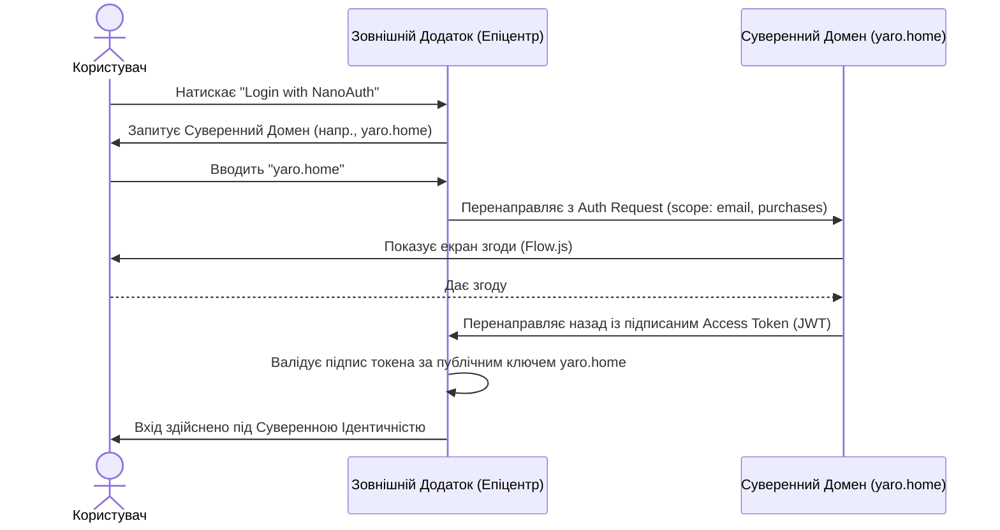

# 🌌 Універсальна Архітектура nan•web (Ментальна Матриця)

Цей документ є **Єдиним Джерелом Істини** для всіх додатків у екосистемі `nan•web`. Він визначає, як взаємодіють логіка, інтерфейс та дані на різних платформах.

---

## 🏗️ 1. Фрактальний Паттерн Nan•Додатків (App-in-App)

Екосистема побудована як **Фрактал Генераторів**. Будь-який nan•додаток може бути господарем (Host), а будь-який інший — під-додатком (Plugin).

### 🛰️ Реєстр Інтентів (Intent Registry)

Кожен Nan•Додаток експортує **Маніфест Інтентів**:

- **Intents**: Список ключових слів або команд, які він може обробити.
- **Generator**: Асинхронна функція-генератор (`async function*`), що обробляє ці інтенты.

### 🧩 Механізм Інтеграції (Recursive Flow)

Коли Банк підключає додаток `Credits`:

1. **Делегування**: Господар викликає `yield* Credits.run(intent)`.
2. **Автономність**: Якщо інтент неповний (наприклад, "хочу кредит"), під-додаток сам запускає діалог (питає суму, термін тощо) через власні `yield`.
3. **Повернення**: Після завершення логіки під-додатка, управління автоматично повертається до Господаря.

---

## 🎯 2. Діалог (Flow.js)

Основними одиницями взаємодії є `yield`.

- **Logic Layer**: Не знає про UI. Знає лише, _що_ йому потрібно (input) або _що_ він хоче повідомити (output).
- **Adapter Layer**: Платформозалежний. Знає, _як_ комунікувати з користувачем — через рендеринг компонентів та виконання запитів до користувача (показати модальне вікно React, озвучити речення, вивести промпт у консоль або увімкнути LED на роботі).

---

## 🌍 3. Мультимодальна Адаптація

### 💻 UI-CLI (Термінал)

- **Природа**: Послідовна, текстова.
- **Двигун**: `@nan0web/ui-cli` (Prompts, ANSI).
- **Flow**: `yield Prompt` -> Рендер ANSI -> Очікування вводу -> `generator.next(value)`.

### 💬 UI-Chat (Месенджери)

- **Природа**: Асинхронна, тривала.
- **Двигун**: `@nan0web/ui-chat`.
- **Flow**: Кожен `yield` відправляє повідомлення з кнопками або запитом тексту.

### ⚛️ UI-React / UI-React-Bootstrap

- **Природа**: Візуальна, нелінійна.
- **Flow**: `yield Component({ path })` -> Оновлення стану -> URL-маршрутизація.
- **Insight**: Кожен `yield` — це стабільний стан програми, на який можна посилатися через Deep Link.

### 🎤 UI-Voice (Голос)

- **Природа**: Часова, безперервна.
- **Lookahead**: 20-слівний буфер для природної інтонації (STT/TTS).
- **Barge-in**: Можливість переривання виводу користувачем.

### 🦾 ROI (Робототехніка)

- **Природа**: Фізична, просторова.
- **Mapping**: Переклад `yield Alert()` у фізичні жести (рух голови, світлова індикація).

---

## 🛡️ 4. Керування та Стабільність (Supervisor Pattern)

Глобальний Диспетчер має абсолютне право переривати будь-який потік:

1. **AbortSignal**: Усі генератори повинні приймати та поважати `signal`.
2. **Пріоритет Хоста**: Господар може зупинити під-додаток за таймаутом або у разі помилки.

---

## 📜 5. Самодокументація (Matrix Guard)

Щоб система не перетворилася на хаос, ми дотримуємося **Протоколу Снапшотів**:

1. **README.md.js**: Документація, що виконується. Невідповідність документу коду — це критична помилка.
2. **Чистота Маніфесту**: Жодна логіка не може існувати поза архітектурою.
3. **Purity**: Жодних крапок з комою у коді. Тільки чистий JavaScript згідно з правилами `nan•web`.

---

## 🛠️ 6. Реалістичний приклад: Екосистема Industrial Bank

Уявімо головний додаток Банку (**Host**), який керує двома nan•додатками: **LLiMo** (чат/підтримка) та **Credits** (кредитування).

### Сценарій діалогу:

1. **Host**: "Вітаю! Оберіть послугу: [Консультація] [Кредит]"
2. **User**: Обирає "Кредит".
3. **Host**: Бачить інтент `category: 'credits'` і робить `yield* flow(Credits.run)`.
4. **Credits (захоплює контроль)**:
   - `yield Select('На яку суму розраховуєте?')`
   - `yield Input('Ваш номер телефону')`
5. **Credits**: Завершує роботу, повертає результат `{ status: 'applied' }`.
6. **Host (повертає контроль)**: "Дякую! Вашу заявку прийнято. Чим ще допомогти?"

### Код реалізації:

```javascript
import { runFlow, Prompt, flow, Alert } from '@nan0web/ui/core'
import Credits from '@industrialbank/credits'
import LLiMo from '@nan•web/llimo'

/**
 * Головний потік Банку — оркестратор.
 * Він не знає, як видавати кредити, він лише знає, КОМУ передати управління.
 */
async function* bankMatrix() {
  const answer = yield Prompt('MainMenu', {
    message: 'Чим можу допомогти?',
    choices: ['Консультація', 'Оформити Кредит'],
  })

  if (answer.value === 'Оформити Кредит') {
    // Рекурсивна передача управління додатку Credits
    // Тепер Credits буде "володіти" діалогом, поки не завершиться
    const result = yield* flow(Credits.run)

    yield Alert({ message: `Статус кредиту: ${result.status}` })
  }

  if (answer.value === 'Консультація') {
    // Передаємо управління розумному чату LLiMo
    yield* flow(LLiMo.run)
  }

  // Після завершення будь-якого під-додатка ми знову тут
  yield Alert({ message: 'Я залишаюсь на звʼязку!' })
}
```

---

## 🧭 7. Чому це зручно?

1. **Ізоляція логіки**: Розробники `Credits` можуть міняти анкету (додавати поля), і це **нічого не зламає** в основному Банку.
2. **Універсальність**: Той самий код `Credits.run` працюватиме в терміналі банку (CLI), на сайті (React) та в телефонному дзвінку (Voice).
3. **Глибока інтеграція**: Nan•додаток може викликати під-nan•додаток (наприклад, `Credits` може викликати `Scanner` для завантаження паспорта).

---

## 📂 8. Архітектура Спільного Контенту та Децентралізована Стійкість

### Проблема

Багато nan•додатків (напр., `legalgreenplanet`, `yaro.home`, `sun.app`) можуть посилатися на один і той самий контент — біографію засновника, юридичний документ, фотогалерею. Виникають дві потреби:

1. **Єдине Джерело Істини**: Редагування одного документа має відображатися скрізь.
2. **Децентралізована стійкість**: Кожен опублікований сайт має містити власну **фізичну копію** контенту, щоб у разі втрати автором оригіналу, дані можна було відновити з будь-якого розповсюдженого дзеркала.

### Рішення: Copy-on-Build + Origin Tracking

**Правила:**

1. **Data Verse** (канонічна директорія) — місце, де автор пише та редагує контент.
2. При **білді** генератор nan•web **копіює** файли в `dist/` кожного сайту разом з маніфестом `_origin.json` (що містить `hash`, `source`, `timestamp`).
3. Кожен опублікований сайт — це **самодостатня, незалежна копія** (працює offline, на GitLab Pages або на будь-якому статичному хості).
4. Якщо канонічні дані втрачено, **скрипт відновлення** може перезаповнити Data Verse з будь-якої опублікованої копії, перевіривши хеші `_origin.json`.

### Оптимізація медіа-асетів (відповідність лімітам GitLab Pages)

Щоб вписатись у ліміт **20 файлів на підключення**:

- Всі зображення автоматично отримують `loading="lazy" decoding="async"`.
- Дрібні спільні іконки **інлайняться як SVG** безпосередньо в HTML (без окремих HTTP-запитів).
- Критичний CSS інлайниться для above-the-fold; решта завантажується асинхронно.
- `<link rel="preload">` застосовується лише до критичних шрифтів та стилів першого екрану.
- JavaScript UI-блоків завантажується через `IntersectionObserver` — `.js` компонента завантажується лише коли блок потрапляє у viewport.

---

## 📡 9. Соціальна Публікація (`share.app`) та Єдиний Фідбек (`connect.app`)

Всі nan•додатки є **видавцями контенту**. `share.app` виступає як **Суверенний Рівень Соціальної Дистрибуції**.

### Потік: Publish & Connect

1. **Publish (`share.app`)**: Автор **налаштовує правила публікації один раз**. Nan•додатки постійно генерують контент. `share.app` слухає **feeds/streams** і відправляє записи на зовнішні платформи (Telegram, LinkedIn, Facebook тощо) із заданою затримкою.
2. **Connect (`connect.app`)**: Коли пост опубліковано, `connect.app` починає стежити за ним на платформах, збираючи нові коментарі, лайки та відгуки.
3. **Єдиний Вигляд та Власність**: Замість того, щоб перевіряти 5 різних додатків, автор відкриває лог `share.app`/`connect.app` на своєму власному домені, обирає пост і бачить єдиний тред усіх коментарів з Facebook, LinkedIn, X та Instagram. **`connect.app` зберігає локальну копію всіх коментарів**, гарантуючи, що автор назавжди зберігає фідбек аудиторії, навіть якщо соцмережа видалить пост.
4. **Універсальна Відповідь**: Автор може відповідати на будь-який коментар прямо з цього Суверенного Фіду. `connect.app` відформатує відповідь і відправить її назад через відповідний адаптер, щоб вона виглядала як нативна відповідь у відповідній соцмережі.

### Rules Engine (conditions + delay)

```yaml
# share.config.yaml — Правила Публікації Автора
sources:
  - feed: yaro.home/data/posts/**/*.yaml
  - feed: sun.app/data/reflections/**/*.md

rules:
  - name: Публічні пости
    if:
      tags: [public, blog]
    publish:
      - adapter: telegram
        channel: '@yaro_channel'
        delay: 0 # миттєво
      - adapter: x
        delay: 30m # через 30 хвилин
      - adapter: facebook
        delay: 2h # через 2 години
      - adapter: linkedin
        delay: 1d 09:00 # наступного дня о 09:00
      - adapter: rss
      - adapter: bluesky
        delay: 1h

  - name: Юридичні документи
    if:
      type: legal
    publish:
      - adapter: linkedin
        delay: 0
      - adapter: email-newsletter
        list: legal-subscribers
        delay: 1h

  - name: Українськомовний контент
    if:
      lang: uk
    publish:
      - adapter: telegram
        channel: '@ukr_channel'
        delay: 0
      - adapter: viber-community
        delay: 15m
```

### Комплексна Матриця Адаптерів

Ця матриця відстежує всі можливі цільові платформи для `share.app` та `connect.app`, визначаючи пріоритет створення адаптерів на основі розміру аудиторії, механізму (API або браузер) та регіонального фокусу.

| Адаптер                    | Платформа   | Механізм                   | Оціночно MAU   | Естім. Всього | Регіон / Ніша               |
| :------------------------- | :---------- | :------------------------- | :------------- | :------------ | :-------------------------- |
| `@nan0web/share-facebook`  | Facebook    | API (Graph API)            | ~3.05 Млрд     | 3.0B+         | Глобально / Загальне        |
| `@nan0web/share-whatsapp`  | WhatsApp    | API (Business API)         | ~2.78 Млрд     | 2.7B+         | Глобально / Месенджер       |
| `@nan0web/share-youtube`   | YouTube     | API (Data API V3)          | ~2.50 Млрд     | 2.5B+         | Глобально / Відео           |
| `@nan0web/share-instagram` | Instagram   | API (Graph API)            | ~2.00 Млрд     | 2.0B+         | Глобально / Візуал, Reels   |
| `@nan0web/share-tiktok`    | TikTok      | API (Creator API)          | ~1.50 Млрд     | 1.5B+         | Глобально / Короткі відео   |
| `@nan0web/share-wechat`    | WeChat      | API (Official Account)     | ~1.30 Млрд     | 1.3B+         | Китай, Азія / Супер-додаток |
| `@nan0web/share-telegram`  | Telegram    | API (Bot API / MTProto)    | ~900 Мільйонів | 900M+         | Глобально, СНД / Крипта     |
| `@nan0web/share-x`         | X (Twitter) | API (v2)                   | ~550 Мільйонів | 600M+         | Глобально / Новини, Web3    |
| `@nan0web/share-pinterest` | Pinterest   | API                        | ~480 Мільйонів | 500M+         | Глобально / Натхнення       |
| `@nan0web/share-reddit`    | Reddit      | API                        | ~430 Мільйонів | 500M+         | Глобально / Спільноти       |
| `@nan0web/share-linkedin`  | LinkedIn    | API (Share API)            | ~310 Мільйонів | 1.0B+         | Глобально / B2B, Кар'єра    |
| `@nan0web/share-viber`     | Viber       | API (Bot API)              | ~250 Мільйонів | 1.0B+         | CEE, СНД / Месенджер        |
| `@nan0web/share-discord`   | Discord     | API (Webhooks/Bot)         | ~200 Мільйонів | 500M+         | Глобально / Ігри, Web3      |
| `@nan0web/share-threads`   | Threads     | API                        | ~150 Мільйонів | 150M+         | Глобально / Мікроблоги      |
| `@nan0web/share-medium`    | Medium      | API                        | ~100 Мільйонів | 100M+         | Глобально / Long-form Tech  |
| `@nan0web/share-substack`  | Substack    | Автоматизація Playwright\* | ~35 Мільйонів  | 35M+          | Глобально / Розсилки        |
| `@nan0web/share-xing`      | Xing        | Автоматизація Playwright\* | ~20 Мільйонів  | 22M+          | DACH (DE/AT/CH) / B2B       |
| `@nan0web/share-bluesky`   | Bluesky     | API (AT Protocol)          | ~5 Мільйонів   | 5M+           | Глобально / Tech, Децентр.  |
| `@nan0web/share-mastodon`  | Mastodon    | API (ActivityPub)          | ~2 Мільйони    | 10M+          | Глобально / Open Source     |
| `@nan0web/share-rss`       | RSS/Atom    | Генератор (XML)            | N/A            | N/A           | Глобально / Стандарт        |

_\* Платформи, позначені як `Автоматизація Playwright`, не мають відкритого API публікації для окремих користувачів, вимагаючи від `@nan0web/share.app` використання headless-браузера для симуляції логіну та публікації._

### Система Затримок / Планування

Формати `delay`:

- `delay: 0` → публікувати негайно
- `delay: 30m` → через 30 хвилин після створення контенту
- `delay: 2h` → через 2 години
- `delay: 1d` → через 24 години
- `delay: 1d 09:00` → наступного дня о 09:00 за місцевим часом
- `delay: Mon 10:00` → наступного понеділка о 10:00

**Ключові принципи:**

1. **Пиши раз — публікуй скрізь**: Автор пише контент у своєму nan•додатку. `share.app` розповсюджує його автоматично.
2. **Правила, а не ручні дії**: Автор налаштовує conditions один раз. Увесь майбутній контент, що відповідає правилам, публікується автоматично.
3. **Затримка як базова функція**: Кожне правило може мати `delay` — від миттєвого (`0`) до запланованого (`1d 09:00`, `Mon 10:00`).
4. **Модульність адаптерів**: Кожен адаптер — окремий nan•app модуль. Додати нову платформу = додати новий адаптер. Без змін ядра.
5. **Суверенний контроль**: Автор володіє контентом, правилами та розкладом. Жодна платформа не "володіє" та не фільтрує алгоритмічно вихідний потік.
6. **Повна автономність (Standalone)**: `share.app` не вшитий у платформу `nan•web` жорстко. Будь-який користувач може встановити його незалежно (через npm CLI або Docker), підключити як джерело даних зовнішній RSS, JSON-фід або іншу папку, і використовувати Rules Engine як повністю самостійну утиліту для дистрибуції.

---

## 🔐 11. Суверенний протокол Single Sign-On (SSO)

Екосистема nan•web переосмислює процес автентифікації. Замість створення акаунтів на кожному новому сайті (наприклад, Епіцентр, Сільпо, Netflix), користувач застосовує **власний Суверенний Домен** (напр., `yaro.home` або `snigirev.eco`) як Провайдера Ідентичності (IdP).

### Діаграма SSO



### Ключові Переваги

1. **Без Паролів**: Користувач автентифікується лише на власному домені (один раз).
2. **Нульові Знання**: Зовнішні магазини (як Епіцентр) не тримають запис про користувача у базі, вони лише верифікують токен.
3. **Відкличний Доступ**: Користувач може будь-коли відкликати доступ до стороннього додатку безпосередньо з панелі керування свого власного домену.
