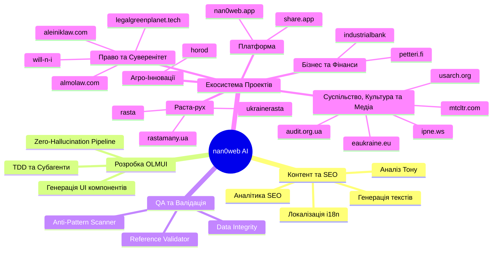

# 🧠 Карта Можливостей ШІ (AI Capability Mind-Map)

Ця мапа структурує усі функції, робочі процеси (workflows) та проекти, з якими може працювати колективний ШІ на базі платформи nan0web. Вона слугує індексом для розуміння того, ЩО ми можемо генерувати, обробляти та деплоїти.

## Візуальна Мапа (Mermaid)

## 1. Генерація та Обробка Контенту
- **Написання та Структурування**: Генерація статей, публічних позицій, архітектурних рішень (Dossier-as-Code).
- **Локалізація та i18n**: Автоматичний переклад контенту без втрати Markdown-структури чи вкладених лінків.
- **SEO та Маркетинг**: Аналіз YouTube-трендів, класифікація відео за алгоритмічним потенціалом (`seo-smm-analyzer`), генерація мета-описів.
- **Аналіз Тону**: `sentiment-analyzer` для виявлення емоційного забарвлення тексту.

## 2. Написання Коду (OLMUI Розробка)
- **Матричний Конвеєр**: Ізольоване виконання етапів (Seed -> Model -> TDD Contract -> UI Adapter -> Mobile/Web UI).
- **Zero Hardcode UI**: Створення CLI, React, Chat та інших інтерфейсів з єдиної бізнес-моделі (`forge-component`).
- **Автономні Субагенти**: Делегування написання автоматизованих тестів до досягнення `100% PASS` перед викликом Архітектора.

## 3. Якість та Валідація (QA / Інспектори)
- **Reference Validator (MD Links)**: Вбудована перевірка всіх внутрішніх та зовнішніх посилань (на статус `200 OK` і правильний MIME-тип).
- **Anti-Pattern Scanner**: Виявлення хардкоду та антипатернів перед релізом (`anti-pattern-scanner`, `test-style-scanner`).
- **Data Integrity**: Перевірка цілісності словників (`i18n-builder`, `inspect-i18n`).

## 4. Проекти та Їх Дедуплікація (Екосистема)
Ми консолідуємо інфраструктуру. Наступні проекти мають спільну або перехресну базу:
- **Rasta Ecosystem**: `rasta`, `ukrainerasta`, `rastamany.ua` — це по суті ОДИН поліморфний проект.
- **Право, Суверенітет та Свобода**: `legalgreenplanet.tech`, `aleiniklaw.com`, `almolaw.com` (Адвокати в Нью-Йорку), `will-n-i` (Проект "Вільні").
- **Суспільство, Культура, Антикорупція та Медіа**: `usarch.org` (Українська школа архітипіки), `mtcltr.com` (Метакультура), `audit.org.ua` (Народний Аудит — антикорупційна діяльність), `eaukraine.eu` (Євроатлантична асоціація), `ipne.ws` (Медіа/Новини).
- **Комерція, Бізнес та Фінанси**: `industrialbank`, `petteri.fi` (бізнес-проекти та фінансові можливості).
- **Платформа**: `nan0web.app`, `nan0web.pm`, `share.app`, `hosting.app`.
- **Агро та Спосіб життя**: `horod`, `underground-oasis`, `tir-dinamo.kiev.ua`.

## 5. Моделі Доступу та Економіка Агентів
Ця можливість дозволяє налаштовувати агентів для комерційного використання:
- **Free / Base**: Базова генерація ідей, ручний копіпейст, запуск одиночних промптів. Інструмент для персонального дослідження.
- **Patreon / Premium**: Повноцінна оркестрація через `agents.md` (Wizard), створення автономних субагентів, автоматичний реліз та перевірка гіпотез на льоту, глибинна SEO-оптимізація та аналіз YouTube.
