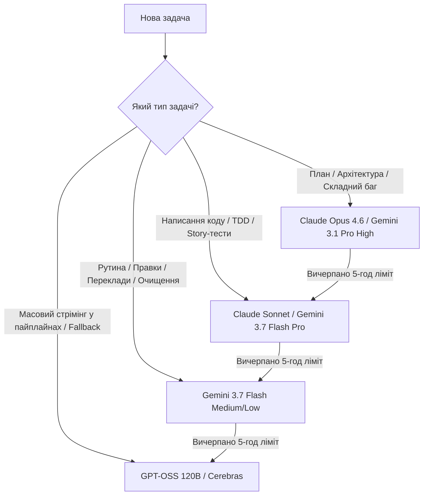

# 📊 Порівняння лімітів: Google AI Pro vs Google AI Ultra (Antigravity / Google One)

Документ для планування та оптимізації витрат токенів у сесіях розробки, OLMUI-генераторах та пайплайнах монорепозиторію.

---

## 1. Загальна порівняльна таблиця (5 годин vs 1 тиждень)

| Модель / Режим | Пакет | **Ліміт на 5 годин** (Запитів / Промптів) | **Токен-бюджет на 5 годин** (Орієнтовно) | **Ліміт на 1 тиждень** (Запитів / Промптів) | **Токен-бюджет на 1 тиждень** (Орієнтовно) | Рекомендована роль у розробці |
| :--- | :--- | :--- | :--- | :--- | :--- | :--- |
| **Gemini 3.7 Flash** *(Low)* | **AI Pro** **AI Ultra** | **150 – 200** **500+** | **~30M** **~100M+** | **1,500 – 2,000** **5,000+** | **~300M** **~1B+** | Фоновий парсинг, рутинні правки, швидкі CLI-команди |
| **Gemini 3.7 Flash** *(Medium)* | **AI Pro** **AI Ultra** | **100 – 150** **350+** | **~25M** **~75M** | **1,000 – 1,200** **3,500+** | **~200M** **~700M** | Базове написання коду, рефакторинг функцій, документація |
| **Gemini 3.7 Flash** *(Pro/High)* | **AI Pro** **AI Ultra** | **60 – 90** **200+** | **~15M** **~50M** | **600 – 800** **2,000+** | **~120M** **~400M** | Глибокий аналіз логіки, пошук багів, алгоритмічні модулі |
| **Gemini 3.1 Pro** *(Low / Std)* | **AI Pro** **AI Ultra** | **50 – 70** **150 – 200** | **~12M** **~40M** | **400 – 500** **1,500+** | **~80M** **~300M** | Робота з великим контекстом (повні файли, монорепа до 2M) |
| **Gemini 3.1 Pro** *(High / Deep)* | **AI Pro** **AI Ultra** | **30 – 40** **100+** | **~8M** **~25M** | **250 – 300** **1,000+** | **~50M** **~200M** | Складний системний рефакторинг, великі архітектурні плани |
| **Claude 3.7 / 4.6 Sonnet** | **AI Pro** **AI Ultra** | **40 – 50** **120 – 150** | **~5M** **~18M** | **300 – 400** **1,200+** | **~35M** **~150M** | Еталонний кодогенератор для точкових складних задач |
| **Claude 4.6 Opus** *(Thinking)* | **AI Pro** **AI Ultra** | **15 – 25** **50 – 70** | **~2.5M** **~8M** | **120 – 160** **500+** | **~18M** **~70M** | Стратегічний дизайн, створення нових пакетів з нуля |
| **GPT-OSS 120B** *(Medium/Open)* | **Обидва** | **200 – 300** | **~20M** | **2,000+** | **~150M** | Невичерпний буфер / резервний fallback |

---

## 2. Ключові відмінності пакетів

### 🔹 Google AI Pro (Базовий Pro-рівень, ~$20/міс)
- **Призначення:** Індивідуальна розробка, чергування моделей.
- **Особливість 5-годинного вікна:** При інтенсивній роботі з **Opus** або **Pro (High)** ліміт може вичерпатися за 1.5–2 години.
- **Стратегія виживання:** 70% часу працювати на *Gemini 3.7 Flash (Medium)*, а *Opus / Pro* підключати тільки на етапі планування.

### 👑 Google AI Ultra / Enterprise (Розширений рівень, ~$249+/міс або Team Tier)
- **Призначення:** Безперервні генеративні пайплайни, автономні субагенти, пакетна обробка відео/статей.
- **Особливість:** Збільшені у **3–4 рази** квоти на важкі моделі (Opus, Gemini Pro Deep) та фактично зняті обмеження на Flash-моделі.
- **Пріоритет черги (Dedicated GPU Priority):** Немає затримок інференсу у вечірні години пік.

---

## 3. Матриця розподілу задач (Як не спалити токени)

### 💡 Практичні поради для сесій:
1. **Планування (Крок 1):** Запускати на **Opus 4.6** або **Gemini 3.1 Pro (High)** — 1-2 промпти на весь план.
2. **Імплементація (Крок 2-4):** Перемикатися на **Gemini 3.7 Flash (Low/Medium)** або **Sonnet 4.6**.
3. **Пайплайни статей / відео (`LLMClient.js`):** Використовувати `streamTextGenerator()` з вибором моделі за замовчуванням `gpt-oss-120b` або `gemini-flash`, щоб не спалювати промпти розробника.
4. **Ковзне вікно 5 годин:** Якщо відчуваєш уповільнення або зловив 429 — перемикайся на Flash, через 5 годин квота на Opus/Pro повністю відновиться.
