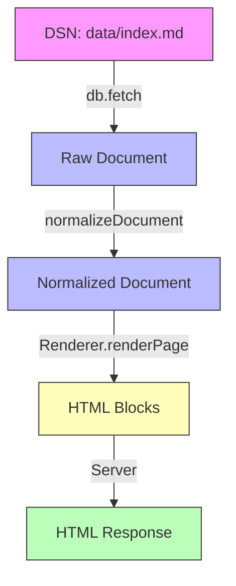

# 📄 Архітектура Рендерингу

## 🏗️ Потік даних



## 📦 Стандарт документа

Будь-який файл (`.md`, `.nan0`, `.yaml`, `.json`) після нормалізації має єдиний формат:

```typescript
interface NormalizedDocument {
    // Метадані з frontmatter (для .md) або кореня (для .nan0/.yaml/.json)
    title?: string
    icon?: string
    layout?: 'page' | 'list' | 'form' | 'feed'
    hidden?: boolean
    order?: number

    // Вміст
    content?: string       // Markdown як рядок (для .md)
    $content?: any[]       // Структура для рендерингу (для .md)
    [key: string]: any      // Додаткові поля
}
```

## 🔄 Процес нормалізації

```mermaid
flowchart TD
    A[db.fetch() result] -->|normalizeDocument| B{Has document?}
    B -->|Yes| C[Extract metadata + content]
    B -->|No| D[Ensure content/$content]
    C -->|Normalize| E[NormalizedDocument]
    D -->|Normalize| E
```

## 🎨 Рендеринг

### 1. `Renderer.renderPage()`
- Отримує `page.source` (наприклад, `data/index`)
- Викликає `resolveData(state, page.source)` → отримує нормалізований документ
- Конвертує в HTML-блоки

### 2. `Renderer.#renderPage()`
```javascript
if (doc && typeof doc === 'object') {
    // ✅ Обробка нормалізованого документа
    if (doc.content) return this.#renderMarkdown(doc.content)
    if (doc.$content) return doc.$content
    return [{ section: true, data: doc }]
}
```

### 3. `Renderer.#renderMarkdown()`
- Парсить Markdown в HTML
- Підтримує `<nan0-sandbox>` для ізольованих компонентів
- Повертає блоки `{ ui-html: "<h1>...</h1>" }`

## 🛡️ Захист від помилок

### 1. Нормалізація
- Гарантує, що `doc` завжди має однакову структуру
- Вилучає внутрішні поля (`document`, `vars`, тощо)

### 2. Fallback
- Якщо документ не вдалося нормалізувати → `{ section: true, data: doc }`
- Якщо документ не має вмісту → `{ h1: page.title }`

## 📚 Приклади

### Приклад 1: Markdown файл
```markdown
---
title: Home
icon: 🏠
---
# Hello, NaN0Web
```

**Потік:**
1. `db.fetch('data/index')` → `{ document: { children: [...] }, vars: { title: 'Home', icon: '🏠' } }`
2. `normalizeDocument()` → `{ title: 'Home', icon: '🏠', content: '# Hello, NaN0Web' }`
3. `Renderer.renderPage()` → `{ ui-html: '<h1>Hello, NaN0Web</h1>' }`

### Приклад 2: NaN0 файл
```nan0
title: Home
icon: 🏠
content: # Hello, NaN0Web
```

**Потік:**
1. `db.fetch('data/index')` → `{ title: 'Home', icon: '🏠', content: '# Hello, NaN0Web' }`
2. `normalizeDocument()` → `{ title: 'Home', icon: '🏠', content: '# Hello, NaN0Web' }` (без змін)
3. `Renderer.renderPage()` → `{ ui-html: '<h1>Hello, NaN0Web</h1>' }`

## 🔧 Реалізація

### 1. Додати нормалізацію
```javascript
// apps/nan0web.app/src/utils/normalizeDocument.js
export function normalizeDocument(doc) {
    if (doc && doc.document) {
        return {
            ...doc.vars,
            content: doc.toString(),
            $content: doc.document.children,
        }
    }
    return {
        ...doc,
        content: doc.content || '',
        $content: doc.$content || [],
    }
}
```

### 2. Використовувати в `buildNavTree.js`
```javascript
// apps/nan0web.app/src/utils/buildNavTree.js
import { normalizeDocument } from './normalizeDocument.js'

const doc = await db.fetch(indexUri) ?? {}
const normalizedDoc = normalizeDocument(doc)
```

### 3. Використовувати в `Renderer.js`
```javascript
// apps/nan0web.app/src/renderer/Renderer.js
if (doc && typeof doc === 'object') {
    if (doc.content) return this.#renderMarkdown(doc.content)
    if (doc.$content) return doc.$content
    return [{ section: true, data: doc }]
}
```
