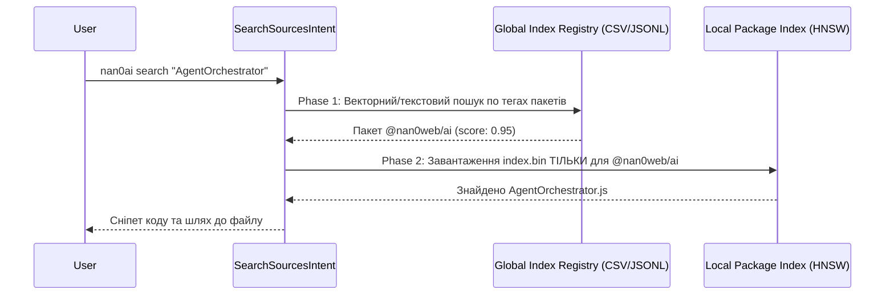

# 🚀 Mission: Agent Orchestrator & CLI Search Model

## 🏁 Overview (Огляд)
Цей реліз об'єднує підсистему автономних агентів (Subagent Orchestrator) та семантичний пошук без галюцинацій (Zero-Hallucination Search Index) у єдину архітектуру. Замість використання `grep`, який часто зависає на `node_modules` чи не релевантних файлах, створюється універсальна модель-намір `SearchSourcesIntent`. Відповідно до OLMUI, логіка пошуку інкапсулюється в моделі (Model-as-Schema), тому всі фронтенди-утиліти (`nan0web ai search`, `nan0cli ai search`, `nan0ai search`) будуть маршрутизуватися через одне й те саме надійне ядро.

## 👥 User Stories (Сценарії)

> Як розробник (Developer Space), коли я виконую `nan0ai search "AgentOrchestrator"` знаходячись в корені монорепозиторію, я хочу щоб утиліта автоматично виявила, що ми в root, та використала глобальний двофазний пошук (Phase 1 → Phase 2). Пошук має завершуватись за $\approx$1 секунду без сирових сканувань.

> Як розробник (User Space), знаходячись глибоко в директорії `packages/ai/src/domain`, при виконанні `nan0cli ai search "query"`, я очікую, що система розумно знайде найближчий `package.json`, розпізнає контекст пакету `@nan0web/ai`, і використає лише специфічний індекс (наприклад, `.datasets` чи `VectorDB` кеш).

> Як архітектор NaN0Web, я хочу аби інструменти `nan0cli`, `nan0web` та `nan0ai` не дублювали логіку аналізу команд чи пошуку. Я описую `SearchSourcesIntent` (extends Model), який бере на себе всю роботу: знаходження БД, звернення до індексу і видача результатів як `yield result(...)`. CLI утилітам залишається лише відрендерити це в термінал.

> Як системний аналітик, я хочу щоб пошук по всьому монорепозиторію не завантажував пам'ять. Система повинна спочатку звернутись до глобального легкого реєстру (App Store аналог) всіх існуючих пакетів та їхніх тегів, щоб за долю секунди знайти найрелевантніші 1-2 пакети, і вже тільки після цього качати та обробляти їх важкі локальні `index.bin`.

## 🏗 Data-Driven Architecture (Моделювання)

### Two-Phase Route Architecture (Мультипакетний Пошук)
Наразі індекси фрагментовані, кожен пакет має своє сховище у своїх теках з індексом файлів. Щоб `AgentOrchestrator` знав, куди йти, `SearchSourcesIntent` використовуватиме Two-Phase Route:

1. **Phase 1 (Namespace Routing):** Створення легкого реєстру (наприклад `apps.csv`, `packages.jsonl`) усіх пакетів у workspace з їхніми назвами, шляхами та масивом `tags`. Спершу `SearchSourcesIntent` векторизує запит чи шукає текстово в масиві тегів, щоб знайти найрелевантніші пакунки.
2. **Phase 2 (Deep Local Search):** У пам'ять завантажується лише HNSW-індекс виявлених `[..selectedPackages]` і проводиться глибокий семантичний пошук.

## 🎯 Scope (Задачі)

**Етап 1: Agent Registry & Orchestrator (DONE ✔️)**
- [x] Реалізовано `AgentOrchestrator` та реєстрацію за `static alias`.
- [x] `CnaiRefactorAgent` (LLM-агент), який використовує `fromPrompt`.
- [x] `BoundaryParser` покритий тестами і стабілізований.

**Етап 2: Model-as-Schema CLI (DONE ✔️)**
- [x] **Інкрементальний Індексатор (Model-as-App):** Реалізовано `IndexWorkspaceApp.js`.
- [x] **Модель Пошуку (Model-as-Intent):** Створено `SearchSourcesIntent.js`, який забезпечує Phase 2 пошуку.
- [x] **Discovery Protocol:** Логіка ініціалізації баз перенесена в `AiAppModel.js`.
- [x] Оновити `bin/nan0ai.js` та перетворити `bin/search-workspace.js` на агностичний адаптер.
- [ ] **Автоматизація (Git Hooks):** Додати скрипт для автоматичного запуску `nan0ai index` при `pre-push` або `release`.
- [ ] **Окрема індексація Source Code:** Відділити `.js` від `.md`.

## ✅ Acceptance Criteria (DoD)
- [x] **Контрактні тести** `task.spec.js` для базових агентів (Етап 1) є стабільно `Green`.
- [ ] **Model-as-Schema:** Існує `SearchSourcesIntent` модель. Всі поля конфігуровано через `static`.
- [ ] **Data Architecture:** Пошук уникає повільного `grep` і базується винятково на семантичних базах через DB-FS. Запит з різним `cwd` підтягує правильні бази.
- [ ] Формат видачі результату на екран містить чіткі шляхи до файлів та короткий контекстний сніпет.
