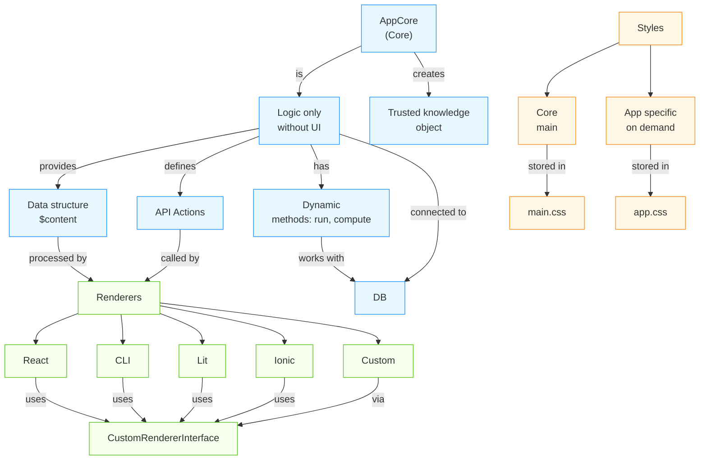

[Читати українською](../../system.md)

# 🔍 Detailed Architecture of AppCore + Multi-Renderer System

## 🧩 Basic Principles of Interaction Design System

**1 = 0 + 0'** - this is not just a formula, but the philosophy of the system. Each component is created as the **smallest trusted fact** that exists independently, but in interaction with others forms a **resonance of trust**.

### Rule: Model as Schema and Model as App

In our ecosystem, we are guided by two related patterns:
1. **Model as Schema**: `Model` is a strict data container (typed via static metadata). Its main role is normalization, validation, and managing defaults. It is a pure schema without an execution environment.
2. **Model as App**: A model can add an **execution environment** to itself. It becomes able to *live* in an environment (having a connected DB, predefined `t` translations, and executing logic in `run()`).

**Important Postulate**:
* **Not all schemas/models must be apps**. Most models (like `UserModel`, `ProjectModel`) remain pure data structures.
* But **any model can become an App** if there is an architectural need to encapsulate its own execution context, API, and isolated business logic. It then evolves into a fully independent Use Case.

---

## 🔄 Interaction Architecture Overview



---

## 🏆 Golden Standard v2: Model as App (Without AppCore)

An in-depth analysis of real applications showed that `AppCore` is a redundant (legacy) abstraction. Instead of creating a separate heavy core component, **the simplest and most efficient standard for an application is a regular `Model`**.

Each application is just a `Model` (a strict Data Schema) that extends its behavior with a `run()` method and business logic. All necessary external tools (DB, translations, environment variables) are passed through the system-guaranteed second argument `options`.

**Key Rules of Golden Standard v2:**
1. **Inheritance**: The app extends the base `Model` from `@nan0web/core` (`AppCore` is being phased out).
2. **State & Metadata**: All state variables of the app are declared as `static` fields (Model-as-Schema). The app instantly gets typing, validation, and default values.
3. **Dependencies (Inversion of Control)**: The app never initiates `DB` or `t` directly. They are injected by the runner via `new AppModel(data, { db, t })`. Access to them is performed through the built-in getter `this.db` or `this._.t`.
4. **Execution (`run`)**: The app guarantees a `run()` entrypoint (async or generator), returning an `AppResult` containing `$content` blocks (OLMUI).

### Reference Example (Model as App)

```javascript
import { Model, AppResult } from '@nan0web/core'

/**
 * @docs
 * # ClassicApp
 * Demonstration of the golden standard v2 app built on top of Model.
 */
export default class ClassicApp extends Model {
    static UI = {
        title: 'Classic Application',
        description: 'Template for the golden standard v2 app',
        icon: '🥇'
    }

    // 1. State metadata (Model-as-Schema)
    static count = { default: 0 }
    static status = { default: 'idle', options: ['idle', 'saved', 'error'] }
    static errorMessage = { default: '' }

    /**
     * @param {object} data - Initial app data/state
     * @param {object} options - Environment dependencies (db, t, renderer)
     */
    constructor(data = {}, options = {}) {
        super(data, options)
        // super automatically unpacks count, status, errorMessage 
        // and makes this.db and this._ (options) available
    }

    /**
     * 2. Main entry point (Run)
     */
    async run() {
        return new AppResult({
            content: this._renderView()
        })
    }

    /**
     * 3. Business logic
     */
    async submit(newCount) {
        const t = this._.t || ((k) => k) // Retrieve translations from options
        
        if (newCount < 0) {
            this.errorMessage = t('Number cannot be negative')
            this.status = 'error'
            return new AppResult({ content: this._renderView() })
        }

        this.count = Number(newCount)
        this.status = 'saved'
        this.errorMessage = ''
        
        return new AppResult({ content: this._renderView() })
    }

    /**
     * 4. OLMUI Data-Driven Render Function
     */
    _renderView() {
        const t = this._.t || ((k) => k)

        return [
            {
                form: {
                    $class: 'classic-form',
                    $onSubmit: (formData) => this.submit(formData.count),
                    content: [
                        { Input: { type: 'number', value: this.count, name: 'count' } },
                        this.status === 'error' && { Alert: this.errorMessage, $variant: 'danger' },
                        this.status === 'saved' && { Alert: t('Saved!'), $variant: 'success' },
                        { Button: { $t: 'Save', type: 'submit' } }
                    ].filter(Boolean)
                }
            }
        ]
    }
}
```
