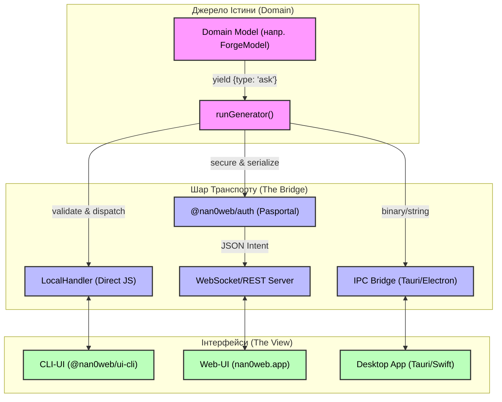

# 🏗️ Архітектура: @nan0web/inspect & The Bridge

Цей документ описує концепцію **OLMUI Bridge**, яка дозволяє доменним моделям взаємодіяти з будь-яким інтерфейсом через уніфікований шар транспорту.

## 📊 Діаграма потоків даних



## 🛣️ Опис роботи

1. **Model** (наприклад, `PackageAuditor`) викидає інтенцію `yield {type: 'ask'}`.
2. **Runner** (`runGenerator`) перехоплює інтенцію та передає її у відповідний **Transport Handler**.
3. **Transport Handler** (Local, WS або IPC) відповідає за доставку інтенції до кінцевого **UI**.
4. **Auth Layer** гарантує, що лише авторизовані клієнти можуть відповідати на запити моделі при дистанційному виконанні.
5. **UI** (Web/CLI/Desktop) відмальовує необхідні компоненти на основі схеми інтенції та повертає результат.

## 💡 Переваги підходу

- **Ізоляція**: Модель нічого не знає про мережу, сокети чи React.
- **Портативність**: Один і той самий код аудиту працює локально в терміналі та віддалено в браузері.
- **Безпека**: Авторизація інтегрована в шар транспорту, а не в бізнес-логіку.

---

## 🔐 Роль Авторизації (Auth Middleware & Database)

У Data-Driven системі (як-от NaN0Web) доменні моделі залишаються "сліпими" не лише до UI, але й до складнощів авторизації. Це досягається завдяки правильному розподіленню ролей:

### 1. Auth як Middleware для `nan0web DB`

Головний актор системи — це База Даних (`@nan0web/db`). Вона відповідає за те, щоб дані могли бути завантажені чи змінені.

- Коли модель виконує `db.fetch('private/..._')`, база перевіряє наявність доступу.
- Якщо `db` — це віддалений або захищений вузол, `@nan0web/auth` працює як **Middleware** для `nan0web DB`, автентифікуючи кожен запит.

### 2. Відсутність Auth-Логіки в Моделях

Доменна модель **нічого не знає** про сесії, куки чи WebSockets. Вона оперує абстрактним контекстом:

- **На етапі Транспорту**: Коли WebSocket або REST підключається, серверний `Transport Adapter` використовує `@nan0web/auth` для перевірки токена.
- **Ін'єкція при ініціалізації**: Якщо сесія валідна, Транспорт створює об'єкт користувача і передає його в `options` при інстанціюванні моделі: `new TransferModel({ user: session.user })` або `runGenerator(model, { db, user })`. Тобто `this._.user` вже існує на момент старту `run()`.
- **В Моделі**: Модель просто звертається до `this._.user?.id`. Якщо його немає — кидає стандартну помилку `Unauthorized`, не дбаючи про те, звідки він взявся.

### 3. Два рівні Авторизації (Приклади)

#### A. Session Auth (Транспорт / Middleware)

Модель "Зміна паролю" не займається логіном, вона працює з наявним контекстом сесії:

```javascript
import { Model, ModelError } from '@nan0web/types'
import { result } from '@nan0web/ui'

class ChangePasswordModel extends Model {
  // Статичне поле для збору перекладів (через i18n-builder)
  static UI = { ERROR_UNAUTHORIZED: 'Unauthorized' }

  async *run() {
    // 1. Контекст сесії вже перевірено і впорскнуто Транспортом ще до виклику run()
    const userId = this._.user?.id
    if (!userId) {
      return result(
        {
          error: new ModelError({
            code: 401,
            message: this._.t(ChangePasswordModel.UI.ERROR_UNAUTHORIZED),
          }),
        },
        false,
      )
    }

    // ... логіка зміни пароля для userId
  }
}
```

#### B. Intent Auth (Логічне підтвердження в Моделі)

Модель "Банківський переказ" вимагає введення ПІН-коду картки. Транспорт ідентифікував користувача, але Транзакція вимагає криптографічного доказу:

```javascript
import { Model, ModelError } from '@nan0web/types'
import { result, ask } from '@nan0web/ui'

class TransferModel extends Model {
  // Статична схема полів
  static cardId = { type: 'string', help: 'Select a card' }
  static pin = { type: 'password', help: 'Enter PIN code', error: 'Invalid PIN code' }
  static amount = { type: 'number', help: 'Amount', default: 0 }

  async *run() {
    const t = this._.t
    // 1. Універсальний запит моделі.
    // UI-Адаптер сам "відмалює" форму для всієї схеми TransferModel.
    // Третім аргументом ми передаємо `this`, щоб попередньо заповнити форму існуючими значеннями,
    // інакше користувачу доведеться вводити всі 15 полів заново.
    const form = yield ask('transfer', TransferModel, this)
    Object.assign(this, form.value)

    // 2. Безпекова валідація (Читання/Fetch)
    // Отримуємо приватні дані картки з БД і порівнюємо PIN.
    const card = await this._.db.fetch(`private/cards/${this.cardId}`)
    if (!card || card.pin !== this.pin) {
      // Throw перериває дану ітерацію, і Транспорт автоматично перехоплює ModelError.
      // Форма знову відобразиться користувачу, але з підсвіченою помилкою для поля `pin`.
      throw new ModelError({ pin: t(TransferModel.pin.error) })
    }

    // 3. Виконання транзакції (Запис/Save)
    // Зберігаємо документ. Зверніть увагу: Транспорт абстрагований від розширень (.json).
    //
    // Зауваження щодо Sharding'у (Алгоритмічний Шардінг):
    // Базовий DB (як Mongo чи Redis) ігнорує шардінг, оскільки їм це не потрібно.
    // DBFS, навпаки, може використовувати шардінг через ліміти файлової системи директорій.
    // Якщо Document ID (наприклад, ULID) є детермінованим (містить час), алгоритм DBFS
    // може математично перетворити `T_01H...` на `2026/04/T_01H...` для O(1) fetch() без жодних індексів.
    await this._.db.saveDocument(`private/transfers/T_ULID_123`, {
      userId: this._.user.id,
      cardId: this.cardId,
      amount: this.amount,
    })

    return result({}, true)
  }
}
```

У цьому прикладі:

- **Транспорт** автентифікував сесію (`this._.user.id`).
- **Модель** одним `yield` делегує UI заповнення всіх необхідних полів моделі (Картка, ПІН, Сума).
- **База Даних (`db`)** завантажує картку для перевірки PIN (читання) і потім зберігає транзакцію (запис), уникаючи вигаданих "зовнішніх API".
- **UI** — це просто засіб відображення (форма), який не приймає жодних рішень щодо логіки.
