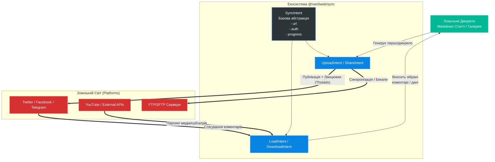

# 🪐 Архітектура Пакету `@nan0web/sync` (SMM Дистрибуція та Універсальна Синхронізація)

Пакет `@nan0web/sync` розробляється як центральний хаб для двостороннього обміну даними між внутрішнім середовищем OLMUI (вашими локальними моделями та сховищем) та зовнішнім світом. Замість написання незалежної, часто дублюючої логіки для сотень API різних платформ, використовується підхід **Model-as-Schema** із введенням уніфікованих Намірів (Intents).

Він дозволяє абстрактно працювати з будь-яким джерелом інформації: від витягування відео з YouTube чи дампа бази через FTP — до створення гілок постів (тредів) у X (Twitter) чи Facebook.

## 🏛 Базові Класи та Ієрархія Намірів

Щоб мінімізувати кількість сутностей, абстрагувати складність і отримувати максимум результату, успадкування будується так:

1. **`SyncIntent` (Абстрактна Модель)** — універсальний базовий клас, що тримає спільну логіку:
   - `url` — Стандартне посилання на ресурс (`https://youtube.com/...`, `ftp://...`, `https://x.com/...`). Пакет спирається на максимально існуючі загальноприйняті стандарти, а системний парсер самостійно визначає платформу-провайдера з URL-адреси.
   - `auth` — Об'єкт авторизаційних даних (токени, ключі, паролі), необхідний для обходу обмежень приватних джерел.
   - `status`, `progress` — Реєстратори стану для легкого біндингу з `UI-CLI` (наприклад, через прогрес-бар) та `UI-Web`.

2. **`LoadIntent`** — це базавой клас, який відповідає за транспортування даних з/у інтернету. Він є базовим для класів `DownloadIntent` та `UploadIntent`.

3. **`DownloadIntent` (Всмоктування / Імпорт)** — відповідає за "поглинання" зовнішніх даних у Систему.
   - `format` — Цільовий формат парсингу (сире відео, mp3 аудіо, виключно текст чи масив коментарів).

4. **`UploadIntent` (Експансія / Експорт)** — публікує та дистриб'ютує ваші смисли у зовнішній світ.
   - `source` — Вказівник на першоджерело у вашій системі (наприклад, `.md` файл зі сховища галереї).
   - `pipeline` — Послідовність трансформацій (наприклад: _створити хук -> озвучити (TTS) -> спакувати відео -> відправити_).

## 🔄 Двостороння Комунікація та Ланцюжки (Треди)

Найбільша цінність `@nan0web/sync` у рамках **Share App** (SMM-компоненту) полягає у контекстному зв'язку та роботі з **ланцюжками**.
Після публікації першого посту, зовнішня соціальна мережа повертає свій ідентифікатор. Зберігаючи цей зв'язок:

- Коли випускається наступна серія (або просто продовження думки), `UploadIntent` може відправити її як коментар-відповідь на попередній пост, утворюючи тред.
- А `DownloadIntent` періодично підтягує всі зовнішні коментарі з Facebook, YouTube чи X назад у вашу базу, і автоматично перекладає у мову користувача. Якщо мИ маємо Пітера і Тараса, які коментують пост французькою і українською мовою, то адміністратор отримає два окремих коментарі, перекладених на українську мову. При відповіді на коментар, він буде опублікований на мові оригіналу коментатора. Відповісти на коментар можна одразу зі своєї адміністративної консолі. Це ідеальний інструмент об'єднання всіх ворожих чи дружніх інформаційних полів у вашому єдиному безпечному дашборді.

## 🌍 Мультимовність та Паралельне Вивчення (Language Matrix)

Оскільки система автоматично транслює ваш контент на 9 мов, виникає безпрецедентна можливість: **перетворення власного сховища сенсів на інтерактивний мовний тренажер (LearnApp)**.
Ця система використовує принципи програмування для вивчення мов:

- **Алгоритмічна структура:** Речення — це алгоритми. Граматичні конструкції (прислівники, дієслова) діють як функції (атоми), а слова (лексика) — як значення (`values`), що передаються в ці функції для утворення сенсу. Оскільки мовні моделі (LLM) розуміють мову як координати у просторі (вектори), ми можемо математично точно підставляти нові іноземні значення у ваші алгоритмічні алгоритми мислення.

### Тренування Пам'яті, Автогенерація Тестів та Діалоги (Memory State & SRS)

- **Збереження вивченого:** Слова або мовні атоми, які ви вже засвоїли, кешуються у вашому `Memory Store`. Ви перестаєте марнувати на них "процесорний час" і зосереджуєтесь лише на "дельті" — нових словах.
- **Інтервальне повторення (Spaced Repetition):** Система відслідковує час засвоєння. Щоб мозок не «видаляв» інформацію, LLM час від часу «перевикористовує» старі вивчені слова у нових алгоритмічних конструкціях тестів. Ви практикуєте їх застосування у нових реченнях та зв'язках.
- **Генерація Тестів:** Читаючи паралельний переклад, ви можете запустити тест. Система генерує квізи, комбінуючи невідоме з уже вивченим, математично закріплюючи вашу власну лексику.
- **Інтерактивні Діалоги (Chat):** Найвищий рівень практики — це пряме спілкування. AI-асистент, маючи доступ до вашого `Memory State`, буде з вами спілкуватися через чат, навмисне обмежуючи власну лексику тими словами та граматичними атомами, які ви зараз вчите чи повинні повторити. Це створює абсолютно безпечний і 100% ефективний симулятор комунікації.
- **Етимологічні Мости (Cognate Mapping):** Оскільки система знає ваші "якірні" мови (українську, англійську тощо), процес вивчення нової мови починається з пошуку спільних векторів. Формуючи тексти або діалоги (наприклад, французькою), ШІ обирає слова, які мають спільне етимологічне коріння з вашими рідними словами (як-от _valise_ -> _валіза_). Це створює миттєвий "міст розуміння" та зменшує поріг входження до нуля.
- **Морфологічна Комбінаторика (Prefix/Root API):** Слова більше не сприймаються як абстракції. Вони розбиваються на функціональні префікси та корені (де `pre-` — це функція "перед", а `dict` — значення "говорити", що разом компілюється у `predict` — передбачати). Ви не вчите словники, ви вчите "патерни проєктування" мови.

## 📡 Контекстна Маршрутизація (Hashtag-based Routing)

Синхронізація також передбачає динамічне визначення цілей для публікації на основі внутрішнього контексту (`frontmatter` або мета-тегів у вашому `.md` файлі).
Якщо встановлено зв'язок авторизації (`auth`) з певними зовнішніми спільнотами (наприклад, "Українською Школою Архетипіки"):

- Ви додаєте мета-тег `#архетипіка` або `#соціологія`.
- `UploadIntent` автоматично розпізнає це і маршутизує публікацію не лише у ваші персональні канали, але й на спільні інформаційні ресурси Школи.
- Ця політика поширюється на всі переклади: стаття миттєво з'явиться в українському та, наприклад, британському хабах обраної платформи.

## ⚙️ Паралельність та Оптимізація (Parallel Execution)

Оскільки пакет взаємодіє з множиною зовнішніх API та вимагає обробки великої кількості скриптів, архітектура будується на принципах **паралельного виконання процесів**.
- **Асинхронний конвеєр:** Генерування мультимовних версій контенту, аудіо-супровід (TTS), генерація зображень та масовий збір зворотного зв'язку відбуваються паралельно, що кардинально прискорює загальний час обробки.
- **AI Strategy:** Для надійного опрацювання LLM-запитів впроваджується стратегія автоматичного балансування навантаження та перемикання між різними мовними моделями (OpenAI, Anthropic, Cerebras, локальні ноди). Це дозволяє запускати запити асинхронно і гарантує безперебійність `Intent`-ів навіть при виникненні API лімітів (429 Too Many Requests) чи проблем у одного з провайдерів.

## 📈 Додаткові інструменти SMM та SEO

Для посилення видимості вашого суверенного хабу та забезпечення органічного трафіку, `@nan0web/sync` втілюватиме наступні інструменти автоматизації:
1. **Динамічна генерація Meta та OpenGraph:** Автоматичне формування оптимізованих `description`, `keywords` та `og:image` розміток для кожної мови окремо (через LLM) під час `UploadIntent`.
2. **Семантична перелінковка:** Модель аналізує контекст нової публікації і автоматично вбудовує посилання на ваші попередні релевантні статті або терміни зі словника, створюючи міцну SEO-мережу всередині хаба.
3. **Автоматичні RSS, мапи сайту та Pinging:** Миттєва генерація `sitemap.xml`, мультимовних RSS-стрічок та автоматичне сповіщення систем (Google, децентралізованих пошуковиків) про вихід нового матеріалу.
4. **Сенс-аналіз (Sentiment Analysis):** При стягуванні масиву коментарів (`DownloadIntent`) система оцінюватиме тональність і залученість, щоб виводити на дашборді пріоритетні відгуки, які вимагають швидкої реакції.
5. **A/B Тестування Заголовків:** Пакет зможе генерувати кілька варіантів і публікувати їх у соціальних мережах, заміряючи перший етап клікабельності.

## ⚖️ Економіка Екосистеми та Ліцензування (Резолюція Ради Мудреців)

Маючи потужну, інноваційну архітектуру, проєкт має спиратися на стійку економіку, яка б не суперечила принципам вільного доступу до Істини (як зауважив Сократ), але дозволяла б системі самовідтворюватись (за Патоном та Да Вінчі):

- **Вільний базовий протокол (Без цензури та кайданів):** Пакет є повністю **безкоштовним для персонального використання**, що підтримує ідеологію суверенних хабів. Як зазначив Іван Сірко, базовий код не міститиме архітектурних обмежень або "DRM-кайданів" на розгортання власних вузлів. Синхронізація сенсів належатиме авторам без жодної цензури чи прихованого контролю.
- **Комерційна Ліцензія для Хостингів (B2B R&D Фонд):** Якщо провайдери бажають встановлювати пакет як SaaS-основу на своїх хостингах і стягувати плату з клієнтів, вони зобов'язані купувати комерційну ліцензію. За згодою з Борисом Патоном, ці кошти формуватимуть фонд R&D для розвитку. Щоб не гальмувати експансію технології (зауваження Ніколи Тесли), для молодих хостинг-провайдерів передбачено гнучкий стартап-період переходу на платну модель.
- **Преміальний Модуль (LearnApp) та @nan0web/learn:** Враховуючи сумніви Сковороди щодо торгівлі шляхом до знань, процес навчання виводиться в окрему алгоритмічну абстракцію — математичне ядро `@nan0web/learn`.
    - **Математика Навчання:** Будь-яка наука (мови, математика, архітектура) розкладається на алгоритмічні атоми. Система обчислює **Дельту** (різницю між наявними знаннями користувача та ціллю) і множить її на вектор **Мотивації**. Це дозволяє агенту підлаштовувати індивідуальну програму для конкретного учня.
    - **Деталізація "Стипендії" (Економіка Балів):** Навчання конвертується у внутрішню економіку.
        - **Внутрішня валюта:** За успішне проходження тестів (підтверджені знання) користувач отримує системні бали/токени.
        - **Тижневі Спринти (Pay-as-you-learn):** Користувач отримує перший тиждень доступу до навчальних алгоритмів безкоштовно. Якщо протягом тижня він виконує план і заробляє, наприклад, 100 балів, ці бали повністю покривають вартість наступного тижня (він продовжує вчитися безкоштовно). Якщо заробив 50 балів — отримує знижку 50%. Якщо здався і не вчиться — оплачує 100% підписки з власної карти.
        - **Захист від ботів (Offline 2LW Verification):** Щоб виключити фармінг стипендій ботами, досягнення найвищих рівнів заохочення (де система може навіть *доплачувати* найкращим студентам бонуси) вимагає проходження протоколу **2LW (Two Live Witnesses)**. Користувач мусить підтвердити офлайн, що він є реальною біологічною одиницею з власною свідомістю. Це унеможливлює "машинне" видоювання платформи і фокусує інвестиції екосистеми виключно в еволюцію людського інтелекту.

---

## 📊 Архітектурна Схема (Mermaid)

Нижче наведено діаграму того, як відбувається архітектурний зв'язок в системі:

### Синергія із Законами Логіки

Всі агенти та скрипти взаємодіють з пакетом `@nan0web/sync`, ніби це єдиний універсальний протокол. Вони не знають, як влаштований Facebook. Вони знають лише структуру `Intent`. Відповідно до Закону Тотожності (А=А), ваша стаття, будучи одним `.md` файлом всередині вашої Свідомості, зберігає свою ідентичність, розбиваючись на тисячу дзеркал (відео, аудіо, твітів) у соціальних мережах алгоритмічно та з мінімальним написанням коду!
