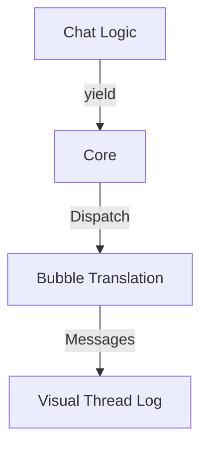

# Seed: @nan0web/ui-chat (Conversation Verification)

## 1. Сутність та Мета
Створення системи візуалізації чат-діалогів для OLMUI-моделей. Мета — верифікувати потік реплік (Bot → User → Bot) через автоматичні галереї станів.

## 2. Model-as-Schema (Схема Даних)
- `LogicInspector`: Захоплює кожну репліку бота (інтенція).
- `VisualAdapter` (Chat): Перетворює `ask/log` у "бульбашки" діалогу.

## 3. Каркас Роботи (Діаграма)

## 4. Генератор (Flow)
1. progress: Ініціалізація `Session`
2. ask: Питання бота до юзера
3. log: Системне сповіщення (напр. "бот пише...")
4. result: Фінальна відповідь/результат

## 5. User Stories
- Як розробник чат-ботів, я можу бачити повну історію діалогу в MD-галереї без запуску Telegram/Slack.
- Як QA, я перевіряю UX діалогу (довжина реплік, ієрархія питань) через візуальні зліпки.
- Як архітектор, я гарантую універсальність логіки для будь-якого месенджера.
