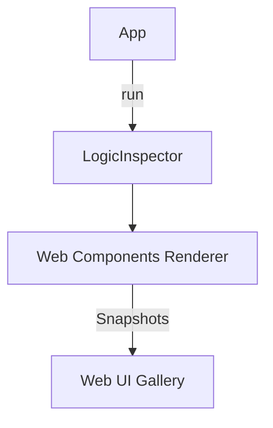

# Seed: @nan0web/ui-lit (Visual Verification)

## 1. Сутність та Мета
Впровадження системи візуальних зліпків (HTML Snapshots) для Lit Web Components. Мета — мати повний візуальний реєстр станів компонентів на основі OLMUI-інтенцій.

## 2. Model-as-Schema (Схема Даних)
- `LogicInspector`: Захоплює бізнес-логіку.
- `VisualAdapter` (Lit/Web): Рендер інтенцій у HTML/Lit-блоки.

## 3. Каркас Роботи (Діаграма)

## 4. Генератор (Flow)
1. progress: Ініціалізація `Lit-Root`
2. ask: Виклик `olmui-input/olmui-select`
3. render: Вкраплення `olmui-header/footer`
4. log: Показ `olmui-alert`

## 5. User Stories
- Як розробник фронтенду, я бачу "зріз" компонентів без необхідності завантажувати всі стилі.
- Як дизайнер, я верифікую ієрархію HTML-компонентів у звіті.
