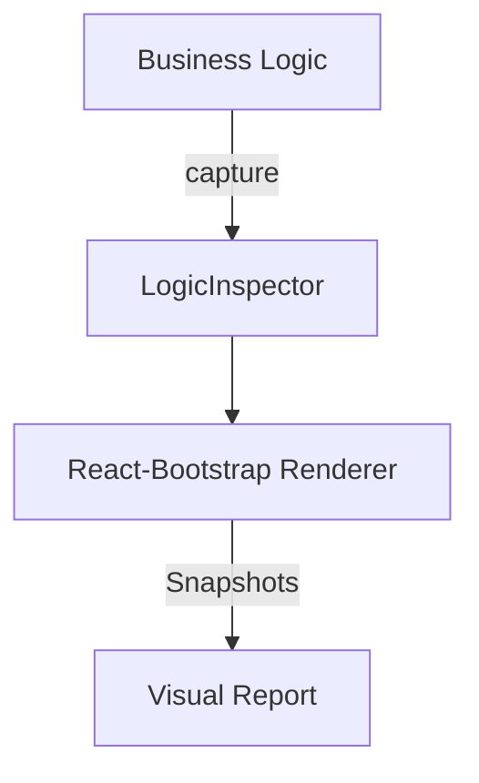

# Seed: @nan0web/ui-react-bootstrap (Visual Verification)

## 1. Сутність та Мета
Розширення системи візуальної верифікації для Bootstrap-компонентів. Мета — гарантувати, що логіка OLMUI коректно мапиться на `react-bootstrap` елементи (Modals, Forms, Alerts) через детерміновані зліпки.

## 2. Model-as-Schema (Схема Даних)
- `LogicInspector`: Захоплює бізнес-кроки.
- `VisualAdapter` (Bootstrap): Рендер інтенцій у Bootstrap-структуру.

## 3. Каркас Роботи (Діаграма)

## 4. Генератор (Flow)
1. progress: Ініціалізація `Bootstrap-Theme`
2. ask: Виклик `FormGroup/FormControl`
3. log: Рендеринг `Alert`
4. result: Завершення

## 5. User Stories
- Як розробник, я впевнений, що мої форми на Bootstrap поводяться згідно з бізнес-моделлю.
- Як дизайнер, я бачу транскрипт компонентів у звіті для перевірки ієрархії.
