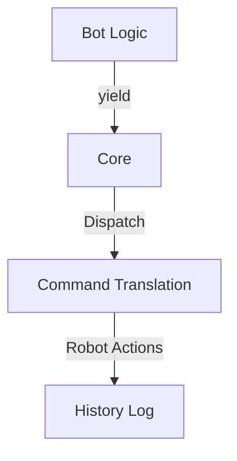

# Seed: @nan0web/ui-robo (Action Verification)

## 1. Сутність та Мета
Впровадження системи верифікації для апаратної логіки (Robotics). Мета — тестувати "рухи" та "дії" робота через моделювання вводу-виводу (OLMUI), не підключаючи реальні сервомотори під час розробки алгоритму.

## 2. Model-as-Schema (Схема Даних)
- `LogicInspector`: Захоплює команди робота (інтенції).
- `VisualAdapter` (Robo): Перетворює `ask/log` у лог команд руху (Command Log).

## 3. Каркас Роботи (Діаграма)

## 4. Генератор (Flow)
1. progress: Ініціалізація `Robot-State`
2. ask: Вимірювання датчиків (Sense)
3. log: Рух виконавчих механізмів (Act)
4. result: Повернення фінального стану

## 5. User Stories
- Як розробник, я можу перевірити алгоритм обходу перешкод через детерміновані дані з датчиків.
- Як інженер, я бачу транскрипт команд у візуальному звіті галереї станів.
- Як архітектор, я керую залізним стеком через чисту OLMUI-логіку.
