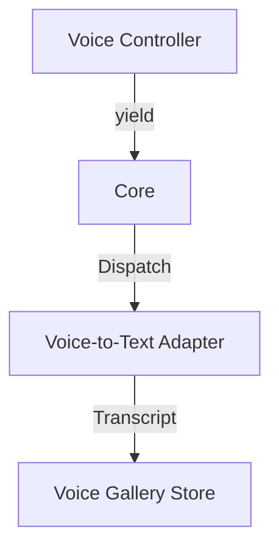

# Seed: @nan0web/ui-voice (Logic Verification)

## 1. Сутність та Мета
Впровадження детермінованого тестування для голосових інтерфейсів. Мета — мати можливість "чути" (через текстові транскрипти) як модель реагує на введення, не використовуючи реальні TTS-рушії під час розробки.

## 2. Model-as-Schema (Схема Даних)
- `LogicInspector`: Захоплює голос моделі (інтенції).
- `VisualAdapter` (Voice): Перетворює `ask/log` у транскрипти підказок (prompts).
- `VoiceVerificationStore`: Сценарна галерея "Голосових зліпків".

## 3. Каркас Роботи (Діаграма)

## 4. Генератор (Flow)
1. progress: Ініціалізація `Voice-Engine` (Mock)
2. ask: Видача голосової підказки
3. log: Підтвердження вводу
4. result: Повернення розпізнаного тексту

## 5. User Stories
- Як розробник, я можу верифікувати діалогову логіку (Voice UX) без необхідності говорити з мікрофоном.
- Як QA, я перевіряю локалізацію голосових підказок через візуальний звіт.
- Як архітектор, я впевнений, що голосовий адаптер дотримується контракту OLMUI.
