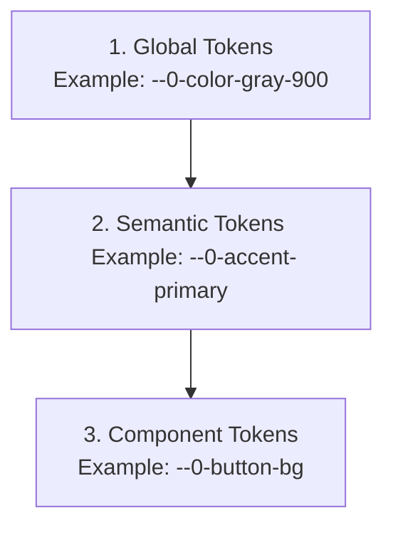

# Theming Architecture for OLMUI (@nan0web/ui)

This document describes the architectural standard for eliminating hardcoded style values in Lit/React components in favor of a flexible, custom design system using CSS Custom Properties (CSS variables) prefixed with `--0-`.

---

## 1. The Hardcode Anti-Pattern in OLMUI
The **OLMUI (One Logic — Many UIs)** principle specifies that the visual presentation of components must integrate seamlessly into any hosting environment, such as corporate banking portals, light mobile web pages, or admin dashboards. 

Having values like the following directly in the component style sheets:
```css
padding: 1.5rem;
border-radius: 12px;
font-size: 1.1rem;
filter: brightness(1.1);
transform: scale(0.98);
```
violates reusability and blocks dynamic branding changes (theme swapping) without rewriting component source code.

---

## 2. Three-Tier Token Architecture

To ensure high flexibility, we apply a classic three-tier CSS custom property structure using the ultra-short `--0-` namespace (Zero/NaN0):



### 2.1. Global Tokens
These define raw values for palettes, base metrics, and font names. They are typically specified at the `:root` level.

*   **Color Palette**: `--0-color-gray-900`, `--0-color-purple-500`, etc.
*   **Base Constants**: default fonts, base sizes.

### 2.2. Semantic Tokens
Semantic tokens map purpose or intent to global tokens. **Components must only use semantic or component-specific variables.**

#### A. Colors & Branding
*   `--0-bg-primary` — main application background.
*   `--0-bg-secondary` — background of container elements (blocks, panels).
*   `--0-bg-card` — background of cards, widgets.
*   `--0-bg-glass` — background of glassmorphic panels with an alpha channel.
*   `--0-text-primary` — color of the main body text.
*   `--0-text-secondary` — color of secondary/subtle text.
*   `--0-text-muted` — color of disabled or minor text.
*   `--0-accent-primary` — primary brand color.
*   `--0-accent-secondary` — secondary brand color.
*   `--0-accent-gradient` — primary brand gradient.
*   `--0-border-subtle` — default border color/style.
*   `--0-border-accent` — highlight border color (focus, activity).

#### B. Spacing & Layout
These govern paddings and margins.
*   `--0-spacing-xs` — 0.25rem (4px) (micro gaps).
*   `--0-spacing-sm` — 0.5rem (8px) (form inputs and small item spacing).
*   `--0-spacing-md` — 1rem (16px) (standard content margins).
*   `--0-spacing-lg` — 1.5rem (24px) (card and section inner paddings).
*   `--0-spacing-xl` — 2rem (32px) (large gaps between sections).
*   `--0-spacing-xxl` — 3rem (48px) (hero and landing sections).

#### C. Borders & Radii
*   `--0-radius-sm` — 8px (buttons, inputs, tag badges).
*   `--0-radius-md` — 12px (small widgets, counter indicators).
*   `--0-radius-lg` — 20px (primary cards, modals, dialog sheets).
*   `--0-radius-pill` — 9999px (circular buttons, avatars).

#### D. Typography
*   `--0-font-sans` — main sans-serif font family.
*   `--0-font-mono` — monospace font family for code, data, and numeric values.
*   `--0-font-size-sm` — 0.85rem (captions, roles, status badges).
*   `--0-font-size-base` — 1rem (base readable font size).
*   `--0-font-size-lg` — 1.15rem (subheadings, card titles).
*   `--0-font-size-h4` — 1.25rem (card header titles).
*   `--0-font-size-h2` — 2rem (mid-level titles).
*   `--0-font-size-h1` — clamp(2.5rem, 6vw, 4.2rem) (large display headings).
*   `--0-font-weight-normal` — 400 (regular text).
*   `--0-font-weight-medium` — 500/600 (buttons, subheadings).
*   `--0-font-weight-bold` — 700/800 (headings, key highlights).
*   `--0-line-height-base` — 1.7 (comfortable body text reading).
*   `--0-line-height-heading` — 1.2 (compact heading lines).

#### E. Transitions & Interaction Effects
*   `--0-transition-fast` — 0.2s ease (button hover effects, opacity changes).
*   `--0-transition-smooth` — 0.4s cubic-bezier(0.4, 0, 0.2, 1) (drawers, theme toggles).
*   `--0-hover-brightness` — 1.15 (brightening multiplier on hover).
*   `--0-active-scale` — 0.97 (clicking button compression ratio).

---

## 3. Theme Support & 100% Accessibility

### 3.1. Theme Modes (Dark, Light, High Contrast)
Switching themes is handled by re-binding semantic variables at the `:root` level via attributes or system preferences.

*   **Dark Mode (Default)**:
    ```css
    :root {
      --0-bg-primary: #0a0a0f;
      --0-text-primary: #f0f0f5;
      --0-border-subtle: rgba(255, 255, 255, 0.06);
    }
    ```
*   **Light Mode**:
    Activated via `[data-theme="light"]` or `@media (prefers-color-scheme: light)`:
    ```css
    :root[data-theme="light"] {
      --0-bg-primary: #ffffff;
      --0-text-primary: #121214;
      --0-border-subtle: rgba(0, 0, 0, 0.08);
      --0-bg-glass: rgba(245, 245, 247, 0.75);
    }
    ```
*   **High Contrast Mode**:
    Specifically optimized for users with low vision, activated via `[data-theme="high-contrast"]`. Gradients and semi-transparent layers are disabled, and borders are made thick and highly contrastive (WCAG AAA):
    ```css
    :root[data-theme="high-contrast"] {
      --0-bg-primary: #000000;
      --0-bg-glass: #000000;
      --0-text-primary: #ffffff;
      --0-text-secondary: #ffff00; /* High contrast yellow */
      --0-border-subtle: 2px solid #ffffff;
      --0-accent-gradient: #ffffff;
      --0-hover-brightness: 1.3;
      --0-active-scale: 1; /* Scaling disabled to prevent jitter/flicker */
    }
    ```

### 3.2. 100% Accessibility (WCAG 2.1 Compliance)
All `@nan0web/ui` components must adhere to the following standards:
1.  **Text Contrast**: The contrast ratio between `--0-text-primary` / `--0-text-secondary` and background colors must be at least **4.5:1** (WCAG AA), and **7:1** in High Contrast mode (WCAG AAA).
2.  **Focus Indicator**: Focus borders must never be hidden (`outline: none`) without replacement. We introduce system focus tokens:
    *   `--0-focus-outline` — `2px solid var(--0-accent-primary)`
    *   `--0-focus-offset` — `2px`
3.  **Animations**: All components must respect the operating system's `prefers-reduced-motion` settings:
    ```css
    @media (prefers-reduced-motion: reduce) {
      * {
        --0-transition-fast: 0s !important;
        --0-transition-smooth: 0s !important;
        --0-active-scale: 1 !important;
      }
    }
    ```

---

## 4. Refactored DemoCounter Example

Below is the standard styling code for `DemoCounter`:

```javascript
	static styles = css`
		:host {
			display: block;
			background: var(--0-bg-glass, rgba(255, 255, 255, 0.03));
			border: 1px solid var(--0-border-subtle, rgba(255, 255, 255, 0.1));
			padding: var(--0-spacing-lg, 1.5rem);
			border-radius: var(--0-radius-md, 12px);
			margin: var(--0-spacing-lg, 1.5rem) 0;
			font-family: inherit;
		}
		h4 {
			margin: 0 0 var(--0-spacing-xs, 0.5rem) 0;
			color: var(--0-accent-secondary, #06b6d4);
			font-size: var(--0-font-size-lg, 1.15rem);
			font-weight: var(--0-font-weight-medium, 600);
			line-height: var(--0-line-height-heading, 1.2);
		}
		.counter-val {
			font-size: var(--0-font-size-h2, 2.2rem);
			font-weight: var(--0-font-weight-bold, 700);
			margin: var(--0-spacing-sm, 0.5rem) 0 var(--0-spacing-md, 1rem);
			font-family: var(--0-font-mono, monospace);
			color: var(--0-text-primary, #f0f0f5);
		}
		button {
			background: var(--0-accent-gradient, linear-gradient(135deg, #7c3aed, #06b6d4));
			color: white;
			border: none;
			padding: var(--0-spacing-sm, 0.6rem) var(--0-spacing-lg, 1.5rem);
			border-radius: var(--0-radius-pill, 9999px);
			cursor: pointer;
			font-weight: var(--0-font-weight-medium, 600);
			font-size: var(--0-font-size-base, 1rem);
			transition: background var(--0-transition-fast, 0.2s), 
			            transform var(--0-transition-fast, 0.1s);
		}
		button:hover {
			filter: brightness(var(--0-hover-brightness, 1.1));
		}
		button:active {
			transform: scale(var(--0-active-scale, 0.98));
		}
		
		/* Accessibility Focus Styles */
		button:focus-visible {
			outline: var(--0-focus-outline, 2px solid #7c3aed);
			outline-offset: var(--0-focus-offset, 2px);
		}
	`
```

---

## 5. TDD Verification: Theming Inspector (`OlmuiThemingInspector`)

To prevent style regressions, we define an architecture auditor in `@nan0web/ui` or `packages/inspect/`.

### 5.1. Linting Criteria
The inspector parses all component code (`*.js`, `*.jsx`, `*.ts`, `*.tsx`, `*.css`) in `src/` to ensure:
1.  **No Raw Colors**: Flag any colors (`#hex`, `rgb`, `rgba`, `hsl` expressions) not wrapped inside a CSS `var()`.
2.  **No Raw Layout metrics**: Flag raw `px`, `rem`, `em` values outside `var()`, excluding `0`, `1px` (thin borders), and `50%` (circular shapes).
3.  **Mandatory Fallback**: All `var(--0-...)` calls must declare fallback defaults. This guarantees that elements render correctly even without global themes.

### 5.2. Polymorphic Auditor Specification
To support multiple target environments (e.g. JavaScript/TypeScript frontend code, Python backends, QML, etc.), we implement a polymorphic delegate pattern where platform subclasses extend the base auditor.

#### A. Base Polymorphic Router (`OlmuiThemingAuditor`)
This class defines all configuration schemes, unified `UI` text tokens, and dynamically loads the subclass inside the `run()` generator to avoid module-level circular dependencies:

```javascript
// packages/ui/src/domain/app/OlmuiThemingAuditor.js
import { AuditorModel } from '@nan0web/inspect/domain/AuditorModel'

export class OlmuiThemingAuditor extends AuditorModel {
	static alias = 'theming'

	static dir = {
		type: 'string',
		help: 'Target directory to scan for styling compliance',
		positional: true,
		default: '.',
	}

	static UI = {
		title: 'OLMUI Theming Auditor',
		description: 'Checks UI styles for hardcoded values (colors, measurements, layouts) and enforces theme variable usage.',
		icon: '🎨',
		starting: 'Auditing styling in {dir}',
		noFiles: 'No styling files found to audit in {dir}',
		doneSuccess: 'All files passed the theming audit (0% hardcode).',
		doneErrors: 'Theming audit failed. Hardcoded design tokens found!',
		auditPassed: 'Audit passed: {file}',
		auditFailed: 'Audit failed for {file}: {errors}',
		errorDb: 'Database not provided to auditor',
		errorColor: 'Hardcoded color "{match}" found without theme variable',
		errorSize: 'Hardcoded size/spacing "{match}" found without theme variable',
	}

	async *run() {
		const AuditorClass = this.platform === 'python'
			? (await import('./PyOlmuiThemingAuditor.js')).PyOlmuiThemingAuditor
			: (await import('./JsOlmuiThemingAuditor.js')).JsOlmuiThemingAuditor

		const delegate = new (/** @type {any} */ (AuditorClass))({
			dir: /** @type {any} */ (this).dir,
			fix: /** @type {any} */ (this).fix,
			platform: /** @type {any} */ (this).platform,
		}, /** @type {any} */ (this)._)
		
		return yield* delegate.run()
	}
}
```

#### B. JavaScript/TypeScript Implementation (`JsOlmuiThemingAuditor`)
This class extends `OlmuiThemingAuditor`, inheriting all static parameters and localized strings while executing specific files scanning:

```javascript
// packages/ui/src/domain/app/JsOlmuiThemingAuditor.js
import { OlmuiThemingAuditor } from './OlmuiThemingAuditor.js'
import { result, show, progress } from '../../core/Intent.js'

export class JsOlmuiThemingAuditor extends OlmuiThemingAuditor {
	async *run() {
		const { t } = /** @type {any} */ (this)._
		yield show(t(OlmuiThemingAuditor.UI.starting, { dir: this.dir }))

		const fsDb = /** @type {any} */ (this)._.db
		if (!fsDb) {
			yield show(t(OlmuiThemingAuditor.UI.errorDb), 'error')
			return result({ ok: false, code: 500, reason: 'no_db' })
		}

		const files = []
		const targetDir = fsDb.resolveSync(this.dir)

		try {
			for await (const entry of fsDb.browse(targetDir, {
				depth: Infinity,
				ignore: ['node_modules', 'dist', 'build', 'play', 'test', '.*'],
			})) {
				if (entry.isFile && /\.(js|jsx|ts|tsx|css)$/.test(entry.name)) {
					files.push(entry.path)
				}
			}
		} catch (e) {
			// Directory might be missing
		}

		if (files.length === 0) {
			yield show(t(OlmuiThemingAuditor.UI.noFiles, { dir: this.dir }), 'error')
			return result({ ok: false, code: 404, reason: 'no_files' })
		}

		const errors = []
		const rawColorRegex = /(?<!var\([^)]*)(#(?:[0-9a-fA-F]{3,4}){1,2}\b|\brgba?\(|\bhsla?\()/g
		const rawSizeRegex = /(?<!var\([^)]*)\b([2-9]px|[1-9]\d+px|[0-9.]+(?:rem|em))\b/g

		for (const file of files) {
			const content = await fsDb.fetch(file)
			const contentString = typeof content === 'string' ? content : JSON.stringify(content)
			const fileErrors = []

			rawColorRegex.lastIndex = 0
			let colorMatch
			while ((colorMatch = rawColorRegex.exec(contentString)) !== null) {
				fileErrors.push(t(OlmuiThemingAuditor.UI.errorColor, { match: colorMatch[1] }))
			}

			rawSizeRegex.lastIndex = 0
			let sizeMatch
			while ((sizeMatch = rawSizeRegex.exec(contentString)) !== null) {
				fileErrors.push(t(OlmuiThemingAuditor.UI.errorSize, { match: sizeMatch[1] }))
			}

			const displayFile = file.startsWith('@app/') ? file.slice(5) : file

			if (fileErrors.length > 0) {
				yield show(
					t(OlmuiThemingAuditor.UI.auditFailed, { file: displayFile, errors: fileErrors.join('; ') }),
					'error',
				)
				errors.push(...fileErrors.map((e) => ({ file: displayFile, error: e })))
			} else {
				yield progress(t(OlmuiThemingAuditor.UI.auditPassed, { file: displayFile }))
			}
		}

		if (errors.length > 0) {
			yield show(t(OlmuiThemingAuditor.UI.doneErrors, {}), 'error')
			return result({ ok: false, code: 400, reason: 'unthemed_tokens', errors })
		}

		yield show(t(OlmuiThemingAuditor.UI.doneSuccess, {}), 'success')
		return result({ ok: true, code: 200 })
	}
}
```

### 5.3. Unified Result Contract (`result()`)
To match standard Web API specifications (such as native Fetch `Response.ok`), we enforce the usage of `ok: boolean` rather than `success: boolean` as the primary indicator for auditor execution status:

1. **`ok: boolean`**: Required indicator denoting if execution succeeded without errors.
2. **`code: number`**: Standard HTTP-like status code (e.g. `200` for OK, `400` for verification errors, `404` for missing targets, `500` for database/system crashes).
3. **Core Orchestration**: The main orchestrator (`ArchitectureAuditor`) dynamically checks `ok` while supporting legacy `success` fallback properties to maintain compatibility with older modules in the workspace:
   ```javascript
   const isOk = data.ok !== undefined ? data.ok : data.success
   if (isOk === false) overallSuccess = false
   ```


