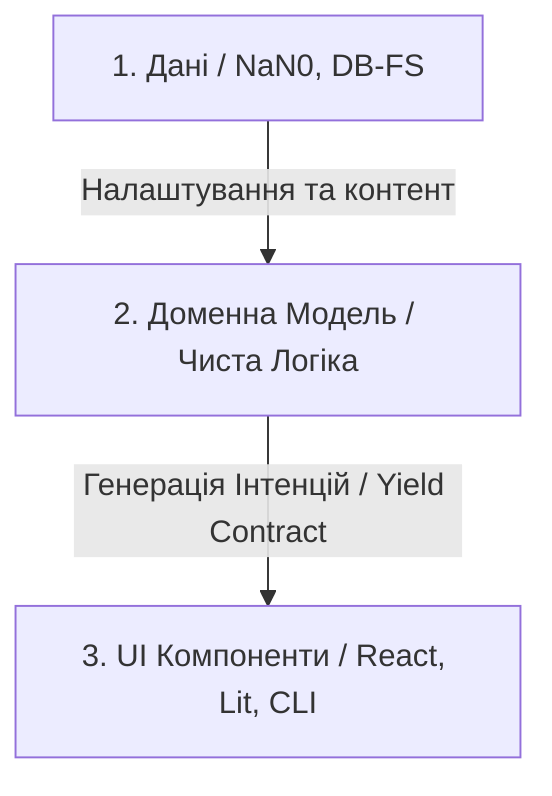

# 🏗️ NaN•Web OLMUI: Розробка додатків

Ласкаво просимо до офіційної документації NaN•Web українською мовою. Цей посібник присвячено проектуванню та побудові додатків на основі концепції **One Logic — Many UI (OLMUI)**.

NaN•Web розглядає будь-який додаток (App) не просто як сукупність інтерфейсних елементів, а як чітке розділення на три незалежні рівні: **Модель (Model) + Компонент (Component) + Дані (Data)**.

---

## 🏛️ Три стовпи NaN•Web додатка

1. **[Доменна Модель (Model)](./model-specification.md)**:
   - Містить виключно чисту бізнес-логіку та опис структури даних (`static schema`).
   - Вона повністю ізольована від середовища виконання та UI-фреймворків.
   - Модель спілкується із зовнішнім світом за допомогою генератора `run()`, повертаючи стандартизовані **інтенції** (наміри): `yield show | ask | log | agent | progress`.
   - Лише в моделі прописані всі звернення, які потребують перекладу. Або це прописується у відповідному полі `static password = { hint: 'password', default: '', errorInvalidFormat: 'Invalid password format' }` або у полі UI `static UI = { errorInvalidFormat: 'Invalid password format', welcomeText: Welcome' }` і всі компоненти використовують лише `t(Model.password.errorInvalidFormat)` або `t(Model.UI.errorInvalidFormat)`.

2. **[UI Компоненти (Components)](./component-weld.md)**:
   - Зберігаються у відповідних папках за платформами (React, Lit, CLI).
   - Поділяються на базові компоненти запиту (Input) та складні компоненти відображення і редагування схем (App Components / Schema Editors).
   - Для виклику конкретного компонента у доменній схемі моделі використовується опція **`hint`** (хінтинг).

3. **[Маршрутизація та Дані (Routing & Data)](./file-routing-and-data.md)**:
   - Маршрутизація в NaN•Web є **файловою** — шлях у файловій системі визначає URL-адресу.
   - Файли даних конфігурують моделі додатків, які мають запускатися на конкретних маршрутах.
   - Дані можуть зберігатися у будь-якому місці: DB-FS, бази даних, Redis, хмара тощо.

4. **[Поведінка ШІ-Агентів (AI / Agent Behaviors)](./agent-behaviors.md)**:
   - Інтеграція агентів ШІ у логіку роботи додатків через інтенцію `yield agent(task)`.
   - Автоматичне тестування генерованого коду перед виконанням.

---

## 📖 Навігація документацією

- **[Специфікація Моделей та Інтенцій](./model-specification.md)** — як писати класи моделей, успадковувати `ModelAsApp` та генерувати інтенції.
- **[Зварювання Інтерфейсів та Хінтинг](./component-weld.md)** — як підключати компоненти до інтенцій за допомогою `hint`.
- **[Файловий Роутинг та Збереження Даних](./file-routing-and-data.md)** — опис файлової маршрутизації та гнучкої архітектури збереження даних.
- **[Автономні ШІ-Агенти в NaN•Web](./agent-behaviors.md)** — поведінка агентів та взаємодія з RA-системою.
- **[Гайд: Як створити новий компонент?](./how-to-create-component.md)** — покроковий приклад створення моделі, рендерера та проведення тестів.
