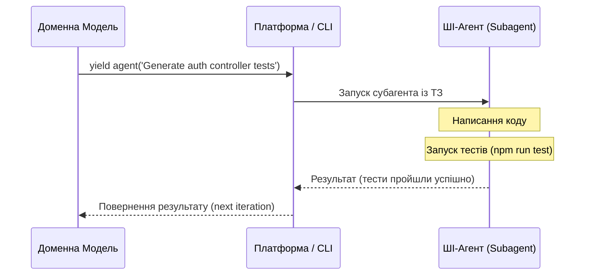

# 🤖 Поведінка та Розробка ШІ-Агентів (AI / Agent Behaviors)

У NaN•Web штучний інтелект розглядається як повноцінний автономний актор, який може виконувати завдання без безпосереднього втручання розробника.

---

## 📡 Інтенція `yield agent(task)`

Доменна модель додатку може делегувати виконання складних завдань ШІ-агенту за допомогою спеціалізованої інтенції **`agent`**.

### Схема роботи агента в пайплайні:

---

## ⚙️ Життєвий цикл автономної роботи

Коли модель викликає агента, виконуються такі етапи:

1. **Аналіз завдання (Analysis)**:
   Агент зчитує системні інструкції, доменні моделі та конфігурації, щоб зрозуміти контекст та правила NaN•Web.

2. **Звернення до RA-системи (Resource Agent)**:
   Агент отримує доступ до необхідних файлів проекту та інструментів розробки (наприклад, `DBFS`).

3. **Кодогенерація та Валідація**:
   Агент генерує потрібні класи, компоненти або тести.

4. **Автоматичне тестування (TDD)**:
   Перед тим як завершити роботу, агент **зобов'язаний** запустити локальні тести (наприклад, `node --test` або `pnpm run test:web-gallery`). Якщо якісь тести падають, агент автоматично виправляє згенерований код, поки всі перевірки не стануть успішними.

5. **Повернення результату**:
   У доменну модель повертаються виключно перевірені та працездатні результати.
