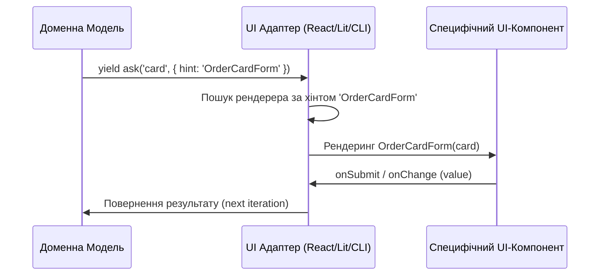

# 🔗 Зварювання Інтерфейсів та Хінтинг

У NaN•Web інтерфейси підключаються до бізнес-логіки за допомогою концепції **зварювання (Interface Welding)**. Адаптери для конкретних платформ перехоплюють інтенції моделей та рендерять відповідні UI-компоненти.

---

## 🧭 Хінтинг компонентів (Component Hinting)

Коли доменна модель генерує інтенції `show` або `ask`, вона може вказати опцію **`hint`**. Це підказка для адаптера, який саме специфічний компонент (App Component) потрібно використовувати замість стандартного поля вводу.

### Схема передачі хінтів:



### Приклад хінтингу в моделі:

```javascript
// Запит вводу реквізитів з хінтом для відображення форми
const cardData = yield ask('cardDetails', {
	hint: 'OrderCardForm',
	model: CardDetails
})
```

---

## 🛠️ Базові поля вводу проти Компонентів Додатків

Адаптери NaN•Web чітко розділяють два класи візуальних елементів:

1. **Базові поля вводу (Input Components)**:
   - Використовуються, якщо `hint` не передано.
   - Адаптер аналізує тип поля зі схеми моделі (`type: 'string'`, `type: 'boolean'`, `options: [...]`) та підбирає стандартний елемент (текстове поле, чекбокс або випадаючий список).

2. **Компоненти додатків (App Components / Schema Editors)**:
   - Використовуються, коли передано конкретний `hint`.
   - Це складніші візуальні структури, що можуть містити внутрішній стан, власну розмітку (наприклад, візуальна форма кредитної картки, графік балансу, дерево папок тощо).

---

## 🎨 Реєстрація кастомних компонентів

В екосистемі OLMUI зварювання інтерфейсів працює автоматично. Користувач платформи (розробник додатка) не пише логіку мапінгу вручну.

Вся взаємодія будується на декларативному рівні:
1. **Реєстрація компонентів додатка**:
   Усі кастомні компоненти додатка реєструються на рівні конфігурації пакету через поле **`exports`** у файлі **`package.json`**. Платформа автоматично виявляє та підключає їх на основі цих експортів.
2. **Логіка відображення**:
   У доменній моделі ви вказуєте хінт для поля:
   ```javascript
   const res = yield ask('card', { hint: 'OrderCardForm', model: CardDetails })
   ```
   Платформа самостійно підбере відповідний компонент за його ім'ям `OrderCardForm` із зареєстрованих експортів і передасть йому об'єкт моделі для відображення або редагування.


