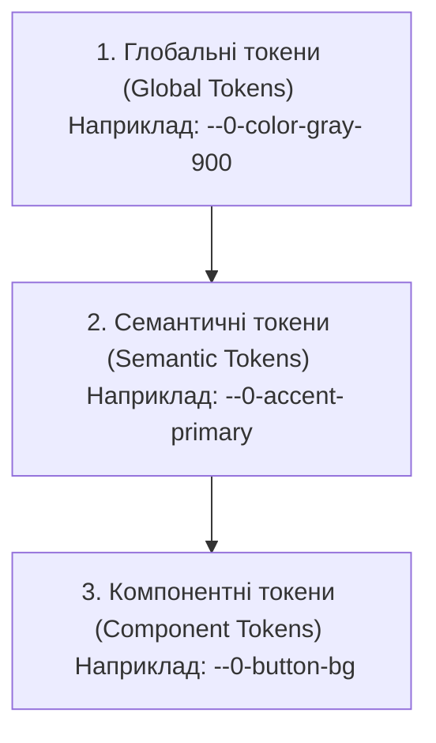

# Архітектура Темізації OLMUI (@nan0web/ui)

Цей документ описує архітектурний стандарт для повної відмови від жорстко закодованих (hardcoded) значень у стилях Lit/React компонентів на користь гнучкої, кастомізованої дизайн-системи на основі CSS Custom Properties (CSS змінних) з коротким префіксом `--0-`.

---

## 1. Проблема хардкоду в OLMUI
Принцип **OLMUI (One Logic — Many UIs)** передбачає, що візуальний шар компонентів має безшовно інтегруватися в будь-яке оточення: корпоративний банкінг, легкий мобільний веб-додаток або адміністративну панель. 

Наявність у коді стилів на кшталт:
```css
padding: 1.5rem;
border-radius: 12px;
font-size: 1.1rem;
filter: brightness(1.1);
transform: scale(0.98);
```
порушує концепцію перевикористання та унеможливлює тонку зміну брендингу (theme-swapping) без переписування коду самих компонентів.

---

## 2. Трирівнева архітектура токенів

Для забезпечення гнучкості використовується класична трирівнева структура CSS-змінних із використанням надкороткого префіксу `--0-` (Zero/NaN0):



### 2.1. Глобальні токени (Global Tokens)
Визначають сирі значення палітри, базових розмірів та шрифтів. Вони зазвичай описуються на рівні `:root`.

*   **Колірна палітра**: `--0-color-gray-900`, `--0-color-purple-500`, і т.д.
*   **Базові константи**: шрифти, базові розміри.

### 2.2. Семантичні токени (Semantic Tokens)
Надають глобальним токенам призначення (сенс). **Компоненти мають використовувати виключно семантичні або компонентні змінні.**

#### А. Кольори та брендинг (Colors)
*   `--0-bg-primary` — основний фон додатку.
*   `--0-bg-secondary` — фони контейнерів другого рівня (блоки, панелі).
*   `--0-bg-card` — фон карток, віджетів.
*   `--0-bg-glass` — фон скляних панелей (glassmorphic) з альфа-каналом.
*   `--0-text-primary` — колір основного тексту.
*   `--0-text-secondary` — колір другорядного тексту.
*   `--0-text-muted` — колір неактивного/заглушеного тексту.
*   `--0-accent-primary` — первинний брендовий колір.
*   `--0-accent-secondary` — вторинний брендовий колір.
*   `--0-accent-gradient` — градієнт бренду.
*   `--0-border-subtle` — межі за замовчуванням.
*   `--0-border-accent` — підкреслені межі фокусу/активності.

#### Б. Сітка та відступи (Spacing & Layout)
Визначають внутрішні та зовнішні поля (padding, margin).
*   `--0-spacing-xs` — 0.25rem (4px) (мікро-відступи).
*   `--0-spacing-sm` — 0.5rem (8px) (компактні відступи елементів форм).
*   `--0-spacing-md` — 1rem (16px) (стандартні відступи списків, контенту).
*   `--0-spacing-lg` — 1.5rem (24px) (внутрішні поля карток, секцій).
*   `--0-spacing-xl` — 2rem (32px) (великі розриви між блоками).
*   `--0-spacing-xxl` — 3rem (48px) (секції лендингів).

#### В. Радіуси заокруглень (Borders & Radii)
*   `--0-radius-sm` — 8px (кнопки, інпути, теги).
*   `--0-radius-md` — 12px (невеликі віджети, лічильники).
*   `--0-radius-lg` — 20px (основні картки, секції, спливаючі вікна).
*   `--0-radius-pill` — 9999px (кругла кнопка, аватарка).

#### Г. Типографіка (Typography)
*   `--0-font-sans` — основний пропорційний шрифт додатку.
*   `--0-font-mono` — моноширинний шрифт для кодів та числових значень.
*   `--0-font-size-sm` — 0.85rem (підписи, ролі, статус-баджі).
*   `--0-font-size-base` — 1rem (стандартний текст).
*   `--0-font-size-lg` — 1.15rem (підзаголовки, імена).
*   `--0-font-size-h4` — 1.25rem (заголовки секцій карток).
*   `--0-font-size-h2` — 2rem (заголовки середнього рівня).
*   `--0-font-size-h1` — clamp(2.5rem, 6vw, 4.2rem) (великі заголовки).
*   `--0-font-weight-normal` — 400 (текст).
*   `--0-font-weight-medium` — 500/600 (кнопки, підзаголовки).
*   `--0-font-weight-bold` — 700/800 (заголовки, важливі акценти).
*   `--0-line-height-base` — 1.7 (комфортне читання).
*   `--0-line-height-heading` — 1.2 (щільні заголовки).

#### Д. Інтерактивність та Анімація (Transitions & Interaction Effects)
*   `--0-transition-fast` — 0.2s ease (ховер-ефекти кнопок, зміна прозорості).
*   `--0-transition-smooth` — 0.4s cubic-bezier(0.4, 0, 0.2, 1) (плавні виїзди меню, зміна теми).
*   `--0-hover-brightness` — 1.15 (підсвічування кнопок при наведенні).
*   `--0-active-scale` — 0.97 (ефект натискання кнопки).

---

## 3. Підтримка тем та 100% Доступність (Accessibility)

### 3.1. Керування темами (Dark, Light, High Contrast)
Перемикання тем реалізується через зміну семантичних токенів відповідно до глобальних атрибутів або системних медіа-запитів.

*   **Dark Mode (За замовчуванням)**:
    ```css
    :root {
      --0-bg-primary: #0a0a0f;
      --0-text-primary: #f0f0f5;
      --0-border-subtle: rgba(255, 255, 255, 0.06);
    }
    ```
*   **Light Mode**:
    Резолвиться через атрибут `[data-theme="light"]` або `@media (prefers-color-scheme: light)`:
    ```css
    :root[data-theme="light"] {
      --0-bg-primary: #ffffff;
      --0-text-primary: #121214;
      --0-border-subtle: rgba(0, 0, 0, 0.08);
      --0-bg-glass: rgba(245, 245, 247, 0.75);
    }
    ```
*   **High Contrast Mode (Режим високої контрастності)**:
    Спеціальний режим для людей зі зниженим зором. Активується через `[data-theme="high-contrast"]`. У цьому режимі вимикаються напівпрозорі градієнти, а межі стають абсолютно контрастними (WCAG AAA):
    ```css
    :root[data-theme="high-contrast"] {
      --0-bg-primary: #000000;
      --0-bg-glass: #000000;
      --0-text-primary: #ffffff;
      --0-text-secondary: #ffff00; /* Яскраво-жовтий акцент */
      --0-border-subtle: 2px solid #ffffff;
      --0-accent-gradient: #ffffff;
      --0-hover-brightness: 1.3;
      --0-active-scale: 1; /* Вимкнено зменшення розміру для запобігання мерехтінню */
    }
    ```

### 3.2. 100% Доступність (Accessibility & WCAG 2.1)
Компоненти `@nan0web/ui` мають гарантувати наступні стандарти:
1.  **Контрастність тексту**: Співвідношення контрасту між `--0-text-primary` / `--0-text-secondary` та `--0-bg-primary` / `--0-bg-card` має бути не менше **4.5:1** (WCAG AA), а в High Contrast — **7:1** (WCAG AAA).
2.  **Фокусні рамки (Focus States)**: Заборонено приховувати фокус (`outline: none`) без заміни. Для фокусу вводиться системний токен:
    *   `--0-focus-outline` — `2px solid var(--0-accent-primary)`
    *   `--0-focus-offset` — `2px`
3.  **Анімації**: Всі компоненти мають поважати налаштування операційної системи `prefers-reduced-motion`:
    ```css
    @media (prefers-reduced-motion: reduce) {
      * {
        --0-transition-fast: 0s !important;
        --0-transition-smooth: 0s !important;
        --0-active-scale: 1 !important;
      }
    }
    ```

---

## 4. Рефакторинг DemoCounter згідно з планом темізації

Нижче наведено еталонний CSS-код компонента `DemoCounter`:

```javascript
	static styles = css`
		:host {
			display: block;
			background: var(--0-bg-glass, rgba(255, 255, 255, 0.03));
			border: 1px solid var(--0-border-subtle, rgba(255, 255, 255, 0.1));
			padding: var(--0-spacing-lg, 1.5rem);
			border-radius: var(--0-radius-md, 12px);
			margin: var(--0-spacing-lg, 1.5rem) 0;
			font-family: inherit;
		}
		h4 {
			margin: 0 0 var(--0-spacing-xs, 0.5rem) 0;
			color: var(--0-accent-secondary, #06b6d4);
			font-size: var(--0-font-size-lg, 1.15rem);
			font-weight: var(--0-font-weight-medium, 600);
			line-height: var(--0-line-height-heading, 1.2);
		}
		.counter-val {
			font-size: var(--0-font-size-h2, 2.2rem);
			font-weight: var(--0-font-weight-bold, 700);
			margin: var(--0-spacing-sm, 0.5rem) 0 var(--0-spacing-md, 1rem);
			font-family: var(--0-font-mono, monospace);
			color: var(--0-text-primary, #f0f0f5);
		}
		button {
			background: var(--0-accent-gradient, linear-gradient(135deg, #7c3aed, #06b6d4));
			color: white;
			border: none;
			padding: var(--0-spacing-sm, 0.6rem) var(--0-spacing-lg, 1.5rem);
			border-radius: var(--0-radius-pill, 9999px);
			cursor: pointer;
			font-weight: var(--0-font-weight-medium, 600);
			font-size: var(--0-font-size-base, 1rem);
			transition: background var(--0-transition-fast, 0.2s), 
			            transform var(--0-transition-fast, 0.1s);
		}
		button:hover {
			filter: brightness(var(--0-hover-brightness, 1.1));
		}
		button:active {
			transform: scale(var(--0-active-scale, 0.98));
		}
		
		/* Фокус-стилі для доступності */
		button:focus-visible {
			outline: var(--0-focus-outline, 2px solid #7c3aed);
			outline-offset: var(--0-focus-offset, 2px);
		}
	`
```

---

## 5. TDD Верифікація: Тематичний Інспектор (`OlmuiThemingInspector`)

Для автоматичного запобігання регресії хардкоду створюється додатковий інспектор у пакеті `@nan0web/ui` (або `packages/inspect/`).

### 5.1. Правила перевірки (Lint Rules)
Інспектор аналізує файли `*.js` / `*.jsx` / `*.ts` / `*.css` у папці `src/` компонентів на відповідність таким критеріям:
1.  **Жодних сирих кольорів**: Пошук регулярними виразами кольорових кодів (`#hex`, `rgb`, `rgba`, `hsl` без обгортки в `var()`).
2.  **Заборона жорстких одиниць**: Перевірка на наявність значень `px`, `rem`, `em` поза межами `var()`, за винятком `0`, `1px` (тонкі межі) або `50%` (круги).
3.  **Обов'язковий фолбек**: Усі виклики `var(--0-...)` мають містити дефолтне значення (fallback), наприклад: `var(--0-spacing-lg, 1.5rem)`. Це гарантує рендеринг елементів навіть за відсутності підключеної глобальної теми.

### 5.2. Специфікація поліморфного інспектора
Для підтримки різноманітних середовищ виконання (наприклад, JavaScript/TypeScript для фронтенду, Python для бекенду тощо), ми використовуємо поліморфний патерн делегування, де підкласи платформи розширюють базовий аудитор.

#### A. Базовий поліморфний роутер (`OlmuiThemingAuditor`)
Цей клас визначає схеми конфігурації, уніфіковані текстові токени `UI` та динамічно імпортує підклас у методі `run()` для запобігання кругових залежностей модулів:

```javascript
// packages/ui/src/domain/app/OlmuiThemingAuditor.js
import { AuditorModel } from '@nan0web/inspect/domain/AuditorModel'

export class OlmuiThemingAuditor extends AuditorModel {
	static alias = 'theming'

	static dir = {
		type: 'string',
		help: 'Цільова директорія для аудиту стилів',
		positional: true,
		default: '.',
	}

	static UI = {
		title: 'OLMUI Theming Auditor',
		description: 'Перевіряє UI-стилі на наявність хардкоду (кольори, розміри, сітка відступів) та контролює використання змінних.',
		icon: '🎨',
		starting: 'Аудит стилів у директорії {dir}',
		noFiles: 'Файлів для перевірки стилів не знайдено у {dir}',
		doneSuccess: 'Усі файли успішно пройшли аудит темізації (0% хардкоду).',
		doneErrors: 'Аудит темізації завершився помилкою. Знайдено захардкоджені значення!',
		auditPassed: 'Перевірка пройдена: {file}',
		auditFailed: 'Невідповідність у {file}: {errors}',
		errorDb: 'Базу даних не передано до аудитора',
		errorColor: 'Хардкод кольору "{match}" знайдено без змінної теми',
		errorSize: 'Хардкод розміру/відступу "{match}" знайдено без змінної теми',
	}

	async *run() {
		const AuditorClass = this.platform === 'python'
			? (await import('./PyOlmuiThemingAuditor.js')).PyOlmuiThemingAuditor
			: (await import('./JsOlmuiThemingAuditor.js')).JsOlmuiThemingAuditor

		const delegate = new (/** @type {any} */ (AuditorClass))({
			dir: /** @type {any} */ (this).dir,
			fix: /** @type {any} */ (this).fix,
			platform: /** @type {any} */ (this).platform,
		}, /** @type {any} */ (this)._)
		
		return yield* delegate.run()
	}
}
```

#### B. JavaScript/TypeScript реалізація (`JsOlmuiThemingAuditor`)
Цей клас розширює `OlmuiThemingAuditor`, успадковуючи всі статичні параметри та локалізовані рядки:

```javascript
// packages/ui/src/domain/app/JsOlmuiThemingAuditor.js
import { OlmuiThemingAuditor } from './OlmuiThemingAuditor.js'
import { result, show, progress } from '../../core/Intent.js'

export class JsOlmuiThemingAuditor extends OlmuiThemingAuditor {
	async *run() {
		const { t } = /** @type {any} */ (this)._
		yield show(t(OlmuiThemingAuditor.UI.starting, { dir: this.dir }))

		const fsDb = /** @type {any} */ (this)._.db
		if (!fsDb) {
			yield show(t(OlmuiThemingAuditor.UI.errorDb), 'error')
			return result({ ok: false, code: 500, reason: 'no_db' })
		}

		const files = []
		const targetDir = fsDb.resolveSync(this.dir)

		try {
			for await (const entry of fsDb.browse(targetDir, {
				depth: Infinity,
				ignore: ['node_modules', 'dist', 'build', 'play', 'test', '.*'],
			})) {
				if (entry.isFile && /\.(js|jsx|ts|tsx|css)$/.test(entry.name)) {
					files.push(entry.path)
				}
			}
		} catch (e) {
			// Directory might be missing
		}

		if (files.length === 0) {
			yield show(t(OlmuiThemingAuditor.UI.noFiles, { dir: this.dir }), 'error')
			return result({ ok: false, code: 404, reason: 'no_files' })
		}

		const errors = []
		const rawColorRegex = /(?<!var\([^)]*)(#(?:[0-9a-fA-F]{3,4}){1,2}\b|\brgba?\(|\bhsla?\()/g
		const rawSizeRegex = /(?<!var\([^)]*)\b([2-9]px|[1-9]\d+px|[0-9.]+(?:rem|em))\b/g

		for (const file of files) {
			const content = await fsDb.fetch(file)
			const contentString = typeof content === 'string' ? content : JSON.stringify(content)
			const fileErrors = []

			rawColorRegex.lastIndex = 0
			let colorMatch
			while ((colorMatch = rawColorRegex.exec(contentString)) !== null) {
				fileErrors.push(t(OlmuiThemingAuditor.UI.errorColor, { match: colorMatch[1] }))
			}

			rawSizeRegex.lastIndex = 0
			let sizeMatch
			while ((sizeMatch = rawSizeRegex.exec(contentString)) !== null) {
				fileErrors.push(t(OlmuiThemingAuditor.UI.errorSize, { match: sizeMatch[1] }))
			}

			const displayFile = file.startsWith('@app/') ? file.slice(5) : file

			if (fileErrors.length > 0) {
				yield show(
					t(OlmuiThemingAuditor.UI.auditFailed, { file: displayFile, errors: fileErrors.join('; ') }),
					'error',
				)
				errors.push(...fileErrors.map((e) => ({ file: displayFile, error: e })))
			} else {
				yield progress(t(OlmuiThemingAuditor.UI.auditPassed, { file: displayFile }))
			}
		}

		if (errors.length > 0) {
			yield show(t(OlmuiThemingAuditor.UI.doneErrors, {}), 'error')
			return result({ ok: false, code: 400, reason: 'unthemed_tokens', errors })
		}

		yield show(t(OlmuiThemingAuditor.UI.doneSuccess, {}), 'success')
		return result({ ok: true, code: 200 })
	}
}
```

### 5.3. Уніфікований формат повернення результатів (`result()`)
Для відповідності стандартним специфікаціям Web API (таким як нативний Fetch `Response.ok`), ми впроваджуємо використання `ok: boolean` замість `success: boolean` як основного індикатора успішності виконання аудитора:

1. **`ok: boolean`**: Обов'язковий індикатор успішності перевірки (без помилок).
2. **`code: number`**: Стандартний HTTP-подібний код статусу (наприклад, `200` для успіху, `400` для помилок перевірки, `404` для відсутності цільових файлів, `500` для критичних збоїв системи або бази даних).
3. **Основна оркестрація**: Головний оркестратор (`ArchitectureAuditor`) динамічно перевіряє `ok`, одночасно підтримуючи legacy-властивість `success` для сумісності зі старими модулями в робочому просторі:
   ```javascript
   const isOk = data.ok !== undefined ? data.ok : data.success
   if (isOk === false) overallSuccess = false
   ```


