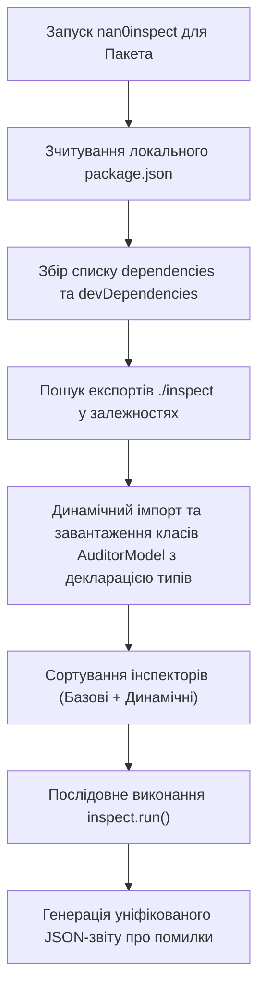

# 🗺️ Динамічна Плагін-Архітектура Інспекторів у Пайплайні та LLiMo (Роадмап)

Цей документ визначає архітектурний стандарт для **динамічного, не-детермінованого виявлення та запуску інспекторів** у монорепозиторії NaN•Web v3.0.0. Замість хардкодингу списку перевірок, конвеєр динамічно сканує дерево залежностей проекту та послідовно запускає всі експортовані інспектори.

---

## 🏗️ 1. Концепція Динамічного Виявлення (Dynamic Discovery)

Кожен пакет або додаток у монорепозиторії може оголошувати власні правила перевірки якості коду та надавати власний інспектор. Виявлення здійснюється автоматично через два механізми в `package.json`:

### A. Експорт субшляху `"./inspect"` з декларацією типів (DX-First)
Пакет експортує точку входу для аудиту разом із обов'язковим файлом декларації типів (`.d.ts`), що забезпечує бездоганну автодокументацію та DX при інтеграції:
```json
"exports": {
    "./inspect": {
        "import": "./src/inspect/I18nInspector.js",
        "types": "./types/inspect/I18nInspector.d.ts"
    }
}
```
Приклади у нашому монорепозиторії:
* **`@nan0web/i18n`**: експортує `I18nInspector.js` з типами.
* **`@nan0web/ui`**: експортує `SnapshotAuditor` та **`IntentAuditor`**!
  > [!TIP]
  > **`IntentAuditor`** — фундаментальний інспектор гігієни виводу, який перевіряє відсутність брудного відлагодження (`console.*`) та гарантує, що вся взаємодія здійснюється виключно через стандартні агностичні OLMUI-інтенти: `yield show()`, `yield log()`, `yield ask()`, `yield agent()` або `return result()`.

### B. Спрощення виявлення та запуск базових інспекторів
Для збереження лаконічності `package.json` ми **не використовуємо** примусові додаткові масиви конфігурацій (на кшталт `nan0web.inspectors`).
Замість цього:
1. Ранер зчитує `package.json` проекту та його прямих залежностей.
2. Якщо залежність декларує експорт `"./inspect"`, її аудитори завантажуються автоматично.
3. Ранер **завжди** доповнює список базовими фундаментальними інспекторами (`ArchitectureAuditor`, `CircularDependencyAuditor`, `IntentAuditor`).

---

## 🔄 2. Алгоритм Автоматичного Збирання Пайплайну (Pipeline Assembly)

Коли AI-асистент чи LLiMo App запускає аудит для конкретного пакета (наприклад, `@nan0web/ai`), ранер здійснює наступні кроки:



### Приклад динамічного ланцюжка для `@nan0web/ai`:
Оскільки `@nan0web/ai` залежить від `@nan0web/db-fs`, `@nan0web/ui` та `@nan0web/i18n`, ранер автоматично збере та послідовно виконає:
1. **`ArchitectureAuditor`** (з `@nan0web/inspect`) — валідація папок.
2. **`I18nInspector`** (з `@nan0web/i18n`) — валідація ключів перекладів.
3. **`SnapshotAuditor`** (з `@nan0web/ui`) — верифікація зліпків інтерфейсу.
4. **`IntentAuditor`** (з `@nan0web/ui`) — перевірка чистоти OLMUI-інтентів та відсутності `console.*`.
5. **`CircularDependencyAuditor`** (з `@nan0web/inspect`) — аналіз Madge.

---

## 🤖 3. Навчання Агентів та Інтеграція в LLiMo App

Ця архітектура дозволяє прискорити розробку у **100 разів** завдяки усуненню галюцинацій на ранніх етапах:

1. **Self-Healing Loop (Петля самовідновлення)**:
   * Агент виконує генерацію коду.
   * Конвеєр динамічно запускає зібраний стек інспекторів.
   * У разі помилки (наприклад, `I18nInspector` каже: *Не знайдено ключ `errorLoadIndex` у локалі `uk`*, або `IntentAuditor` знаходить `console.log`), агент миттєво отримує точковий контекст помилки і виправляє її, не турбуючи розробника.

2. **Легковажна Емуляція у LLiMo**:
   * LLiMo App більше не потребує тривалих діалогів із запитаннями на кшталт "Чи все я переклав?".
   * Детерміновані інспектори виступають в ролі **суворих компіляторних бар'єрів**. Якщо бар'єр не пройдено, LLiMo миттєво повертає агенту чітку інструкцію на виправлення конкретного файлу/рядка.

---

## 📈 План Впровадження (Action Items)

- [ ] **Крок 1**: Модернізувати `InspectorApp.js` для динамічного імпорту субшляхів `"./inspect"` з дерева залежностей (використовуючи `import.meta.resolve` або VFS зчитування `node_modules`).
- [ ] **Крок 2**: Створити **`IntentAuditor`** всередині `@nan0web/ui` або `@nan0web/inspect` для сканування вихідних файлів на наявність прямого системного виводу.
- [ ] **Крок 3**: Інтегрувати динамічний збір інспекторів у `packages/pipeline` та навчити конвеєр запускати їх послідовно.
- [ ] **Крок 4**: Оновити системні промпти LLiMo для використання результатів динамічного інспектування як фінального критерію готовності завдання.
