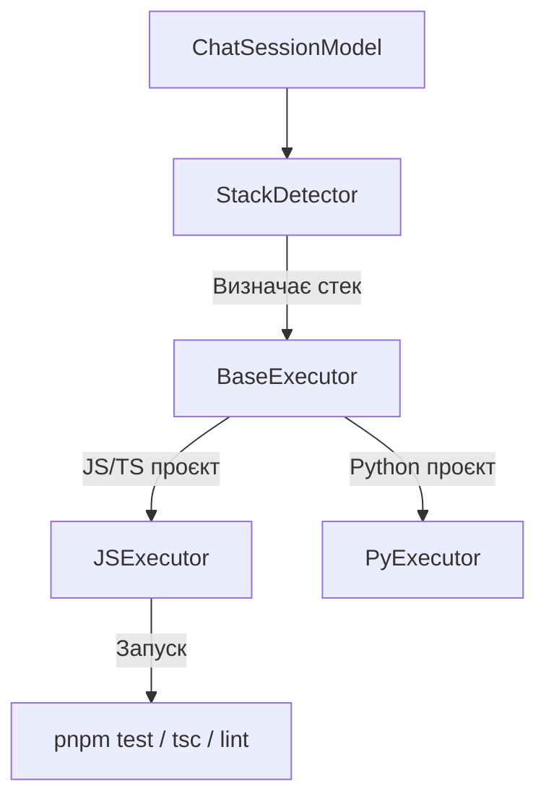

# 🏗️ Архітектурний План: Автономний TDD-Цикл, Поліморфні Виконавці та Пайплайни (v3.2.0)

Цей документ визначає архітектуру та етапи інтеграції автономного циклу розробки, поліморфного виконання команд для різних стеків, логування трас для відтворення помилок та зшивання всього конвеєра згідно з `app-pipeline`.

---

## 1. Поліморфні Виконавці Стеків (Polymorphic Stack Executors)

Для того щоб `llimo.v3` був повністю агностичним до мови програмування проєкту, виконання команд ізолюється від `ChatSessionModel` через абстракцію виконавців (Executors).

### Схема взаємодії:


### Компоненти:
1. **`StackDetector`**:
   - Аналізує корінь проєкту (наявність `package.json`, `requirements.txt`, `Cargo.toml` тощо).
   - Повертає ідентифікатор стеку (наприклад, `'js'`, `'py'`).
2. **`BaseExecutor` (Абстрактний клас)**:
   - Декларує методи:
     - `test()` — запуск тестів проєкту.
     - `build()` — збірка проєкту (транспіляція, перевірка типів).
     - `lint()` — перевірка стилю та форматування коду.
     - `validate()` — запуск проєктних інспекторів (наприклад, `project-validator`).
3. **`JSExecutor` (Реалізований за замовчуванням)**:
   - Викликає `pnpm test`, `tsc` та `prettier --check` відповідно до стандартів NaN•Web.
4. **`PyExecutor` (Резервний стек)**:
   - Викликає `pytest`, `flake8` або `mypy`.

---

## 2. Автономний TDD-Цикл (TDD Run Loop)

Замість завершення роботи після першої генерації, сесія чату переходить в автономний режим зворотної відповіді від компілятора та тестів.

### Алгоритм циклу:
1. **Генерація**: Модель створює або редагує код файлів через boundary-блоки.
2. **Збереження**: Користувач (або система автоматично у неінтерактивному режимі) підтверджує запис файлів на диск.
3. **Верифікація**: Викликається `Executor.test()` та `Executor.build()`.
4. **Аналіз результатів**:
   - Якщо тести та білд завершились успішно (exit code 0), цикл переривається з успіхом.
   - Якщо виникли помилки, вміст консолі (stdout + stderr) зчитується, загортається у службовий системний промпт та відправляється моделі:
     ```markdown
     ---boundary:@test-failures---
     [Error: test suite failed]
     ...детальний стек помилки...
     ---boundary---
     ```
5. **Корекція**: Модель отримує помилку і в наступній ітерації генерує патч для її виправлення. Цикл повторюється до `maxIterations` (за замовчуванням: 5) або вичерпання ліміту токенів.

---

## 3. Логування Трас та Симулятор Відтворення (Snapshot Trace Playback)

Для швидкого відтворення збоїв парсингу та аналізу баг-репортів користувачів впроваджується протокол зліпків сесії.

### Формат Snapshot Log:
Кожен запит і відповідь записується у файл сесії `~/.llimo/chats/<id>/session_trace.jsonl`:
```json
{"timestamp": "2026-05-28T21:00:00Z", "role": "system", "content": "..."}
{"timestamp": "2026-05-28T21:00:05Z", "role": "user", "content": "..."}
{"timestamp": "2026-05-28T21:00:10Z", "role": "assistant", "content": "...", "metrics": {"promptTokens": 1024, "completionTokens": 256}}
{"timestamp": "2026-05-28T21:00:12Z", "role": "tool_output", "command": "@ls", "result": "..."}
```

### Механізм Playback:
Через команду `llimo3 playback <шлях_до_trace.jsonl>` розробник запускає симуляцію:
- Замість реального виклику LLM API система читає відповіді з файлу логу, відтворює всі внутрішні команди та збережений хід думок.
- Це дозволяє запустити офлайн-дебаг парсера без витрат токенів та імітувати поведінку користувача на 100%.

---

## 4. Конвеєр Кроків (Master App Pipeline)

Зшивання інструментів у єдиний процес відповідно до 9-етапного `app-pipeline`:
1. **Крок 1**: Генерація `seed.md` та `user-stories.md` (Аналіз наміру).
2. **Крок 2**: Генерація моделей даних (`domain/*.js`) -> автоматична валідація структури.
3. **Крок 3**: Контрактні сценарії (`*.story.js`) -> запуск тестування TDD.
4. **Крок 4**: Генерація UI Адаптера.
5. **Крок 5**: Інтеграція інтерфейсу UI-CLI.
6. **Крок 6**: Створення UI-CHAT.
7. **Крок 7**: Створення UI-WEB.
8. **Крок 8**: Створення UI-MOBILE.
9. **Крок 9**: Фінальне збирання та QA.

Кожен крок є окремим файлом воркфлоу, що послідовно запускається через `llimo3` за допомогою параметра `-w <workflow-name>`.
