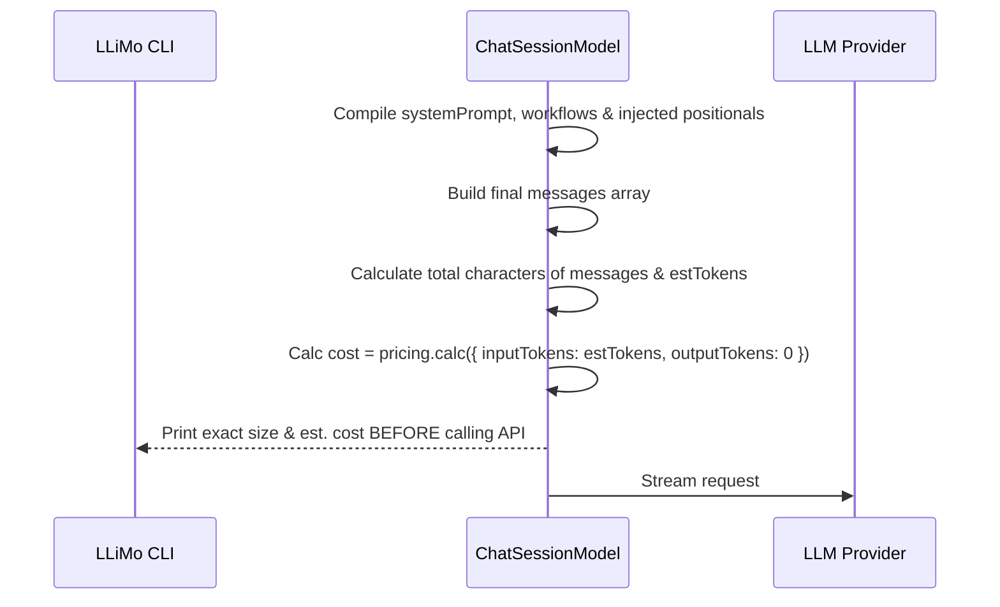

# 🏗️ Архітектурний План: Точне Оцінювання Контексту та Гігієна мовних файлів (v3.2.0)

Цей план описує архітектурні зміни для усунення розбіжностей в очікуваному розмірі промпту, виправлення формату файлу `data/_/langs.nan0` та інтеграції цих перевірок в автономний конвеєр.

---

## 1. Точне Оцінювання Розміру Промпту (Budget & Context Estimation)

### Поточна проблема:
LLiMo виводить оцінку промпту (`Prompt: 539 bytes (~129 tokens)`) на основі лише користувацького вводу (`promptText`). Проте повний промпт, що надсилається до LLM, також містить:
* Системні інструкції (`system.md` + опис воркфлоу та інструментів).
* Автоматично завантажені файли специфікацій (через `_positionals`).
Через це реальний розмір промпту (наприклад, 2520 токенів) значно перевищує початкову оцінку, що вводить розробника в оману щодо бюджету.

### Пропоноване рішення:
Перенести розрахунок та показ деталей промпту безпосередньо у цикл cascade-моделей після того, як сформовано фінальний масив `messages`.



#### Зміни в `ChatSessionModel.js`:
1. Видалити попереднє логування `prompt_details` перед циклом cascade.
2. Розраховувати `totalChars` та `estimatedTokens` для всього масиву `messages`.
3. Використовувати `modelInfo.pricing.calc` для точного розрахунку орієнтовної ціни вхідного контексту.
4. Виводити повідомлення з деталями промпту та бюджетом безпосередньо перед надсиланням запиту:
   `· Trying model: gpt-oss-120b@cerebras... (est. cost: $0.001142, prompt: 2520 tokens)`

---

## 2. Гігієна `langs.nan0`/`langs.yaml` та запобігання галюцинаціям перекладів

### Поточна проблема:
Конфігурація підтримуваних мов додатку зазвичай міститься у `data/_/langs.nan0` або `data/_/langs.yaml`. Вона має описувати виключно перелік доступних локалей, наприклад:
* У форматі простого списку (`uk, en`).
* Або у форматі списку об'єктів (як у `@bank` додатках, наприклад `langs.yaml`):
  ```yaml
  - title: English
    locale: en
    code: en
  - title: Українська
    locale: uk
    code: uk
  ```
Проте на початкових фазах (`1-seed`) модель намагається згенерувати туди повноцінний словник перекладів з функціональними ключами (на кшталт `divideByZero: ...`).

Переклади мають зберігатися виключно в локалізованих каталогах:
* `data/uk/_/t.yaml`
* `data/en/_/t.yaml`

### Пропоноване рішення:
1. **Уточнення інструкцій Фази 1 (`1-seed`)** в `AppPipeline.js`:
   Явно додати інструкцію про формат конфігурації мов (`langs.nan0` або `langs.yaml`), наголосивши, що це список доступних мов, а не словник перекладів.
2. **Уточнення інструкцій Фази 2 (`2-model`)**:
   Нагадати моделі, що переклади властивостей мають реєструватися через Late-Bound механізми у файлах `data/{locale}/_/t.yaml` з camelCase ключами.
3. **Автоматична валідація в `inspect-i18n`**:
   Якщо інспектор `inspect-i18n` виявляє у файлі конфігурації мов структуру об'єкта перекладів (наявність функціональних ключів, що не стосуються опису мов), він повертає помилку валідації, запускаючи Self-Healing цикл для автоматичного виправлення.

---

Для перевірки та збирання перекладів використовуються вбудовані у `@nan0web/i18n` інструменти:
* **Інспектор `inspect-i18n`** — для автоматичної валідації відповідності словникових ключів camelCase властивостям доменної моделі.
* **Воркфлоу `i18n-builder`** — для побудови фінальних словників перекладів на основі моделі, виключаючи будь-який ручний хардкод.
Ми маємо інтегрувати ці перевірки безпосередньо у кроки пайплайну LLiMo для забезпечення автоматичного виявлення порушень та їх самолікування.

---

## 4. Динамічне вилучення інструкцій та конфігурування інспекторів по фазах

Щоб уникнути жорсткого хардкоду інструкцій та списку інспекторів всередині класу `AppPipeline.js`, нам потрібен механізм їх динамічного завантаження безпосередньо з екосистеми NaN•Web.

### Варіанти реалізації:

#### Варіант 1: Frontmatter-конфігурація у файлах воркфлоу (Децентралізований)
Кожен `.md` файл воркфлоу (наприклад, `pipeline-no1-seed.md`) містить метадані у форматі YAML Frontmatter на початку файлу:
```yaml
---
phase: "1-seed"
inspectors:
  - "inspect-i18n"
  - "inspect-structure"
instructions:
  uk: "Ви перебуваєте у Фазі 1 (SEED)..."
  en: "You are in Phase 1 (SEED)..."
---
```
* **Плюси**: Повна автономність. Достатньо створити новий файл воркфлоу у папці `global_workflows/`, і пайплайн автоматично дізнається про нову фазу, інструкції та інспектори.
* **Мінуси**: Потребує парсингу YAML Frontmatter з Markdown під час старту.

#### Варіант 2: Динамічне зчитування з пакетів монорепозиторію (Package-Driven)
Кожен пакет (наприклад, `@nan0web/i18n` або `@nan0web/inspect`) експортує конфігураційний файл `pipeline.config.yaml` або має спеціальне поле в `package.json`. При ініціалізації конвеєра `AppPipeline` сканує директорію `packages/` та реєструє:
* Які інспектори (скрипти перевірки) запускати для кожної фази.
* Які супутні інструкції для ШІ додати до системного промпту.
* **Плюси**: Інструменти I18n самі визначають, як ШІ має з ними працювати, оскільки інструкції лежать безпосередньо в коді `@nan0web/i18n`.
* **Мінуси**: Потребує сканування файлової системи монорепозиторію при кожному запуску.

#### Варіант 3: Централізований реєстр конвеєра (`pipeline.config.yaml` у корені)
Усі кроки, необхідні інспектори та інструкції описані в одному центральному файлі конфігурації конвеєра:
```yaml
phases:
  1-seed:
    workflows: [init-project, pipeline-no1-seed]
    inspectors: [inspect-i18n, inspect-structure]
    instructions: "@nan0web/i18n/docs/phase1_instructions.md"
```
* **Плюси**: Один файл конфігурації для всієї платформи. Легко переглядати та редагувати весь конвеєр в одному місці.
* **Мінуси**: Будь-який новий інспектор у пакетах вимагає оновлення центрального файлу конфігурації.

