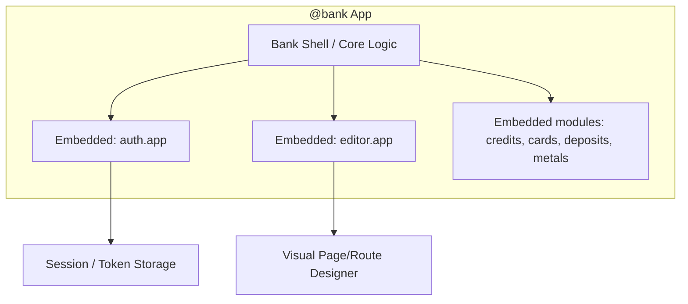
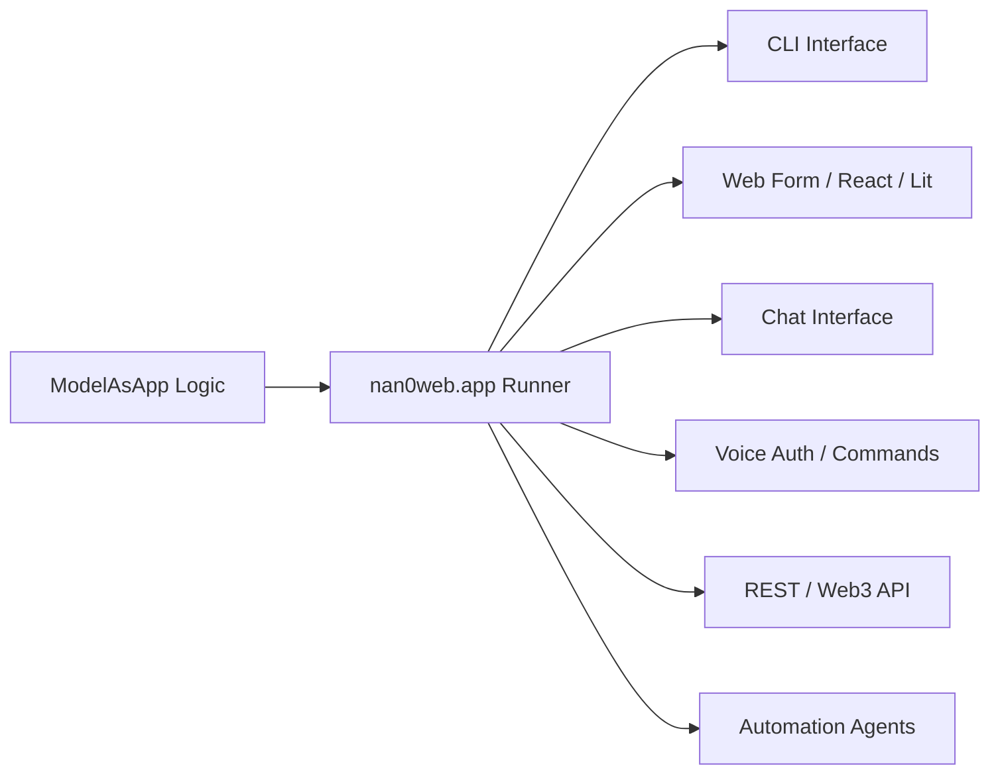
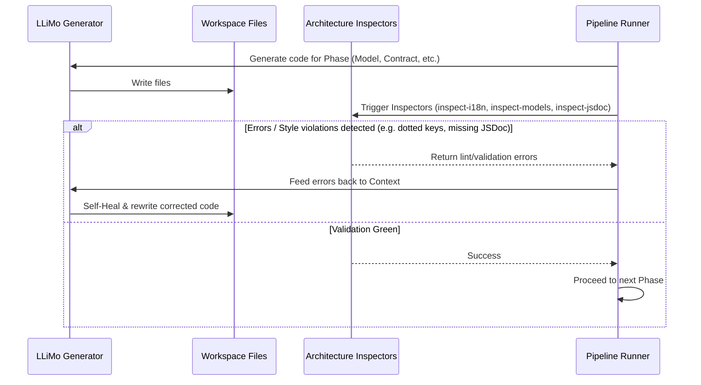

# Фрактальна архітектура та Самолікувальні конвеєри NaN•Web

Цей документ визначає фундаментальну специфікацію фрактальної інтеграції додатків, архітектуру мульти-інтерфейсного раннера `nan0web.app` та протокол автоматичного самолікування коду (Self-Healing) в конвеєрах розробки LLiMo.

---

## 1. Фрактальна архітектура додатків (Fractal Nesting)

Додатки в екосистемі NaN•Web є **фрактальними**. Це означає, що будь-який додаток може містити всередині себе, налаштовувати та оркеструвати інші додатки.



### Принцип роботи:
* **Композиція замість успадкування**: `@bank` виступає як зовнішній контейнер, який інтегрує в себе `auth.app` (для автентифікації) та `editor.app` (для візуального керування контентом).
* **Ізоляція баз даних**: Кожен вбудований додаток може працювати з власною базою даних через універсальний інтерфейс `@nan0web/db` (яка за конфігурацією може зберігатися в Object Store, SQL або DB-FS).
* **Взаємодія**: Додатки спілкуються через шину подій (`event()`) або прямі Late-Bound виклики генераторів.

---

## 2. Мульти-інтерфейсний Раннер (`nan0web.app`)

`nan0web.app` — це універсальний хост-контейнер (**Runner**), який відповідає за динамічний запуск логіки, описаної в `ModelAsApp`.



### Протокол запуску:
* **Аналіз експортів**: Раннер сканує експортовані інтерфейси моделі. Якщо додаток експортує інтерфейси `cli`, `web`, `chat`, `voice` або `robot` — раннер автоматично надає користувачеві доступ через цей канал.
* **Зварювання (Welding)**: Раннер бере чисту доменну логіку та монтує її на платформо-залежні адаптери (наприклад, `@nan0web/ui-cli` для терміналу або Lit-компоненти для PWA).

### 🌐 i18n Маршрутизація та SEO (SEO-Friendly Routing)
Для забезпечення безкомпромісного SEO при мультилінгвальності, платформа використовує такий розподіл обов'язків:
1. **Єдине джерело (nav.nan0)**: Логічна навігація містить лише чисті відносні шляхи контенту (наприклад, `href: docs`).
2. **Web-сервер (SSR/SSG)**: 
   - Автоматично дописує префікс поточної мови до публічного URL (наприклад, `/uk/docs`, `/en/docs`).
   - Якщо користувач відкриває загальний URL `/docs` без локалі, сервер виконує **302 Redirect** на основі заголовка `Accept-Language` (або дефолтну мову сайту).
   - Секція `<head>` обов'язково наповнюється мета-тегами `<link rel="alternate" hreflang="..." href="..." />` для пошукових роботів.
3. **CLI-інтерфейс**: SEO-адреси не потрібні. Термінал використовує логічний `href` безпосередньо та мапить його на фізичний файл локалі сесії (наприклад, `data/uk/docs.nan0`), забезпечуючи швидкий доступ.

### 🗂️ Розподіл Роутингу (Content vs Actions)
* **Контент**: Сторінки для читання обслуговуються повністю через **File-System Routing** (читання `data/{locale}/{href}.nan0`). Жодного JS-роутингу для цього писати не потрібно.
* **Складні дії (Actions)**: Системні операції (наприклад, `build`, `test`) реєструються як команди (`ModelAsApp.command`) безпосередньо в коді. Якщо користувач запускає `nan0web build` — CLI минає інтерактивну навігацію контенту та виконує бізнес-логіку команди.

---

## 3. Самолікувальний AI-Конвеєр (Self-Healing Pipeline)

Конвеєр розробки не просто генерує код, а запускає петлю автоматичного виправлення помилок (Self-Healing Loop) за допомогою вбудованих архітектурних інспекторів.



### Автоматизовані перевірки:
1. **`inspect-i18n`**: Перевіряє словники та словникові ключі. Автоматично видобуває camelCase-властивості з моделей, запобігаючи використанню крапок (`app.title`).
2. **`inspect-models`**: Перевіряє сумісність моделей з Model-as-Schema v2 (відсутність DOM-залежностей, чистота декларацій).
3. **`inspect-jsdoc`**: Перевіряє наявність V8-оптимізованих JSDoc-типів для автодоповнення.
4. **`inspect-structure`**: Перевіряє гігієну імпортів та чистоту файлової структури.

---

## 4. Карта впровадження для банківських конвеєрів

При запуску конвеєра розробки сайту банку:
```bash
llimo3 pipeline run app "створи банківський додаток кредитів"
```
LLiMo виконає такі кроки:
1. **Phase 1-2**: Створення ТЗ та чистої моделі `CreditModel` (мовою запиту користувача — українською).
2. **Phase 3**: Автоматична генерація тестів.
3. **Phase 4-7**: Створення інтерфейсів. На кожному етапі запускається `inspect-i18n` для автоматичної екстракції та реєстрації camelCase перекладів, а також лінтери для перевірки JSDoc. У разі виявлення помилок, конвеєр перезапускає генератор з описом помилки для автоматичного самолікування.
