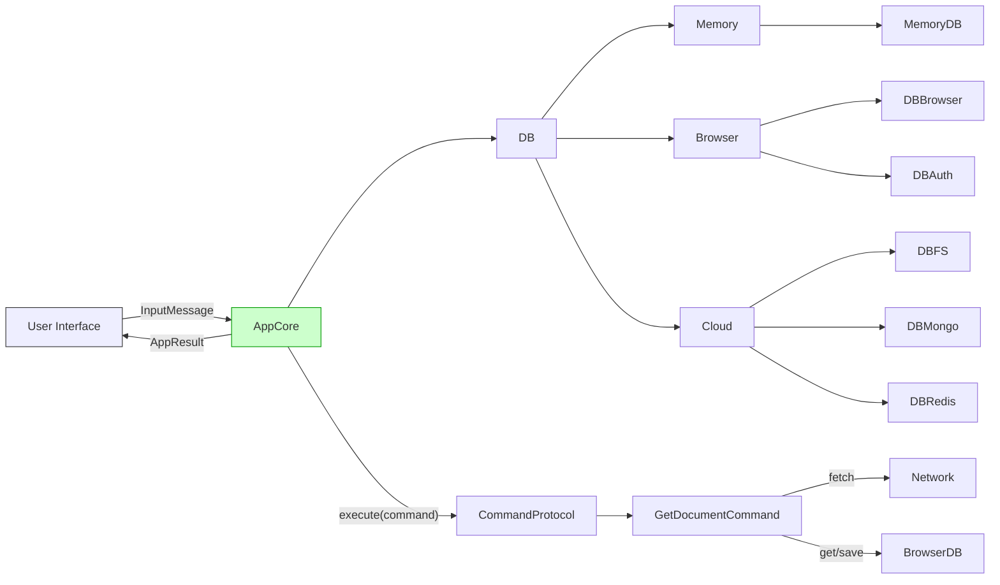

# 🧱 NaN•App Template — Zero-Noise, Command-Driven App

> A minimal, **verified-by-execution**, UI-agnostic application template  
> that focuses on **truth**, not "looks", **action**, not UI.

**Every line of documentation is executable as a test.**  
**Every component is a documented command.**  
**No framework noise — only intentions and actions.**

---

## ✅ Goals

1. **Create a web application using `@nan0web/*` ecosystem**
2. **Ensure 100% test coverage with `node:test`**
3. **Every exported function or component has a test**
4. **All documentation is in `src/README.md.js` and generates:**
   - `README.md` (English)
   - `.datasets/README.jsonl` (LLM-ready)
5. **Support UI React and UI Lit (`@nan0web/ui-react`, `@nan0web/ui-lit`)**
6. **Full localization support (English, Ukrainian)**
7. **All logic lives in `AppCore`, not in React components**

---

## 📦 Project Structure

```text
apps/myapp/
├── commands/                     # Pure action logic
│   ├── GetDocumentCommand.js
│   └── GetDocumentCommand.test.js
│
├── models/                       # Data structures as trusted knowledge
│   ├── Document.js
│   └── Document.test.js
│
├── app/                          # Application core
│   ├── AppCore.js
│   └── bootstrap.js
│
├── src/
│   ├── components/               # UI-agnostic components (React or Lit)
│   │   └── DocumentView.jsx      # Renders { $content } blocks
│   ├── playground/               # CLI demo that works without UI
│   │   └── main.js
│   └── README.md.js              # Executable documentation → tests + dataset
│
├── docs/
│   └── uk/README.md              # LLM-generated translation (structurally validated)
│
├── .datasets/
│   └── README.jsonl              # Machine-trainable dataset
│
├── README.md                     # Generated document from src/README.md.js
├── system.md                     # System instructions (Ukrainian only)
└── package.json                  # Scripts: test, coverage, docs, release
```

---

## ✅ Key Principles

| Principle                        | Implementation in this Template |
|----------------------------------|----------------------------------|
| **Idea**                         | An app that renders static content but proves it exists |
| **Architecture**                 | `AppCore` → Command → `AppResult` → Any UI |
| **Test Every Fragment**          | `*.test.js` with `node:test`, 100% coverage |
| **Documentation from Code**      | `src/README.md.js` = test + docs |
| **Verified Knowledge**           | Docs are executed → fail if code changes |
| **Localization**                 | `docs/uk/README.md` via LLM (content & structure preserved) |
| **Physical Artifact**            | `releases/v0.1.0.jsonl` + `git tag` |
| **Reproducibility**              | `playground/main.js` runs without build |

> This is not a scaffold.  
> This is **a proof that an app can exist in harmony with logic, truth, and freedom**.

---

## 🔄 Command-Driven Architecture



---

## ✅ GetDocumentCommand — The First Action

```js
// commands/GetDocumentCommand.js
import { ExecutableCommand } from "@nan0web/protocol"
import Document from "../models/Document.js"
import AppResult from "@nan0web/core/types/AppResult.js"

/**
 * Command: GetDocumentCommand
 * Purpose: Retrieve a document by URI and locale, using indexedDB as cache
 */
class GetDocumentCommand extends ExecutableCommand {
  /**
   * Execute action to get document
   * @param {object} msg - Input with `uri`, `locale`
   * @returns {Promise<AppResult>}
   */
  async run(msg) {
    const { uri = "/", locale = "en" } = msg.input
    const path = `/${locale}${uri === "/" ? "/index" : uri}.json`

    if (!path) {
      return AppResult.from({
        content: ["❌ URI is required"],
        error: new Error("URI not provided"),
        priority: 2
      })
    }

    try {
      const data = await this.context.db.get(path) || await this.context.db.fetch(path)
      const document = Document.from({ ...data, $uri: uri, $source: data ? "cache" : "network" })
      return AppResult.from({
        content: ["📄 Document loaded successfully"],
        meta: { document },
        priority: 1
      })
    } catch (err) {
      return AppResult.from({
        content: ["⚠️ Failed to load document"],
        error: err,
        priority: 3
      })
    }
  }
}

export default GetDocumentCommand
```

---

## ✅ Test: Verification, Not Just Coverage

```js
// commands/GetDocumentCommand.test.js
import { describe, it } from "node:test"
import assert from "node:assert"
import GetDocumentCommand from "./GetDocumentCommand.js"
import { MemoryDB } from "@nan0web/test/src/mock/MemoryDB.js"

describe("GetDocumentCommand", () => {
  it("should load document from db when found", async () => {
    const db = new MemoryDB()
    await db.connect()
    await db.save("/en/about.json", { title: "About Us", content: [{ h1: "Who We Are" }] })

    const cmd = new GetDocumentCommand()
    cmd.context = { db }

    const result = await cmd.run({
      input: { uri: "/about", locale: "en" }
    })

    assert.equal(result.meta.document.title, "About Us")
    assert.equal(result.meta.document.$source, "cache")
  })

  it("should return error if no URI provided", async () => {
    const cmd = new GetDocumentCommand()
    cmd.context = { db: new MemoryDB() }

    const result = await cmd.run({ input: {} })

    assert.ok(result.error)
    assert.equal(result.priority, 2)
  })
})
```

> This test **proves existence**.  
> It will run in CLI, browser, CI — and fail if broken.

---

## ✅ Model: Document — Trusted Structure

```js
// models/Document.js
import Document from "@nan0web/co/src/models/Document.js"

class AppDocument extends Document {
  // Extend with app-specific fields if needed
}

export default AppDocument
```

> You can customize, but **the core structure is verified**.

---

## ✅ AppCore: The Heart of the App

```js
// app/AppCore.js
import { AppCore } from "@nan0web/core"
import GetDocumentCommand from "../commands/GetDocumentCommand.js"
import { CommandProtocol } from "@nan0web/protocol"

class MyAppCore extends AppCore {
  constructor(config) {
    super(config)

    this.registerProtocol(
      new CommandProtocol({ command: new GetDocumentCommand(), db: this.db })
    )
  }

  async run() {
    await this.bootstrapI18n("/i18n/{{locale}}.json")
  }
}

export default MyAppCore
```

---

## 🛠 Playground: Proof of Life Without UI

```js
// src/playground/main.js
import MyAppCore from "../app/AppCore.js"
import { MemoryDB } from "@nan0web/test/src/mock/MemoryDB.js"

const db = new MemoryDB()
await db.connect()

const app = new MyAppCore({ db })
await app.db.save("/en/index.json", {
  content: [{ h1: "Hello from Playground!" }, { p: "This app exists." }]
})

const result = await app.execute({
  action: "getDocument",
  input: { uri: "/", locale: "en" }
})

if (result.meta?.document) {
  console.log("✅ SUCCESS: App loaded document:", result.meta.document.content)
} else {
  console.error("❌ FAILED: App did not return document", result)
}
```

> Run: `node src/playground/main.js` — if it works, **the app is alive**.

---

## ✅ Executable Documentation (`README.md.js`)

```js
/**
 * @docs
 * # 🚀 NaN•App — Command-Driven Trusted App
 *
 * This app proves that **software can be truthful**, not just functional.
 *
 * ## How to Use
 *
 * ```js
 * import MyAppCore from "./app/AppCore.js"
 * const app = new MyAppCore({ db })
 * const result = await app.execute({ action: "getDocument", input: { uri: "/about" } })
 * ```
 *
 * ## Features
 *
 * - ✅ UI-agnostic (React, Lit, CLI, Voice)
 * - ✅ Offline-first with IndexedDB
 * - ✅ Every action is a command
 * - ✅ 100% test coverage
 * - ✅ Documentation is trusted
 */
import { describe, it } from "node:test"
import assert from "node:assert"

describe("Documentation: README.md.js", () => {
  it("should be syntactically valid and executable", () => {
    assert(true) // This file runs — it's already trusted
  })
})
```

> Run `pnpm test:docs` → generates:
> - `README.md` (English)
> - `.datasets/README.jsonl` (LLM-ready dataset)

---

## 🌐 Localization

- `docs/uk/README.md` — generated by LLM from `README.md`
- Tools:
  - `llimo translate uk`
  - Structural validation
