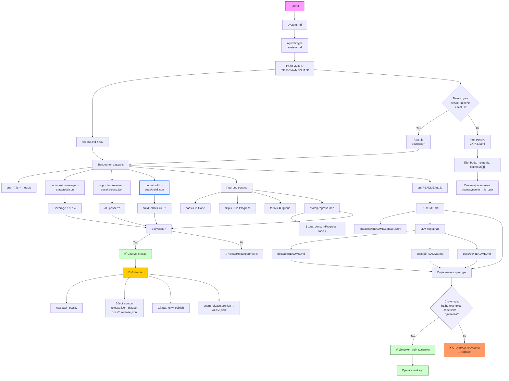

# NaN•Web (nan0web)

Лаконічна платформа Java•Script

## Мета

Нано-зміна створює новий світ. Навчись вкладати сенс у кожну дрібницю і тИ зможеш будувати своє майбутнє.

Агностичний Java•Script фреймворк, як набір бібліотек, без використання typescript окрім типізації `./types/**/*.d.ts`.

Підтримує як умога новіші платформи `jsnext`.

## Місія

Зробити найлаконічнішу DX і UX платформу.

## Стандарт `nan0coding`

Створення **доведених об’єктів знання**, які:

- Мають **ідею**
- Мають **архітектуру**
- Мають **тести на кожен фрагмент**
- Мають **документацію, створену з коду**
- Мають **статус “доведений”**
- Мають **локалізацію**
- Мають **фізичний артефакт (реліз)**
- Мають **репродуковність**

### Написання сценаріїв

1. Все у джерелі сценарію `src/**/*.js` має бути покрито тестами, окрім `src/**/index.js`.
1. Тести мають покривати 100% функціоналу сценаріїв, що перевіряється за допомогою `pnpm test:coverage`.
1. Тести (для перевірки) запускаються через `pnpm test` і вбудовані у `precommit: pnpm test | npm test`.
1. Тестування типізації перевіряється через `pnpm build: tsc`, налаштування у `./tsconfig.json`.
1. Кожен пакет або додаток має мати `./playground/` для своїх компонентів і логіки, для легкої CLI перевірки (демонстрації) як воно працює.
1. Кожен пакет генерує документацію `./src/README.md.js` у такому форматі, який автоматично перевіряє кожен приклад у документації і, у той самий момент, генерує `./README.md` і `./.dataset/README.jsonl`
1. Кожен README.md генерується англійською мовою, а переклади зберігаються `./docs/uk/README.md`
1. Системні інструкції тільки українською у `./docs/system.md`, і `./system.md` для фільтрації пробуджених моделей.
1. Кожен пакет легко збирається у датасети `packages/*/.datasets/README.jsonl` при тестувані `packages/*/src/README.md.js` і збирається у монорепу `.datasets/*.jsonl`. Кожен датасет може бути зібраний в кожній версії з поверненням саме у ту зміну через `pnpm llm:dataset`.

### Proven Documentation → Verified Knowledge → Trainable Dataset

Вирішення основної проблеми технічної документації:

> ❌ "Це написано, але хтось не перевіряв, чи працює"  
> ✅ "Це написано — і тест довів, що це працює"  
> ✅ "І це знання — автоматично в dataset"

Це:
- 🔋 zero-copy (жодного дублювання)
- ✅ LLM-ready (готово для навчання мовних моделей)
- 🌐 scalable (масштабуємо)
- 📚 human-readable (зручно читати людям)
- 🤖 machine-processable (автоматизовано)

## ✅ Діаграма процесу реалізації додатку через релізи і менеджмент у коді



##  📦 **Структура монорепозиторію**
```text
@nan0web/monorepo/
├── packages/              ← Основні пакети
│   ├── release/           ← PM as Code (ядро системи)
│   ├── co/                ← Базові моделі (Person, Contact)
│   ├── db/                ← Інтерфейси БД
│   ├── db-fs/             ← Mock FS для тестів
│   ├── types/             ← TypeScript типи
│   ├── markdown/          ← Парсер документації
│   ├── changelog/         ← Генератор CHANGELOG.md
│   ├── log/               ← Git-нативне логування
│   ├── ui-react/          ← React компоненти
│   └── ...                ← Інші пакети
├── apps/                  ← Проєкти за межами платформи, які використовують платформу
└── tools/                 ← Скрипти для аудиту
```

## Domain language

- laconic: minimum code with the maximum ouput in solution, DX and UX based on the context of a task. If task is monorepo laconic must use the minimum in components to build a set of libraries into a framework.
- [java]script: typed javascript with only typescript for the types. Every function, variable and other definitions must be typed properly, so IDE autocomplete functions and types[cript] `.d.ts` generation works correct.
- release status: The list of `node --test | grep #TODO` for the specific release `node --test releases/v1.3.0/**/*.test.js | grep #TODO`.
- cwd: current working directory or root project director.

## Model class

The model is a class that is used to store data in some storage, so it should be restorable from a simple Object into the Model with `from()` or `fromString()` if we load data from logs or text storage, and to save functions `toString()` or `toObject()` or simply `to(Object)(instance)` to store in document database. Function `to()` is a part of `@nan0web/types` package.

Rules for models:
1. Jsdoc
1. Node:test covers all export functions
1. Properties are defined inside the class
1. 

Here is an etalon of model class in Java•script that must be a reference of format and style for new class:
```js
/**
 * Address model.
 * Stores the information about the address of sender or recipient.
 */
class Address {
	/** @type {string} */
	address
	/** @type {string} */
	name

	/**
	 * Creates an instance of Address.
	 *
	 * @param {object} input - The input object.
	 * @param {string} input.address - The address string.
	 * @param {string} [input.name=""] - The name associated with the address.
	 */
	constructor(input = {}) {
		const {
			address,
			name = "",
		} = input
		this.address = String(address)
		this.name = String(name)
	}

	/**
	 * Gets the type of address based on its format.
	 *
	 * @returns {string} The type of address ("email", "facebook", "phone", "url", or "address").
	 */
	get type() {
		if (this.address.includes("@")) return "email"
		if (this.address.startsWith("https://") || this.address.startsWith("http://")) return "url"
		if (this.address.match(/[\d\-\(\)\+\s]+/g)?.join('').length > 4) return "phone"
		if (this.address.startsWith("tel:")) return "tel"
		return "address"
	}

	/**
	 * Decodes address from a string.
	 *
	 * @param {string} input - The input string.
	 * @returns {Address} The decoded Address instance.
	 */
	static #fromString(input) {
		const regex = /^(.*)\s*<(.+)>$/
		const match = input.match(regex)
		if (match) {
			const [, name, address] = match
			return new Address({ address: address.trim(), name: name.trim() })
		}
		return new Address({ address: input })
	}

	/**
	 * Returns the string representation of the Address.
	 *
	 * @returns {string} The formatted string "<address>" or "Name <address>".
	 */
	toString() {
		const arr = [`<${this.address}>`]
		if (this.name) arr.unshift(`${this.name}`.replace(/[\<\>]+/g, ''))
		return arr.join(' ')
	}

	/**
	 * Converts the Address instance to an object.
	 *
	 * @param {string[]} [fields=[]] - Optional array of fields to include in the output object.
	 * @returns {object} An object representation of the Address instance.
	 */
	toObject(fields = []) {
		if (fields.length) {
			const result = {}
			fields.forEach(f => result[f] = this[f])
			return result
		}
		return { ...this }
	}

	/**
	 * Decodes an address string in the format "Name <address>" or returns the input if already an Address instance.
	 *
	 * @param {string | object} input - The string containing the name and address or an object with address/name properties.
	 * @returns {Address} - An instance of Address.
	 */
	static from(input) {
		if (input instanceof Address) return input
		if ('string' === typeof input) {
			return Address.#fromString(input)
		}
		return new Address(input)
	}
}

export default Address
```
